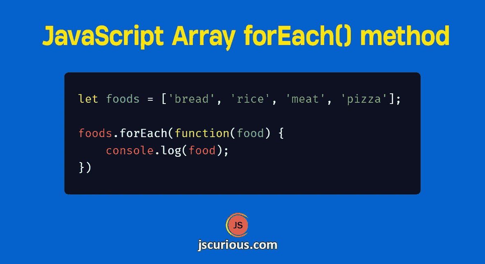

# JavaScript Array forEach()方法循环遍历数组

> 原文：<https://javascript.plainenglish.io/javascript-array-foreach-method-to-loop-through-an-array-f3af3610846f?source=collection_archive---------8----------------------->



(Posted in jscurious.com)

当我们有一个数据数组时，我们经常需要遍历所有的数组元素，并使用数组元素执行一些操作。我们可以使用`for`循环来做到这一点，但是 JavaScript array `forEach()`方法是新的方法。

# forEach()方法如何工作

JavaScript array `forEach()`方法遍历数组元素，并为每个元素执行一个函数。语法是:

```
array.forEach(callback, thisArg);
```

callback 是一个为每个数组元素执行的函数，thisArg 是一个在 callback 中用作`this`的值。

示例:

```
let foods = ['bread', 'rice', 'meat', 'pizza'];foods.forEach(function(food) {
    console.log(food);
});
```

输出

```
bread
rice
meat
pizza
```

回调函数接受 3 个参数。

*   正在为其调用函数的当前元素(必需)
*   原始数组中元素的索引(可选)
*   原始数组(可选)

让我们看一个使用所有 3 个参数的例子。在这个例子中，我们将使用`forEach()`删除数组中的重复项。

```
let arr1 = [20, 30, 15, 30, 40, 15];let unique = [];arr1.forEach((item, index, array) => {
    if(index === array.indexOf(item)) {
        unique.push(item);
    }
});console.log(unique);  // [20, 30, 15, 40]
```

在回调函数中，我们使用`indexOf()`方法将当前项的索引与原始数组中该项的索引进行匹配。

方法返回数组中第一个匹配元素的索引。这意味着如果同一个元素在数组中出现不止一次，那么`indexOf()`将返回数组中从左数第一个元素的索引。

因此，如果当前元素的索引和由`indexOf()`返回的索引不匹配，那么该元素在数组中存在多次。只有唯一的元素会被推送到唯一数组。

# 值为空的数组

`forEach()`方法不会为空值调用回调函数。

```
let arr = [20, 30];arr[5] = 50;console.log(arr); // [20, 30, empty × 3, 50]arr.forEach(function(item) {
    console.log(item);
});
```

输出

```
20
30
50
```

这里没有为所有 3 个空值调用回调函数。

# 终止/跳过 forEach 循环

与`for`循环不同，我们不能在`forEach()`方法中使用`break`或`continue`。要终止`forEach()`,我们需要通过它内部的一个异常。类似地，我们需要使用`return`语句来跳过当前迭代，而不是`continue`关键字。

```
let arr1 = [20, -45, 30, 15, 30, 40, 15];arr1.forEach((item, index) => {
    if(item < 0) {
        return;
    } if(index == 3) {
        throw new Error('Terminating forEach');
    } console.log(item); 
});
```

输出

```
20
30
Uncaught Error: Terminating forEach
```

> 如果需要在循环中使用`break`或`continue`，那么在这种情况下使用`for`循环(`for`、`for…of`)。

# 使用 thisArg 的示例

在这个例子中，我们将从一个数组中过滤偶数和奇数，并将其设置为各自的对象属性。

```
function filterNumbers() {
    this.even = [];
    this.odd = [];
}let numbers = [20, 83, 15, 58, 49, 62];const obj = new filterNumbers();numbers.forEach(function(item) {
    if(item % 2 === 0) this.even.push(item);
    else this.odd.push(item);
}, obj)console.log(obj.even); // [20, 58, 62]console.log(obj.odd); // [83, 15, 49]
```

这里,`filterNumbers`的实例被传递给`forEach`,用作回调中的`this`。

# 有关系的

*   [JavaScript 中遍历对象和数组的不同方式](https://jscurious.com/different-ways-to-iterate-through-objects-and-arrays-in-javascript/)
*   [JavaScript 中数组的 map()和 filter()方法](https://jscurious.com/map-and-filter-methods-of-array-in-javascript/)
*   [JavaScript 中查找数组元素的 6 种方法](https://jscurious.com/how-to-find-elements-in-array-in-javascript/)

*感谢您的宝贵时间* ☺️
更多网络开发博客，请访问[jscurious.com](http://jscurious.com/)