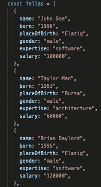
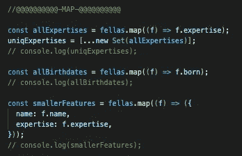
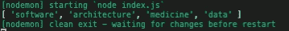
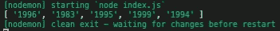
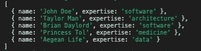
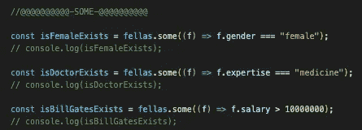
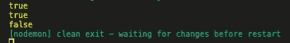
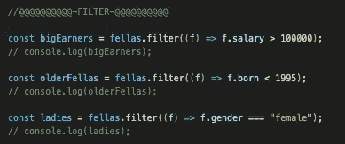
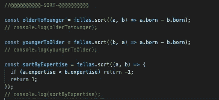

# JavaScript 数组方法:Map，Some，Filter，Sort

> 原文：<https://javascript.plainenglish.io/javascript-array-methods-map-some-filter-sort-c60a93586526?source=collection_archive---------8----------------------->

大家好，今天我会试着快速覆盖一些 JS 数组方法。这是一段时间后的第一个 JS 帖子，今天的内容还算初级水平。我试图涵盖 4 个 JS 数组方法的基础。我希望你会喜欢和我一起。

我将使用 GitHub repo 为您提供代码[这里](https://github.com/eren23/js-methods-basics-blog/blob/main/index.js)。

# 要使用的数据

在 index.js 文件的顶部有一个对象数组，它来自下面的链接，您可以使用它来跟随教程。

# 可选 NPM 套餐

在这篇文章中，我们将使用节点时间，所以如果你喜欢跟随，你需要在你的本地。你可以在这里下载[。](https://nodejs.org/en/)

如果你想在你的项目中有一个热重装特性，就像我在教程中使用的那样，你可以继续从 GitHub 安装代码，只需在根目录中运行命令“npm install ”,或者如果你想在根目录中手动完成，你应该按顺序运行下面的命令:

`npm install -D nodemon`

之后，您可以在 package.json 文件中创建一个新脚本:

现在，您可以通过运行以下命令，使用热重装启动节点运行时:

# 地图()

JavaScript Map 方法是一种可以通过为每个数组元素调用函数来创建新数组的方法。

# 一些()

同样，对于 Some 方法，我们提供了一个函数，并看到数组的元素通过了测试。作为一个更人性化的解释，检查我们是否有任何人具有软件专业知识或类似的东西。一些方法返回一个布尔结果。

*   在第一次使用时，我们检查在我们的对象数组中是否存在女性。
*   在第二次使用中，我们检查对象数组中是否存在医生。
*   在第三个用法中，我们检查我们的对象数组中是否有一个富人。

# 过滤器()

Filter 方法使用通过给定测试的 all 数组元素创建一个新数组。

*   在第一次使用中，我们创建了一个新的数组，其中包含年薪超过 100，000 的人
*   第二次使用创建一个新数组，其中包含 1995 年之前出生的人。
*   第二个创建了一个只有女性的新数组。

我不会显示 filter 的任何输出，因为与其他输出相比，输出相当长，我发现保持 post 可读性更好。

# 排序()

排序方法帮助我们对一个数组的元素进行排序，但是在这篇文章中，我们将创建自定义排序来处理人员的特定特征，并且是双向的。

*   第一次使用将数组中的元素按出生日期从大到小排序。
*   从代码中可以看出，第二种用法与第一种用法正好相反。
*   最后一个用法是用 JS Sort 方法按字母顺序对字符串进行排序的例子。

我希望你会觉得这篇文章很有用，事实上，我写这篇文章是为了再次刷新数组的基础知识，同时帮助其他人使用这样的资源。

我希望在新的岗位上看到你。:)

*最初发表于*[*【https://blog.akbuluteren.com】*](https://blog.akbuluteren.com/blog/javascript-array-methods-map-some-filter-sort)*。*