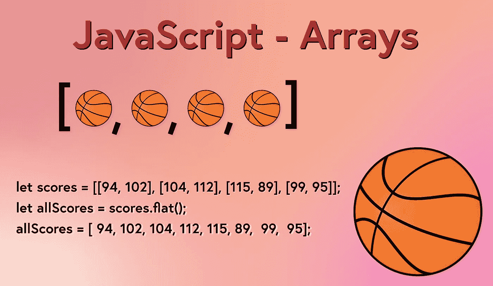

# JavaScript 数组方法综合指南

> 原文：<https://javascript.plainenglish.io/javascript-arrays-an-overview-with-examples-9225aaa8f9b5?source=collection_archive---------14----------------------->

[数组](https://developer.mozilla.org/en-US/docs/Web/JavaScript/Reference/Global_Objects/Array)在最基本的层面上是数据的集合(或列表)。由于程序不断地处理数据，数组在 JavaScript 中被广泛使用。

典型的程序会将数据添加到列表中，就像购物车中的产品一样，这些数据可以存储在一个数组中。购物车数组可以添加、删除和重新排列商品。

为了完成这样的任务，数组附带了许多内置方法，在使用它们时提供了很大的灵活性。

本文将研究如何创建数组、使用数组访问数据以及使用数组。



JavaScript Arrays — An Overview with examples

对阵列有广泛的支持，包括一篇关于阵列的[详细 MDN 文章](https://developer.mozilla.org/en-US/docs/Web/JavaScript/Reference/Global_Objects/Array)。

## 创建数组

可以使用数组文字语法或数组构造函数来创建数组。

```
// array literal syntax
let cart = ['pencil', 'hat', 'paper', 'belt'];
// creates an array with a length of 4 and defined content
```

数组构造函数可用于创建一个没有长度的空数组、一个指定长度的数组和一个具有指定内容的数组。用数组构造函数创建数组相当于使用数组文字语法。

```
let cart = new Array();
// creates an array with a length of 0 and no contentlet cart2 = new Array(3);
// creates an array with a length of 3 and undefined contentlet cart3 = new Array('pencil', 'map', 'shirt');
// creates an array with a length of 3 and defined content
```

# 数组基础

## 数组长度属性

属性`length`是数组可用的一个属性。它返回一个数字，该数字等于数组中包含的项数。

```
let cart = ['pencil', 'hat', 'paper', 'belt'];
cart.length; // 4
```

## 访问数组中的项

数组是基于索引的，这意味着数组中的每一项都对应一个从零开始的索引号。数组中的第一项的索引为 0。下一项的索引为 1，依此类推。数组中的项保持它们的顺序，这对应于索引值。

这提供了一些可预测性，因为数组中的项将总是位于相同的索引处，除非被程序改变。

```
let cart = ['pencil', 'hat', 'paper', 'belt'];
cart[0]; // 'pencil'
cart[2]; // 'paper'
cart[5]; // undefined
```

# 数组方法

array 类有一个类方法和几个实例方法。使用数组和实例方法的一个关键概念是它们如何改变或不改变原始数组。接受数组并修改原始数组的方法称为破坏性方法。它被认为是破坏性的，因为原始数组被破坏，新数组取而代之。

与此相反，接受数组并在完成后保持其原始数组不变的方法称为非破坏性方法。方法完成后，原始数组保持不变。

这是一个重要的概念，因为在处理数组数据时，保持原始数据的完整性非常重要。

[**isArray()**](https://developer.mozilla.org/en-US/docs/Web/JavaScript/Reference/Global_Objects/Array/isArray)

Array 类有一个名为 isArray()的方法，它接受一个变量值，并根据它是否是一个数组返回一个布尔值。

```
let cart = ['pencil', 'hat', 'paper', 'belt'];
Array.isArray(cart); // true
Array.isArray('pencil'); // false
```

## 向数组中添加或从中移除的破坏性方法

[](https://developer.mozilla.org/en-US/docs/Web/JavaScript/Reference/Global_Objects/Array/shift)

**从数组中移除第一个元素并返回它。如果数组为空，则返回 undefined。原始数组被修改。**

```
let cart = ['pencil', 'hat', 'paper', 'belt'];
cart.shift(); // 'pencil'
cart; // ['hat', 'paper', 'belt']
```

**[**unshift()**](https://developer.mozilla.org/en-US/docs/Web/JavaScript/Reference/Global_Objects/Array/unshift)**

**将传递的元素插入数组的开头。如果几个项作为多个参数传递，它们将按照作为参数列出的顺序添加到数组中。返回值是数组的新长度。原始数组被修改。**

```
let cart = ['pencil', 'hat', 'paper', 'belt'];
cart.unshift('map'); // 5
cart; // ['map', 'pencil', 'hat', 'paper', 'belt'];
```

**[**pop()**](https://developer.mozilla.org/en-US/docs/Web/JavaScript/Reference/Global_Objects/Array/pop)**

**从数组中移除最后一个元素并返回它。如果数组为空，则返回 undefined。原始数组被修改。**

```
let cart = ['pencil', 'hat', 'paper', 'belt'];
cart.pop(); // 'belt'
cart; // ['pencil', 'hat', 'paper']
```

**[**推()**](https://developer.mozilla.org/en-US/docs/Web/JavaScript/Reference/Global_Objects/Array/push)**

**将传递的元素插入到数组的末尾。如果几个项作为多个参数传递，它们将按照作为参数列出的顺序添加到数组中。返回值是数组的新长度。原始数组被修改。**

```
let cart = ['pencil', 'hat', 'paper', 'belt'];
cart.push('map'); // 5
cart; // ['pencil', 'hat', 'paper', 'belt', 'map'];
```

**[**拼接()**](https://developer.mozilla.org/en-US/docs/Web/JavaScript/Reference/Global_Objects/Array/splice)**

**通过从数组中的指定索引处开始移除和/或替换数组中的元素来修改数组。返回值是移除的项目。原始数组被修改。**

```
let cart = ['pencil', 'hat', 'paper', 'belt'];
cart.splice(1, 2); // ['hat', 'paper'];
cart; // ['pencil', 'belt']
```

**该方法可以接受附加参数，这些参数被插入到数组中从数组中移除元素的位置。**

```
let cart = ['pencil', 'hat', 'paper', 'belt'];
cart.splice(1, 2, 'printer', 'computer', 'hard drive'); // ['hat', 'paper'];
cart; // ['pencil', 'printer', 'computer', 'hard drive', 'belt']
```

## **连接、分割或连接数组的非破坏性方法**

**[T21【concat()】](https://developer.mozilla.org/en-US/docs/Web/JavaScript/Reference/Global_Objects/Array/concat)**

**合并两个数组并返回一个新的组合数组。可以通过将多个数组作为单独的参数添加来组合它们。原始数组未被修改。**

```
let cart1 = ['pencil', 'pen', 'marker'];
let cart2 = ['hat', 'cap', 'belt'];
let combinedCart = cart1.concat(cart2);
combinedCart; // [ 'pencil', 'pen', 'marker', 'hat', 'cap', 'belt' ]cart1; // ['pencil', 'pen', 'marker'];
cart2; // ['hat', 'cap', 'belt'];
```

**[**切片()**](https://developer.mozilla.org/en-US/docs/Web/JavaScript/Reference/Global_Objects/Array/slice)**

**创建一个新数组，从指定的起始索引位置复制原始数组，并将所有项复制到可选的结束索引位置。可以使用负数，表示从数组末尾偏移多少作为起始索引。原始数组未被修改。**

```
let cart = ['pencil', 'hat', 'paper', 'belt'];
cart.slice(1); // [ 'hat', 'paper', 'belt' ]
cart.slice(1, 3); // [ 'hat', 'paper' ]
cart.slice(-2); // [ 'paper', 'belt' ]cart; // ['pencil', 'hat', 'paper', 'belt'];
```

**[**加入()**](https://developer.mozilla.org/en-US/docs/Web/JavaScript/Reference/Global_Objects/Array/join)**

**通过组合数组中的所有项来创建字符串。可以传递一个可选的分隔符参数，它可以是一个字符串，也可以尝试转换为一个字符串。分隔符将放在数组中所有项目的前面，但不会放在第一个项目的前面或最后一个项目的后面。如果没有定义分隔符，则在项目之间放置一个逗号。**

```
let cart = ['pencil', 'hat', 'paper', 'belt'];
cart.join(); // 'pencil,hat,paper,belt'
cart.join(' '); // 'pencil hat paper belt'
cart.join('--'); // 'pencil--hat--paper--belt'
```

## **破坏性分类和反转**

**[](https://developer.mozilla.org/en-US/docs/Web/JavaScript/Reference/Global_Objects/Array/reverse)**反转()****

****反转数组中的值并返回修改后的数组。原始数组被修改。****

```
**let cart = ['pencil', 'hat', 'paper', 'belt'];
cart.reverse(); // [ 'belt', 'paper', 'hat', 'pencil' ]
cart; // [ 'belt', 'paper', 'hat', 'pencil' ]**
```

****[**sort()**](https://developer.mozilla.org/en-US/docs/Web/JavaScript/Reference/Global_Objects/Array/sort)****

****如果可选的参数比较函数不存在，默认情况下将数组按升序排序。compare 函数将比较这两个数字，并根据比较结果将这两个数字移动到数组中的正确位置。原始数组被修改。****

```
**let numbers = [2, 5, 1, 4, 3];
numbers.sort(); // [1, 2, 3, 4, 5]function compareNumbers(a, b) {
  return a - b;
}
numbers.sort(compareNumbers); // [1, 2, 3, 4, 5]function compareNumbersDesc(a, b) {
  return b - a;
}
numbers.sort(compareNumbersDesc); // [ 5, 4, 3, 2, 1 ]**
```

## ****在数组中搜索特定值****

****[**indexOf()**](https://developer.mozilla.org/en-US/docs/Web/JavaScript/Reference/Global_Objects/Array/indexOf)****

****查找第一个匹配项的索引位置，并返回索引值。使用严格等式`===`完成搜索，如果没有找到匹配，将返回`-1`。****

****该方法还接受一个可选的第二个参数 startIndex，它指示搜索匹配应该从哪个索引位置开始。startIndex 的负数将从偏移索引位置开始搜索。****

```
**let numbers = [2, 6, 8, 1, 7, 2, 7, 9, 2, 15, 37];
numbers.indexOf(7); // 4
numbers.indexOf(10); // -1
numbers.indexOf(2); // 0
numbers.indexOf(2, 4); // 5
numbers.indexOf(2, -3); // 8numbers.indexOf('15'); // -1let cart = ['pencil', 'hat', 'paper', 'belt'];
cart.indexOf('hat'); // 1
cart.indexOf('bubble'); // -1**
```

****[](https://developer.mozilla.org/en-US/docs/Web/JavaScript/Reference/Global_Objects/Array/lastIndexOf)**lastIndexOf()******

******从数组末尾向后查找第一个匹配项的索引位置，并返回索引值。使用严格等式`===`完成搜索，如果没有找到匹配，将返回`-1`。******

******该方法还接受一个可选的第二个参数 startIndex，它指示搜索匹配应该从哪个索引位置开始。startIndex 的负数将从偏移索引位置开始搜索。******

```
****let numbers = [2, 6, 8, 1, 7, 2, 7, 9, 2, 15, 37];
numbers.lastIndexOf(2); // 8
numbers.lastIndexOf(15); // 9
numbers.lastIndexOf(2, 5); // 5
numbers.lastIndexOf(2, -4); // 5****
```

## ******非破坏性迭代******

******第一组数组迭代方法使用数组并检查数组的内容，允许程序员使用输出进行评估。******

******[**forEach()**](https://developer.mozilla.org/en-US/docs/Web/JavaScript/Reference/Global_Objects/Array/forEach)******

****迭代数组中的每个值。接受回调函数作为参数，回调函数本身最多接受三个参数，来自数组的迭代元素、当前迭代的索引和由`forEach`方法调用的 enter 数组。****

```
**let cart = ['pencil', 'hat', 'paper', 'belt'];cart.forEach(function callback(item, index) {
  console.log(`index: ${index} for item: ${item}`);
});// index: 0 for item: pencil
// index: 1 for item: hat
// index: 2 for item: paper
// index: 3 for item: belt**
```

****[**隔()**](https://developer.mozilla.org/en-US/docs/Web/JavaScript/Reference/Global_Objects/Array/every)****

****对数组中的每一项执行计算，如果每一项都返回 true，则返回 true，如果至少有一项返回 false，则返回 false。****

```
**let cart = ['pencil', 'hat', 'paper', 'belt'];cart.every((word) => word.length > 3); // false**
```

****[**有的()**](https://developer.mozilla.org/en-US/docs/Web/JavaScript/Reference/Global_Objects/Array/some)****

****对数组中的每一项执行计算，如果至少有一项返回 true，则返回 true；如果所有项都返回 false，则返回 false。****

```
**let cart = ['pencil', 'hat', 'paper', 'belt'];cart.some((word) => word.length > 3); // true**
```

****[**查找()**](https://developer.mozilla.org/en-US/docs/Web/JavaScript/Reference/Global_Objects/Array/find)****

****将返回数组中匹配测试函数的第一个元素。如果没有匹配，则返回 undefined。****

```
**let people = [
  { name: 'bob', age: 24 },
  { name: 'kal', age: 46 },
  { name: 'mel', age: 33 },
];people.find((person) => person.age > 30); // { name: 'kal', age: 46 }**
```

****[**findIndex()**](https://developer.mozilla.org/en-US/docs/Web/JavaScript/Reference/Global_Objects/Array/findIndex)****

****将返回数组中匹配测试函数的第一个元素的索引值。如果没有匹配，则返回-1。****

```
**let people = [
  { name: 'bob', age: 24 },
  { name: 'kal', age: 46 },
  { name: 'mel', age: 33 },
];people.findIndex((person) => person.age > 30); // 1**
```

****[**包括()**](https://developer.mozilla.org/en-US/docs/Web/JavaScript/Reference/Global_Objects/Array/includes)****

****检查数组中的值，如果找到匹配项并且数组中包含该值，则返回 true。如果找不到匹配项，并且数组中不包含该值，则返回 false。****

```
**let cart = ['pencil', 'hat', 'paper', 'belt'];
cart.includes('hat'); // true
cart.includes('button'); // false**
```

****下一组数组迭代方法接受原始数组，并基于原始数组的一些处理或评估返回一个新数组。****

****[**地图()**](https://developer.mozilla.org/en-US/docs/Web/JavaScript/Reference/Global_Objects/Array/map)****

****将根据循环访问数组中每一项的回调函数的结果返回一个新数组。最适合基于数组中的所有元素使用数组的情况。****

```
**let numbers = [2, 6, 8];let double = numbers.map((number) => number * 2);double; // [ 4, 12, 16 ]**
```

****[**滤镜()**](https://developer.mozilla.org/en-US/docs/Web/JavaScript/Reference/Global_Objects/Array/filter)****

****将基于比较函数返回一个新数组，该比较函数返回返回 true 的元素并忽略返回 false 的元素。最适合基于筛选数组使用数组的情况。****

```
**let people = [
  { name: 'bob', age: 24 },
  { name: 'kal', age: 46 },
  { name: 'mel', age: 33 },
];let youngerPeople = people.filter((person) => {
  if (person.age < 40) {
    return person;
  }
});youngerPeople; // [ { name: 'bob', age: 24 }, { name: 'mel', age: 33 } ]**
```

****最后一组数组迭代方法基于数组的元素产生一个结果。****

****[**减少()**](https://developer.mozilla.org/en-US/docs/Web/JavaScript/Reference/Global_Objects/Array/Reduce)****

****对数组中的每一项执行用户提供的 reducer 函数，并返回最终结果。使用累加器参数和当前值参数，累加器参数保存遍历数组时的结果，当前值参数是遍历数组时数组元素的值。reduce 函数也接受可选的初始值参数。****

```
**let ages = [25, 28, 32, 35, 28, 20];
let initialValue = 200;let totalAges = ages.reduce((total, age) => total + age, initialValue);totalAges; // 368**
```

****[**平()**](https://developer.mozilla.org/en-US/docs/Web/JavaScript/Reference/Global_Objects/Array/flat)****

****将创建一个新数组，并将所提供数组的所有子数组元素连接在一起。该方法接受可选的深度参数。****

```
**let numbers = [[1, 4], 6, 1, [6, 1, 8], 8];
numbers.flat(); // [ 1, 4, 6, 1, 6, 1, 8, 8 ]let newNumbers = [
  [1, 4],
  [2, [4, 9]],
];
newNumbers.flat(); // [ 1, 4, 2, [ 4, 9 ] ]
newNumbers.flat(2); // [ 1, 4, 2, 4, 9 ]**
```

****[flat map()](https://developer.mozilla.org/en-US/docs/Web/JavaScript/Reference/Global_Objects/Array/flatMap)****

****结合了`flat()`和`map()`的功能，同时将元素映射到一个新数组，并展平新创建的数组。****

```
**let motto = ['to be', 'or not', 'to be, that is the question'];
let mottoWords = motto.flatMap((part) => part.split(' '));
mottoWords; // [ 'to', 'be', 'or', 'not', 'to', 'be,', 'that', 'is', 'the', 'question' ]**
```

## ****结论****

****掌握 JavaScript 数组对于任何程序员来说都是必须的，因为它们被广泛使用，并且可用于处理数组的方法允许许多不同类型的操作。本文只是简单介绍了如何使用数组和利用不同的可用方法。方法列表并不全面，但涵盖了许多最重要的方法。****

*****更多内容请看*[***plain English . io***](http://plainenglish.io)****