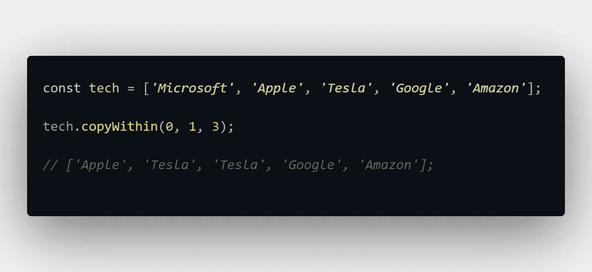
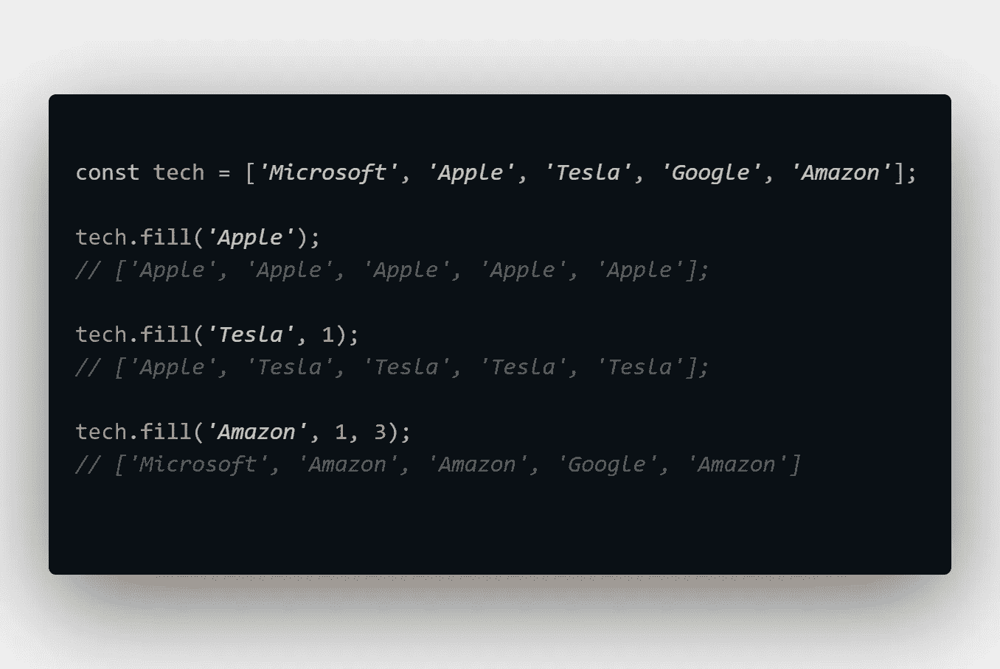
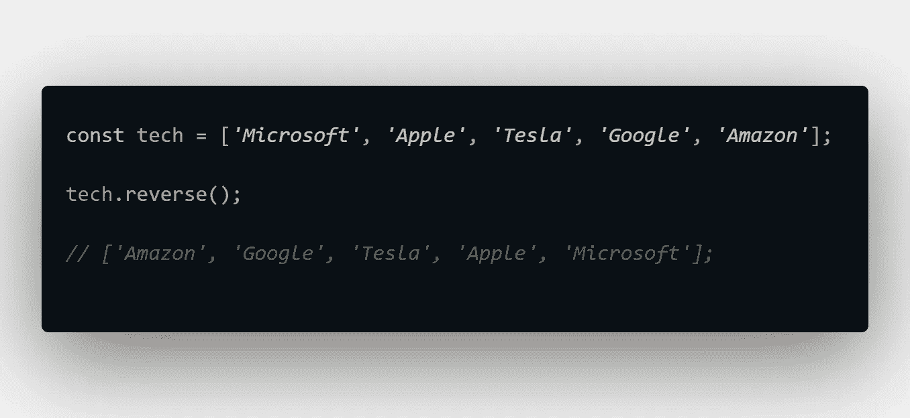
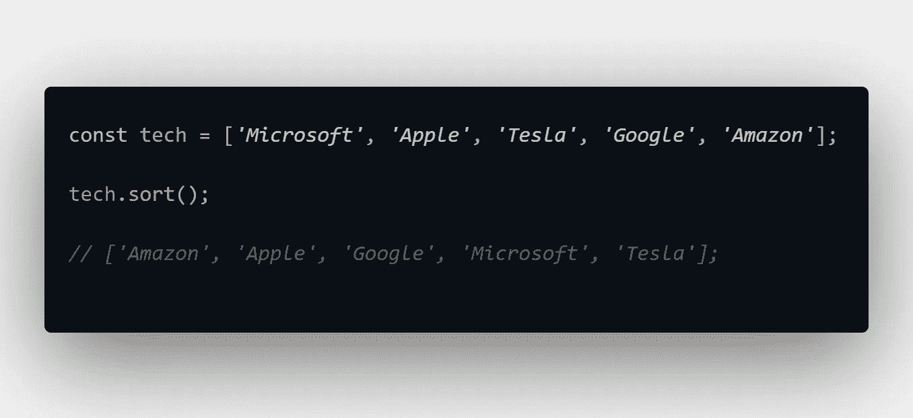
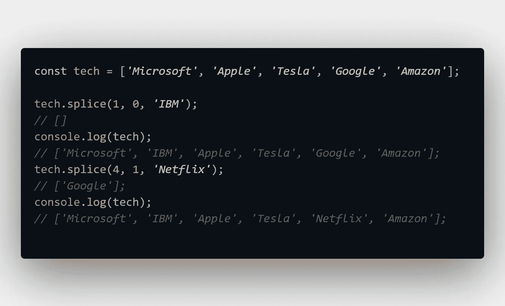
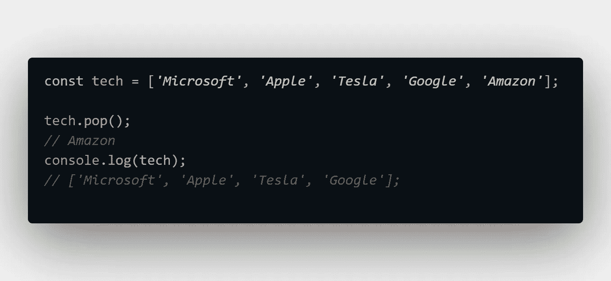
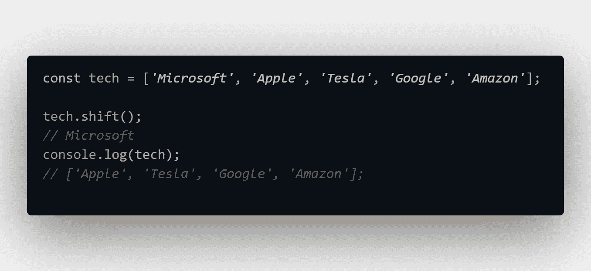
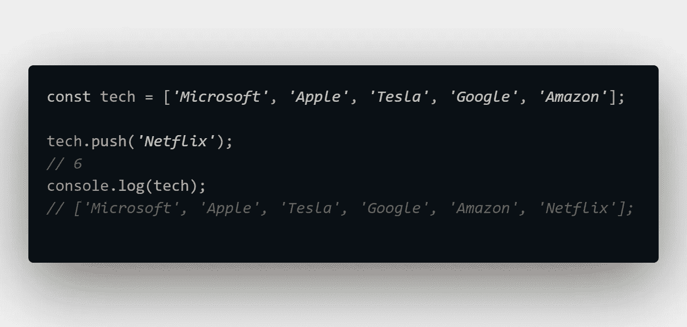
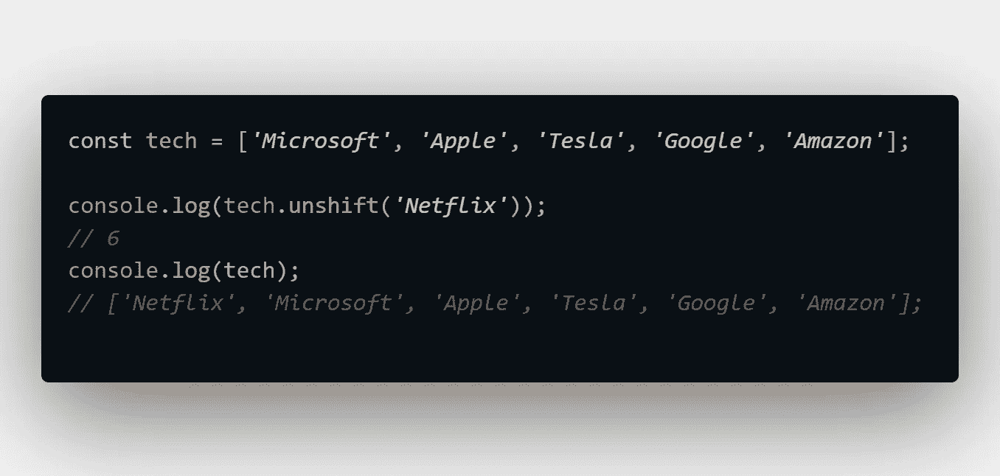

# JavaScript 数组引用备忘单和分解——变异方法

> 原文：<https://javascript.plainenglish.io/javascript-arrays-reference-cheat-sheet-and-breakdown-mutating-methods-e89a3b0c7755?source=collection_archive---------11----------------------->

## 第 2 部分:这些方法改变了原始数组，构成了 JavaScript 提供的全部数组方法的一小部分。

Photo by [Earl Wilcox](https://unsplash.com/@earl_plannerzone?utm_source=medium&utm_medium=referral) on [Unsplash](https://unsplash.com?utm_source=medium&utm_medium=referral)

一个 3 部分数组系列，1 部分数据，1 部分突变方法，1 部分非突变方法。这是本系列的第 2 部分。

第 1 部分: [JavaScript 数组引用备忘单和分解统计](/javascript-arrays-reference-cheat-sheet-and-breakdown-stats-f0cae8416de)

第 3 部分: [JavaScript 数组引用备忘单和分解——非变异方法](/javascript-arrays-reference-cheat-sheet-and-breakdown-non-mutating-methods-c95288942800)

## 变异方法:

超过一半(56%)的变异方法涉及到在数组中添加或删除元素。

这些方法中的 5 个(56%)接受参数，而另外 4 个(44%)不接受参数。

这些方法中的 5 个不返回值(56%)，而是改变数组*的内容并返回新的修改后的数组。*

2 个方法返回值(22%)。

2 方法返回新数组的长度(22%)。

一般来说，大多数变异方法都会接受一些参数，并且大多数方法会就地改变数组的内容。

# 5 个就地返回修改过的数组的方法

## 。copyWithin()

—复制数组中的数组元素序列。

*   **接受**参数。
*   返回修改后的数组；修改到位。没有复制。

## 。填充()

—用静态值填充数组的所有元素，无论您指定什么值。

*   **接受**参数。
*   用填充值返回修改后的数组；修改到位。没有复制。

## 。反向()

—反转数组元素的顺序(第一个变成最后一个，最后一个变成第一个)。

*   **不接受**参数。
*   返回反转的数组；修改到位。没有复制。

## 。排序()

—根据 UTF-16 单位值以升序对数组元素进行排序。

*   **不接受**参数。
*   返回排序后的数组；修改到位。没有复制。

## 。拼接()

—添加、删除或替换数组的内容。

*   **接受**参数:值。
*   如果某个元素已被移除，则返回被移除/替换的元素。如果添加了元素，则返回一个空数组。修改到位。没有复制。

# 2 个返回值的方法:

## 。流行()

—从数组末尾删除最后一个元素。

*   **不接受**参数。
*   返回值，即被移除的元素。

## 。shift()

—从数组的开头删除第一个元素。

*   **不接受**参数。
*   返回值，即被移除的元素。

# 2 个返回数组新长度的方法

## 。推送()

—在数组末尾添加一个或多个元素。

*   **接受**的说法:价值。
*   返回数组的新长度。

## 。未移位()

—将一个或多个元素添加到数组的开头。

*   **接受**参数:值。
*   返回数组的新长度。

代码片段只是用这些方法可以做什么的例子。亲自试验一下，看看你还能用它们做些什么！

*更多内容尽在*[***plain English . io***](http://plainenglish.io/)