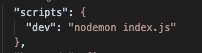
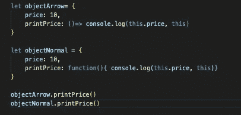
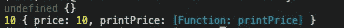
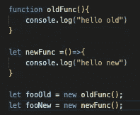
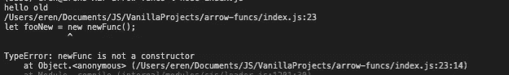
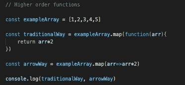

# JavaScript 箭头函数解释

> 原文：<https://javascript.plainenglish.io/javascript-arrow-functions-explained-3f21b1bd8d7a?source=collection_archive---------9----------------------->

大家好，今天我将继续用箭头函数解释 JavaScript 的基本概念。我不认为我能够涵盖箭头函数的所有特性，我也不认为它们在大多数情况下是必要的，但是如果你对这篇文章有任何建议或改进，请在评论部分提出。

你可以在[发布期间点击](https://github.com/eren23/js-arrowfunc-blogpost)查看代码。

# 可选 NPM 套餐

在这篇文章中，我们将使用节点时间，所以如果你喜欢跟随，你需要在你的本地。你可以在这里下载。

如果你想在你的项目中有一个热重装特性，就像我在教程中使用的那样，你可以继续从 GitHub 安装代码，只需在根目录中运行命令“npm install ”,或者如果你想在根目录中手动完成，你应该按顺序运行下面的命令:

`npm install -D nodemon`

之后，您可以在 package.json 文件中创建一个新脚本:

现在，您可以通过运行以下命令，使用热重装启动节点运行时:

# 什么是箭头函数？

如果你熟悉 Python 语言，箭头函数本质上非常类似于 Python Lambda 函数。Lambda 函数基本上是匿名函数，具有特定的语法，接受一组参数并相应地给出输出。

箭头函数的常规语法如下:

`let ourFunction = (argument1, argument2, argument3, ... ,argumentN) => anexpression`

在 JavaScript 的范围内，arrow 函数可以做很多事情，但有一些权衡。

# 哪里不使用箭头函数？

”没有自己的到 this 或 super 的绑定，不应用作方法。没有参数或新的目标关键字。不适合调用、应用和绑定方法，这些方法通常依赖于建立范围。不能用作构造函数。不能用屈服，在其体之内。”

这些限制直接来自于 MDN 网站，在这个网站上你可以找到许多关于许多技术的资源。

在上面的四条中，我认为最重要的两条是不能用作方法和不能用作构造函数。

下面的例子说明了为什么我们不应该使用箭头函数作为方法。

在这个例子中，我们创建了两个对象，一个使用常规函数作为方法，另一个使用新的箭头函数。当我们检查下面的结果时。

正如我们在箭头函数中看到的，我们现在不能通过使用“this”来到达所有者对象。如果你想了解 JavaScript 中不同用例的“this”是什么，你可以查看这个[链接](https://www.w3schools.com/js/js_this.asp)来找出答案。

现在我们来看另一个例子，用 arrow 和普通函数作为构造函数。

现在我们有了两个新的函数，我们正试图把它们都用作构造函数。

结果和预期的一样，虽然第一个构造函数给出了期望的输出，但是第二个构造函数失败了，因为 arrow 函数不支持这样的事情。

# 在哪里使用箭头函数？

箭头函数适用于许多其他情况，我个人只在没有上述限制时使用它们。然而，箭头函数有一个明显更好的用例，大多数人经常在高阶函数中使用它。如果你不知道什么是高阶函数，它们基本上是以一个函数作为参数或者返回一个函数作为结果的函数。你可以从[这里](https://dev.to/damcosset/higher-order-functions-in-javascript-4j8b)继续深入查看。

让我们以我之前在一篇关于 JavaScript 数组方法的文章中解释过的高阶函数之一 map 方法为例。(你可以点击[这里的](https://eren23.medium.com/)链接查看我的其他帖子。)

正如你在上面看到的，我们用两种不同的 map 方法的输出创建了两个变量，用 arrow 函数创建的变量占用了更少的代码和空间。

# 结论

JS arrow 函数非常好，我猜大多数人现在已经习惯了。当在使用它之前考虑所有的限制时，它帮助我们，开发者，用更少的努力写更干净和更可读的代码。

我希望你喜欢阅读这篇文章。下次见:)。

*原载于*[*https://blog.akbuluteren.com*](https://blog.akbuluteren.com/blog/javascript-arrow-functions-explained)*。*