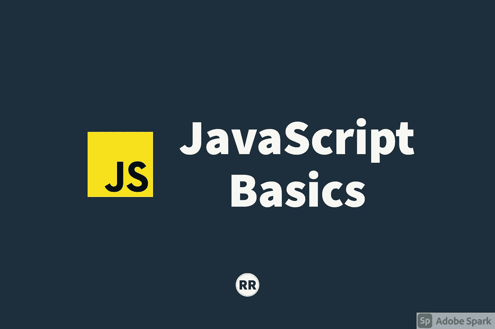

# JavaScript 基础:调用、绑定和应用

> 原文：<https://javascript.plainenglish.io/javascript-basics-call-bind-and-apply-f1e425026f88?source=collection_archive---------12----------------------->

## 控制“这个”变量



在本帖中，我们将讨论以下方法:`call, bind, and apply`。但是在我们开始之前，让我们先来看看受益于这些方法的变量，`this`。

# “这个”变量

在 JavaScript 中，当一个函数被调用时，就会创建一个`execution context`。结果，我们有了我们的`variable environment`(函数内定义的变量)`outer environment reference`(函数/变量或者任何可以在函数外引用的东西)，还有一个为我们设置的变量`this`。

关于`execution context`的更多信息，我会在这篇[博客](https://medium.com/javascript-in-plain-english/javascript-basics-execution-context-bd79ede1ccdd)中详细讨论。

在某些情况下,`this`变量可以指向`global`对象，而在其他情况下，它可以指向包含作为属性的函数的对象。准确地确定`this`变量最终会是什么可能很棘手。`call, bind, and apply`方法在这个问题上派上了用场。

# 调用、绑定和应用

函数是一种特殊的对象，它有一个隐藏的可选属性`name`,如果不包含它，它可以是匿名的。如果没有提供名称，它可以是一个`anonymous`函数(例如`function(){console.log("anonymous")`)。一个函数也有一个包含代码行的`code`属性，它是可调用的，所以我们可以运行代码。

JavaScript 中的所有函数都可以访问特殊的函数/方法。函数只是一个可以有属性和方法的对象，比如`call, bind, and apply`方法。这三个都与`this`变量有关。

## 约束

让我们从`bind`方法开始。假设我们有下面的例子:

```
const person = {
   firstname: "Rei",
   lastname: "Rey",
   getFullName: function(){
      let fullname = this.firstname + ' ' + this.lastname;
      return fullname
   }
}const logname = function(){
   console.log('Name: ' + this.getFullName())
}let logPersonName = logname.bind(person); 
logPersonname(); // Name: Rei Rey 
```

我们有一个具有特定属性和方法的`person`对象。我们有函数表达式，`logname`依赖于`this`变量。但是这两个变量是相互关联的，当引用`this`时，我们想要的是`person`对象。如果我们立即调用`logname`，它实际上会抛出一个类型错误。为什么？

函数`logname`将从`global execution context`中调用。`this`变量将引用`global`对象。默认情况下，`global`对象没有附加一个名为`getFullName`的方法。所以引用`this.getFullName`会返回`undefined`，调用它会抛出一个错误。

为了解决这个难题，我们在调用函数之前执行了一个额外的操作。重新聚焦，我们的功能是`logname`。快速提醒一个函数是一个特殊的对象，它有包括`bind`在内的方法。我们用这个方法来控制这个函数中的`this`变量指向哪里。

在`bind()`函数中，我们传递我们想要引用的对象。在这种情况下，我们传入`person`对象。幕后发生的事情是，`bind()`函数返回一个新函数，制作了`logname`函数的新副本，并设置了这个新的函数对象，其中`this`变量现在引用传入的参数(`person`)。我们将这个新函数存储到一个变量`logPersonName`中。当我们调用这个函数时，我们现在得到了我们期望的结果。

概括地说，在一个函数上调用`bind()`会创建同一个函数的副本。

## 打电话申请

因为`call`和`apply`相似，所以我们将同时讨论它们。让我们从`call`开始。让我们参考之前的相同示例，其中对`logname`做了一些更改:

```
const person = {
   firstname: "Rei",
   lastname: "Rey",
   getFullName: function(){
      let fullname = this.firstname + ' ' + this.lastname;
      return fullname
   }
}const logname = function(greeting){
   console.log(greeting + " " + this.getFullName())
}logname.call(person,"Hello") // Hello Rei Rey
logname.apply(person, ["Hello"]) // Hello Rei Rey
```

我们调整了函数表达式`logname`，以期待一个参数`greeting`。类似于`bind`,`call`方法将允许我们控制`this`变量在函数上下文中的位置。我们传入`person`对象来设置引用，我们也可以用它传递参数，问候语`"Hello”`。

与创建函数副本的`bind`不同，`call`实际上执行函数，并决定`this`变量应该是什么，其余的将作为通常传递给函数的参数。

我们将介绍函数的最后一个方法是`apply`方法。它与`call`完全相同，但是我们只传入两个参数:指向`this`变量的`object`和包含我们希望传递的参数的数组。

使用`bind`方法，我们也可以传递单个参数。由于`bind`返回函数的副本，我们可以在传入参数后立即调用它。

```
logname.bind(person)("Hello")
```

一个更干净的方法将涉及我们之前已经有的:

```
let logPersonName = logname.bind(person); 
logPersonname("Hello");
```

概括地说，`call`和`apply`是相似的，因为它们不创建函数的副本。相反，它们调用函数并控制`this`指向哪里。

# 履行

让我们来看两个实际实现这些方法的例子。

## 功能借用

假设我们想创建另一个类似于`person`的对象，它有自己的`firstname`和`lastname`属性。然而，我们不一定想要包含`getFullName`属性。我们想借用和重用这个方法，因为它依赖于`this`。我们可以应用(没有双关语的意思)我们所讨论的来解决这个难题。

```
const person = {
   firstname: "Rei",
   lastname: "Rey",
   getFullName: function(){
      let fullname = this.firstname + ' ' + this.lastname;
      return fullname
   }
}const person2 = {
   firstname: “Other”,
   lastname: “Name”
}
```

我们想调用`person`对象上的方法，但是将`this`变量设置为`person2`对象。

```
console.log(person.getFullName.apply(person2)) // Other Name 
```

## 函数 Currying

这特别涉及到`bind`方法。有了`call`和`apply`，我们可以像平常一样简单地传递参数。通过`bind`，我们正在创建该函数的新副本。如果我们决定向它传递参数会发生什么？

```
function multiply(a,b){
   return a*b
}const multipleByTwo = multiply.bind(this,2)
```

提醒一下，`bind`不是打电话。那么它在这种情况下做什么呢？当进行复制时，给它参数设置这些参数的永久值。通过传递值`2`，我们说在这个函数副本中，第一个参数将始终是一个`2`

函数`multiply`中的变量`a`将始终为`2`。这相当于使用这个函数，然后设置`this` 关键字。

```
// equivalent
function multipleByTwo(b){
   const a = 2; 
   return a*b
}//the first parameter is permanently set to 2\. Thus this will be the //second parameter.console.log(multipleByTwo(4)) // 8
```

关于`function currying`技术的更多细节，请参考这篇[文章](https://javascript.info/currying-partials)。

# 结论

我们已经讨论了 JavaScript 中`this`变量的基础知识，以及如何使用`bind`、`call`和`apply`方法控制它指向哪里。理解这些概念有助于课堂上的高级主题和反应。