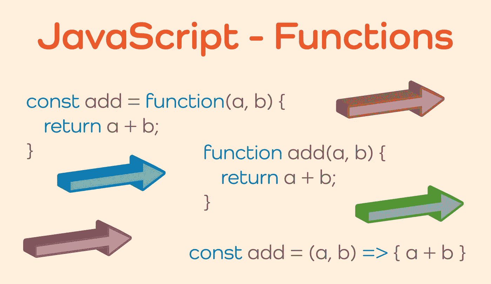

# JavaScript—函数的基础

> 原文：<https://javascript.plainenglish.io/javascript-basics-of-functions-780dca10c81a?source=collection_archive---------8----------------------->

## JavaScript 中的函数——对初学者的全面介绍

JavaScript 中的函数是可以定义的代码段，需要时可以调用。它们可以被认为是整个程序中的子程序。函数很有用，因为它们允许程序员编写一段代码，然后可以在整个程序中多次使用，这有助于减少代码重复。函数还允许程序员创建离散的代码段，这些代码段可以在逻辑上与程序中的其他代码分开。



JavaScript — Basics of Functions

功能包括以下特征:

*   可以接受零个或多个参数
*   可以在函数调用结束时返回指定的值
*   会对程序的其他部分产生副作用而不返回值

## 如何创建函数

函数可以用几种不同的方法创建。创建它们最常见的方式是作为函数声明或函数表达式。

**功能声明**

[函数声明](https://developer.mozilla.org/en-US/docs/Web/JavaScript/Reference/Statements/function)(也称为函数语句)是创建函数的一种方式。要以这种方式创建一个函数，该函数必须有一个*名称*，可选的*参数*，以及一个在函数块内执行的*语句*。

```
function sayHello(name) {
  return `hello, ${name}`;
}
```

上例中，函数名为`sayHello`，可选参数为`name`，语句为`return `hello, ${name}`;`。在本例中，该语句使用`return`语句显式地从函数中返回值。但是，如果省略了`return`语句，该函数将返回`undefined`。

函数声明的一个独特特征是，当程序运行时，在执行代码之前，函数声明被提升到封闭函数作用域或全局作用域的顶部。这允许在原始代码中定义函数声明之前调用它们。

```
greeting('melvin');function greeting(name) {
  return `Howdy, ${name}!`;
}// Even though the function declaration comes after the function call, hoisting moves the function declaration to the top of the global scope
// 'Howdy, melvin!'
```

**函数表达式**

[函数表达式](https://developer.mozilla.org/en-US/docs/Web/JavaScript/Reference/Operators/function)是一个存储在变量中的函数，可以是命名函数，也可以是匿名函数，这意味着即使它有参数和语句，它也没有名字。

```
// named function expression
const welcomeMessage = function hello(name) {
  return `hello, welcome ${name}.`;
};// anonymous function expression
const assignedTask = function (task) {
  return `your task is: ${task}.`;
};welcomeMessage('ned');
// 'hello, welcome ned.'assignedTask('front-end development');
// 'your task is: front-end development.'
```

函数表达式存储在变量中，可以作为参数调用或传递给另一个函数。在大多数情况下，函数表达式与函数声明非常相似，但是，函数表达式不会被提升到局部或全局范围的顶部。在定义函数表达式之前调用它会产生引用错误，因为函数在被调用之前不会被定义。

```
sayHello(); // Uncaught ReferenceError: sayHello is not definedconst sayHello = function () {
  return 'hello...';
};
```

## 关闭

javascript 函数的一个重要特性是[闭包](https://developer.mozilla.org/en-US/docs/Web/JavaScript/Guide/Functions#closures)的概念。创建函数时，一个函数可以包含一个或多个附加函数。每个函数都可以有自己的变量和特定于其作用域的函数。被其他函数封闭的函数可以访问它们自己的作用域变量和函数，以及被封闭的函数的所有变量和函数。但是，封闭函数不能访问内部定义的变量和函数。

闭包的另一个特性是能够保留内部函数的变量和函数，即使在外部函数已经执行之后。JavaScript 将保留这些变量和函数，稍后在执行封闭函数的内部函数时可以访问它们。

```
const welcomeMessage = function (name) {
  let employeeName = name;
  const greeting = function (message) {
    return `${message}, ${employeeName}.`;
  }; return greeting;
};let myGreeting = welcomeMessage('kalvin');myGreeting('hello'); // 'hello, kalvin.'
myGreeting('welcome'); // 'welcome, kalvin'
```

在这里的例子中，函数表达式`welcomeMessage`被声明并接受参数`name`。变量`employeeName`在函数表达式的范围内声明。另一个接受参数`message`的函数表达式`greeting`在`welcomeMessage`的范围内声明。函数`greeting`可以访问其封闭函数声明的变量，并使用变量`employeeName`及其自身参数`message`的值返回一个字符串。

可以看到，通过将函数赋给变量`myGreeting`并为参数`name`传递一个值来调用该函数。该函数保留该变量，并在`myGreeting`调用内部函数`greeting`时使其可用。这种结构允许使用不同的`message`参数值多次调用外部函数，但是最初声明的`employeeName`变量值被保留并从函数调用中返回。

## 功能参数

自 2015 年起，除了上述传统类型的参数外，还有两种新类型的参数。这些新型参数为`default parameters`和`rest parameters`。

[缺省参数](https://developer.mozilla.org/en-US/docs/Web/JavaScript/Guide/Functions#default_parameters)可以提供缺省值，如果调用函数时没有给函数提供值，则可以使用该缺省值。这允许函数运行而不会导致错误。

```
function sendGreeting(message, name = 'Anonymous') {
  return `${message}, ${name}.`;
}sendGreeting('Welcome to the chatroom');
// 'Welcome to the chatroom, Anonymous.'
```

[Rest 参数](https://developer.mozilla.org/en-US/docs/Web/JavaScript/Guide/Functions#rest_parameters)在函数需要不确定数量的参数时很有用。其余参数允许使用扩展运算符的函数接受`x`数量的参数。这些项目将被接受到函数中而不会产生错误。

```
function customerList(name, ...cart) {
  return `customer: ${name}, ordered the following items:${cart.map(
    (item) => ` ${item}`
  )}`;
}customerList('kal', 'book', 'hat', 'pencil', 'computer');
```

## 箭头函数

ES2015 附带的另一个新功能是[箭头功能](https://developer.mozilla.org/en-US/docs/Web/JavaScript/Guide/Functions#arrow_functions)。这些函数可以用精简的语法编写，并且有一些其他的重要特性。与传统功能相比，Arrow 功能在处理`this`的方式上也有所不同。

```
const sayHi = (name) => {
  return `hi, ${name}.`;
};sayHi('jim');
// hi, jim.
```

## 结论

函数对于 JavaScript 语言是必不可少的。它们使得在程序中做很多事情成为可能，包括在整个程序中共享代码，逻辑分组代码，以及创建返回值的子程序。函数也有特定的属性和特性，了解和掌握它们很重要。像提升、闭包、默认参数和箭头函数这样的特性对于 JavaScript 来说是非常重要的细微差别，应该掌握这些特性才能更好地使用 JavaScript 中的函数。

*多内容于* [***中***](http://plainenglish.io/)