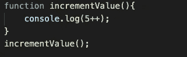

# JavaScript 基础知识测验来测试你的知识

> 原文：<https://javascript.plainenglish.io/javascript-basics-quiz-ec9ccb557ea2?source=collection_archive---------8----------------------->

嘿，大家好！参加这个有趣的测验，检查你对 JavaScript 基础知识的掌握程度。这个测验主要涵盖了操作员。去看看吧！

## **选择以下代码片段的正确输出**

# **代码片段 1:**

Code Snippet 1

a) 1

b)误差

c)正确

南

# **代码片段 2**

Code Snippet 2

a) 6

b) 5

c)未捕获的语法错误

d) 5++

# **代码片段 3**

Code Snippet 3

a) 3，7

b) 3

c) 7

d)语法错误

# **代码片段 4**

Code Snippet 4

a)正确

b)错误

c)语法错误

d)未定义

# **代码片段 5**

Code Snippet 5

a)真实真实真实

b)假真真

c)假假假

d)真假真

# **代码片段 6**

Code Snippet 6

a)真实真实真实

b)假假假

c)假假真

d)真假真

# **代码片段 7**

Code Snippet 7

1、2、3

b)语法错误

c)1.2

d) 2，3

# **代码片段 8**

Code Snippet 8

a)第一

b)类型转换错误

c)年龄

南

# 答案:

代码片段 1: a)

代码片段 2: c)

代码片段 3: c)

代码片段 4: a)

代码片段 5: b)

代码片段 6: c)

代码片段 7: c)

代码片段 8: d)

*更多内容请看*[***plain English . io***](http://plainenglish.io/)