# 面向初学者的 JavaScript 最佳实践

> 原文：<https://javascript.plainenglish.io/javascript-best-practices-for-beginners-c5092ad6465b?source=collection_archive---------6----------------------->

Best Practices in JavaScript that every beginner must know

让我们快速讨论一下使用 JavaScript 时可以遵循的一些最佳实践。我已经介绍了一些我们在日常编程中会经常用到的基本知识。

让我们开始吧。

## 总是使用 let 或 const 定义变量

通过使用`let`或`const`定义变量，我们可以避免如下问题

*   全局变量和名称空间的污染:假设你的应用程序使用了一个全局变量`title`。在代码的其他部分，你再次定义了一个变量`title`(没有`let`或`const`)，但是这个变量是特定于那个函数的，它与全局变量`title`没有任何关系。那么这个`title`变量可能会改变全局值。

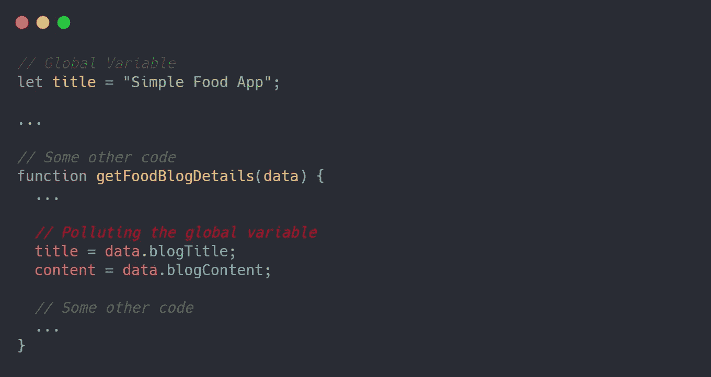

Pollution of global variables

*   如果我们使用`let`或`const`来定义变量，那么变量将被阻塞作用域，这意味着它只对那个代码块可用。因此它不能改变全局变量。

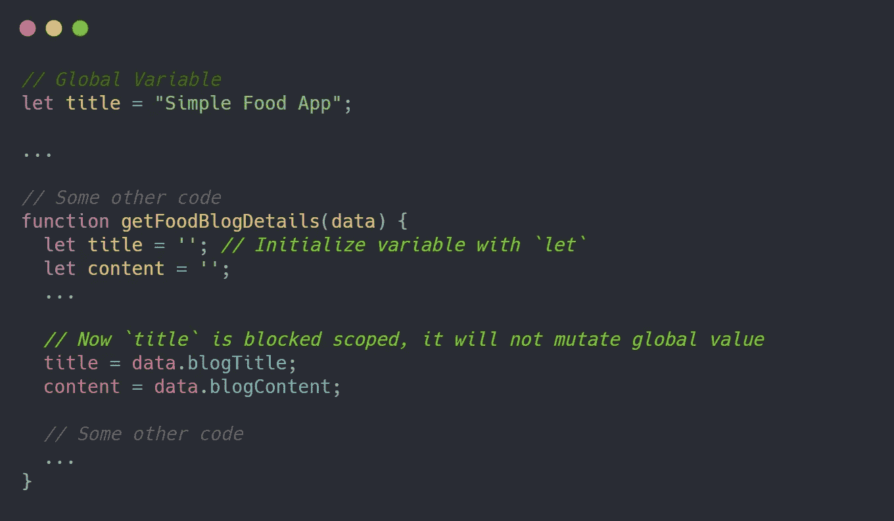

Remediation for pollution of global variables

*   **暴露敏感数据:**假设您将 API 键存储在一个全局变量中(您在没有使用`let`或`const`的情况下定义了这个变量)，那么这个 API 键将被存储在全局对象(`window`)中，任何访问您的站点的人都可以很容易地访问它。

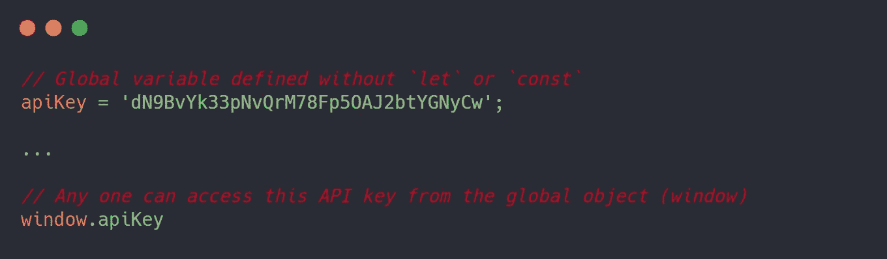

Sensitive data can be accessed from the global object (window)

*   同样，如果我们使用`let`或`const`来定义变量，那么变量将被阻塞，并且不会暴露给全局对象(`window`)。

## 始终正确定义条件

*   如果要检查变量的 falsy 值(`undefined`，`null`，空字符串)，只需使用 NOT 运算符(`!`)，而不是检查每个 falsy 值。

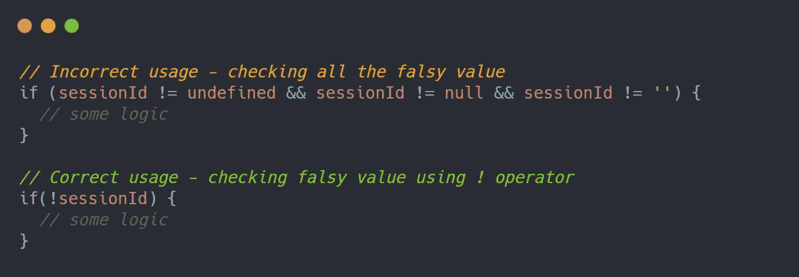

Checking falsy values

*   如果要检查对象中是否存在键/值。您可以使用 AND 运算符(`&&`)安全地逐个检查该键/值是否存在。

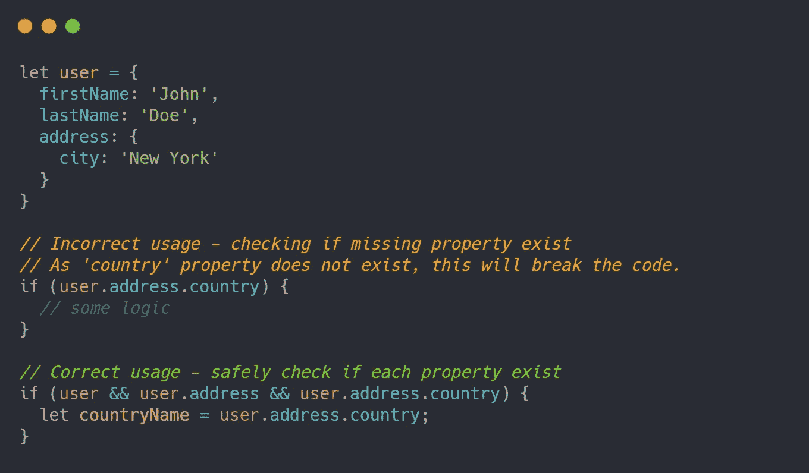

Checking if object key/value exists or not

*   你也可以使用*可选链接*来检查一个键/值是否存在于一个对象中。

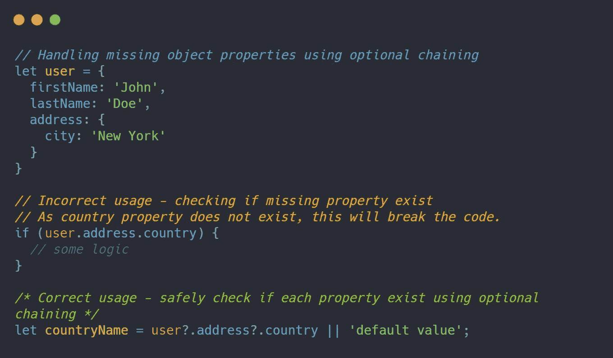

Optional Chaining

## 分号

在我们深入之前，这里有一个活动。你能猜出下面函数的输出是什么吗？

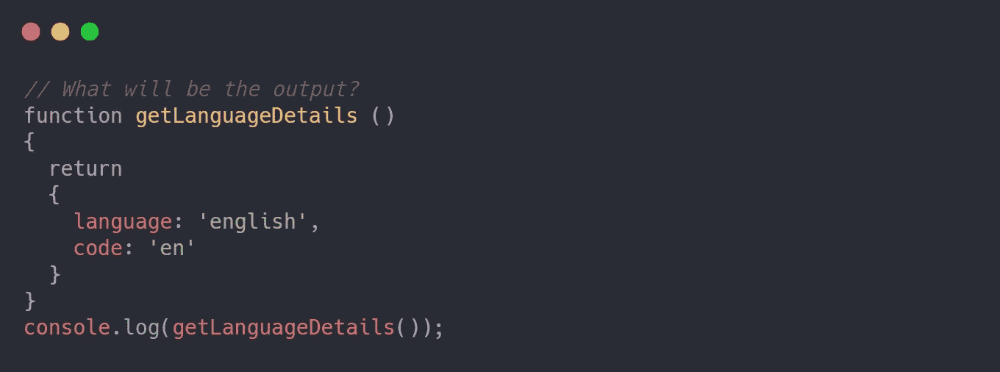

What will be the output of the console?

**回答:**输出会是`undefined`😲。但是怎么做呢？这是因为 JavaScript 引擎在解析代码时会自动插入分号。如果代码没有像上面的例子那样正确格式化，JavaScript 引擎将在返回语句(`return;`)的末尾添加一个分号(`;`)，并认为没有返回值。因此，返回值为`undefined`。

> **自动分号插入(ASI):** 在解析代码的时候，JavaScript 引擎会自动在每个标记的末尾插入一个分号。这有时可能会导致代码出现意外行为。你可以在这里阅读更多相关信息[。](https://developer.mozilla.org/en-US/docs/Web/JavaScript/Reference/Lexical_grammar#automatic_semicolon_insertion)

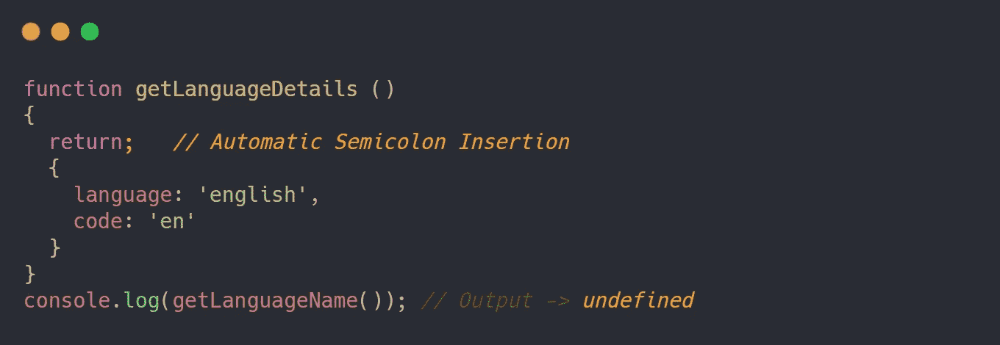

Automatic Semicolon Insertion

还建议在代码的每个语句末尾添加一个分号，以避免 ASI 问题。

## 括号

来自不同编程语言背景的人倾向于从下一行的大括号开始。但是在 JavaScript 中，这可能会导致代码的意外行为。

*   永远不要在下一行开始花括号(`{}`)。由于 ASI，您的代码可能会出现意外行为。

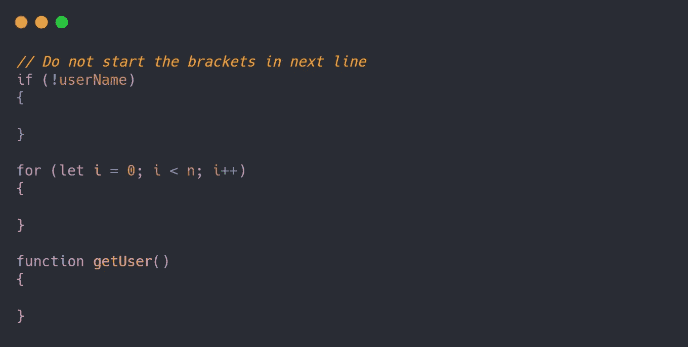

*   总是在语句结束后开始花括号(在同一行)。

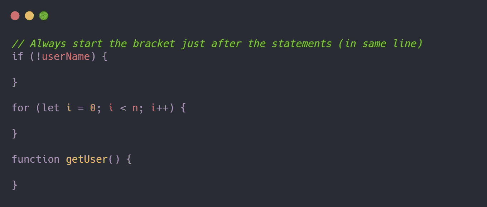

> 我们可以通过使用[更漂亮的](https://prettier.io/)或任何其他格式化工具/库格式化代码来避免这些问题。

## 模板文字

模板文字用于定义字符串值。模板文字用反斜杠(`` ``)括起来，动态值/占位符可以用美元符号``${dynamicValue}``传递。

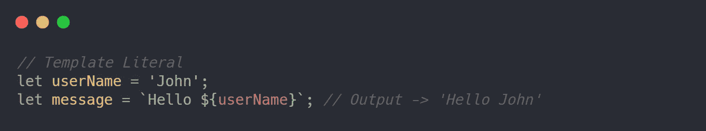

Example for Template Literals

下面是模板文字的一些用例。

*   模板文字可以用来定义动态 HTML 内容。

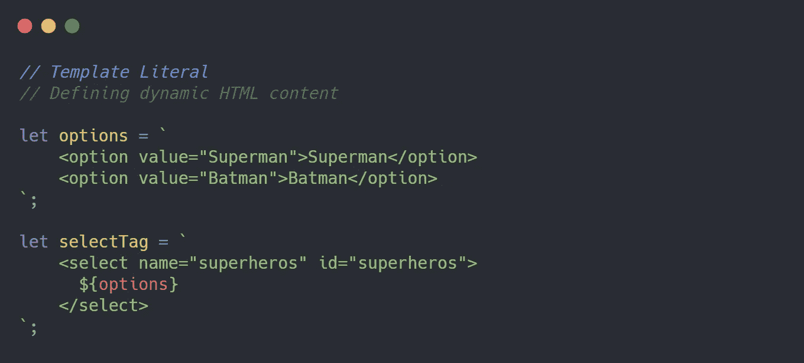

Defining dynamic HTML content using template literals

*   模板文字可以用来定义数据库查询

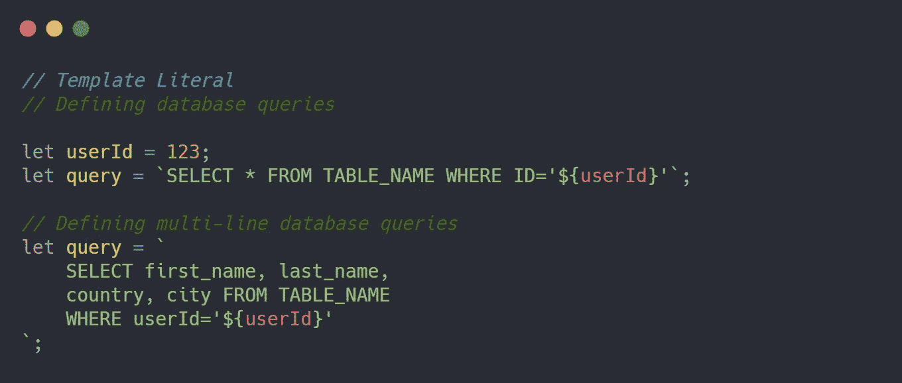

Defining DB queries using template literals

*   模板文字可以用来定义动态短 URL(单行)。

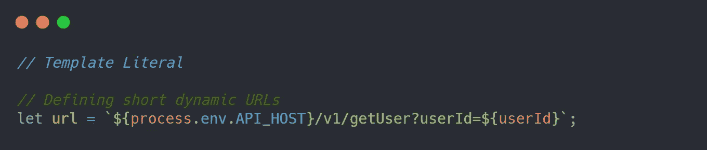

Defining short URLs using template literals

*   **不要使用**模板文字来定义多行的长 URL。因为 API 不支持多行 URL。有很多方法可以在一行中处理多个参数，但是我们不打算在这里全部讨论。

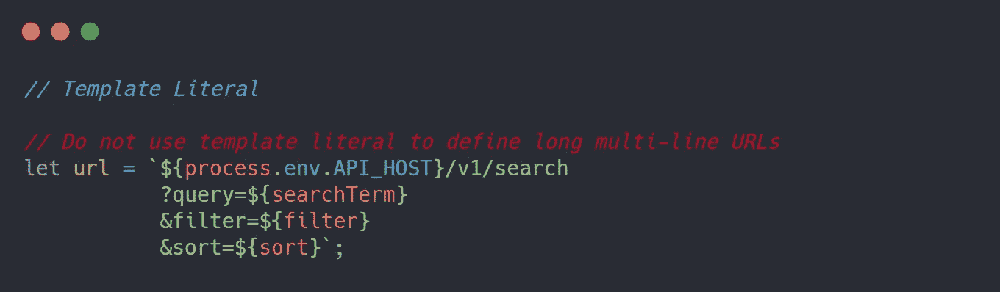

Avoid template literals for long multi-line URLs

> 通过使用 linters 和代码格式化程序，我们可以避免本文中讨论的大多数问题。下面是一些流行的 linters 和代码格式化程序。
> 
> **棉绒** : [ESLint](https://eslint.org/) ， [JSLint](https://www.jslint.com/)
> 
> **编码格式器** : [更漂亮](https://prettier.io/)

这就是我今天的全部内容。希望你喜欢。😉

你也可以看看我写的关于用 JavaScript 命名变量和函数的文章[。](https://medium.com/@syed.afroz.pasha/a-quick-beginners-guide-on-naming-variables-and-functions-in-javascript-d44f31de8012)

谢谢你的来访。如果你喜欢的内容，请支持我，并关注我更多这样的内容。

Support my work by buying me a coffee 😉

在 [LinkedIn](https://www.linkedin.com/in/syedafrozpasha/) 、 [Twitter](https://twitter.com/SyedAfroz_Pasha) 和 [GitHub](https://github.com/SyedAfrozPasha) 上与我联系。

*更多内容请看*[***plain English . io***](http://plainenglish.io)