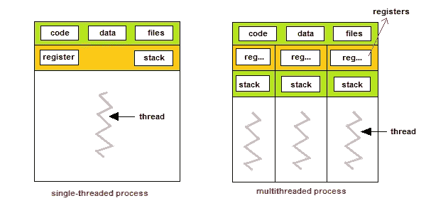
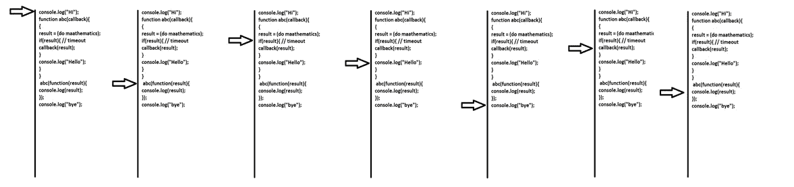

# JavaScript 回调和承诺指南

> 原文：<https://javascript.plainenglish.io/javascript-callback-and-promise-eb0bad91e773?source=collection_archive---------8----------------------->

理解 JavaScript 回调和承诺。


Photo by [Oskar Yildiz](https://unsplash.com/@oskaryil?utm_source=medium&utm_medium=referral) on [Unsplash](https://unsplash.com?utm_source=medium&utm_medium=referral)

## 关于 JavaScript 的一点知识

JavaScript 是一种脚本语言。它可以直接写在网页的 HTML 部分，并在页面加载时自动运行。

## JavaScript 引擎

1.  V8——在 Chrome 和 Opera 中
2.  蜘蛛猴——在火狐浏览器中
3.  IE 的脉轮
4.  ChakraCore for Microsoft Edge
5.  狩猎用硝基鱼和松鼠鱼

## JavaScript 能做什么？

JavaScript 可以做任何其他编程语言能做的事情。但是，*“它的能力很大程度上取决于它运行的环境*。

## *客户端*

1.  *向页面添加新的 HTML，更改现有内容，修改样式。*
2.  *对用户动作做出反应，在鼠标点击、指针移动、按键时运行。*
3.  *通过网络向远程服务器发送请求，下载和上传文件。*
4.  *获取和设置 cookies，向访问者提问，显示消息。*
5.  *记住客户端的数据(“本地存储”)。*

## *服务器端*

1.  *读/写文件。*
2.  *执行网络请求。*
3.  *创建 API。*

## *什么是回调？或者为什么我们需要复试？*

*JavaScript 按自顶向下的顺序运行代码。然而，在某些情况下，代码在其他事情发生之后运行(或者必须运行),并且也不是按顺序运行的。这被称为异步编程。*

**举例:-**

1.  *获取用于 DOM 操作的数据*
2.  *经过复杂的数学计算后得到结果*

## *JavaScript 是单线程编程语言*

**

*Single Thread vs Multi Thread ( IMG 1 )*

## *回调如何工作*

**

*Callback ( IMG 2 )*

## *承诺*

*承诺允许我们在运行下一个代码之前等待某个代码完成执行。*

## *与回调的差异*

*两者之间的区别是当使用回调方法时，我们通常只是将回调传递给一个函数，然后在完成时调用该函数以获得结果。然而，在 Promises 中，您在返回的 Promise 对象上附加回调。*

***回调地狱***

1.  *阅读变得越来越困难(代码开始向两个方向移动——从上到下，然后从左到右)。*
2.  *这变得越来越难管理。*
3.  *当代码被嵌套得更深时，还不清楚发生了什么。*
4.  *我们必须始终确保不会意外地声明与外部作用域中已经声明的变量同名的变量(这称为 [*隐藏*](https://stackoverflow.com/questions/11901427/an-example-of-variable-shadowing-in-javascript) )。*
5.  *我们必须考虑三个不同地点的三个不同的错误。*
6.  *我们甚至不得不重命名每个错误，以确保我们不会掩盖它上面的错误。如果我们最终在这一系列操作中做了额外的请求，我们必须找到额外的变量名，它们不会与上面的作用域中的错误冲突。*

## ***承诺状态***

*   ***待定** —异步操作尚未完成*
*   ***已履行** —操作已完成，承诺有值*
*   ***被拒绝** —操作已完成，但出现错误或失败。*

## *承诺链*

*当我们需要执行一系列异步任务时，承诺链变得非常有用。*

## *承诺方法*

1.  *承诺。所有*
2.  *承诺.比赛*
3.  *承诺。都解决了*
4.  *承诺。任何*

## *承诺。所有*

*当您希望累积一批异步操作并最终以数组形式接收它们的每个值时，满足这一目标的 promise 方法之一是 Promise.all。*

```
*const promise1 = new Promise((resolve) => {resolve([‘apple’, ‘orange’]);});const promise2 = new Promise((resolve) => {resolve([‘grape’, ‘banana’]);});let fruitsArray = [];Promise.all([promise1, promise2]).then(([basket1, basket2]) => {basket1.forEach((fruit) => {fruitsArray.push(fruit);});basket2.forEach((fruit) => {fruitsArray.push(fruit);});console.log(fruitsArray);}).catch((error) => { console.log(error) });*
```

## *承诺.比赛*

*每当 iterable 中的一个承诺用该承诺的值或原因解析或拒绝时，该方法返回一个履行或拒绝的承诺。*

```
*const promise1 = new Promise((resolve) => {setTimeout(() => {resolve(‘some result’)}, 200)})const promise2 = new Promise((resolve, reject) => {reject(new Error(‘some promise2 error’))})Promise.race([promise1, promise2]).then((result) => {console.log(result)}).catch((error) => {console.error(error)})*
```

## *承诺。都解决了*

*Promise.allSettled 方法最终有点类似于 Promise.all，除了不是在一个承诺失败时立即拒绝错误，Promise.allSettled 将返回一个承诺，该承诺最终总是在所有给定承诺都已解决或拒绝后解决，将结果累积到一个数组中，其中每一项都表示其承诺操作的结果。*

```
*const add = (num1, num2) => new Promise((resolve) => resolve(num1 + num2))const multiply = (num1, num2) => new Promise((resolve) => resolve(num1 * num2))const fail = (num1) =>new Promise((resolve, reject) =>setTimeout(() => reject(new Error(‘You, my friend, were too late’)), 200),)const fail2 = (num1) =>new Promise((resolve, reject) =>setTimeout(() => reject(new Error(‘Being late is never a good habit’)),100,),)const promises = [add(2, 4), multiply(5, 5), fail(‘hi’), fail2(‘hello’)]Promise.allSettled(promises).then((result) => {console.log(result)}).catch((error) => {console.error(error)})*
```

## *承诺。任何*

*Promise.any 的结果成为解决的承诺的值。*

```
*const resolved = (num1, num2) => return new Promise((resolve) => resolve(num1 + num2))const rejected = () =>return new Promise((resolve, reject) =>setTimeout(() => reject(new Error(‘You, my friend, were too late’)), 200),)const promises = [rejected(), rejected(), resolved(1, 2), rejected(), rejected(), rejected()]
 Promise.any(promises).then((result) => {console.log(result) // result: 4}).catch((error) => {console.error(error)})*
```

## *定制承诺*

*演示承诺如何工作的示例代码。*

```
*var CustomPromise = function (callback) {
 this.then = function (resolver, rejector) {
 // sucsuss metod
 callback(resolver);
 }
}function demopromise() {
 return new CustomPromise(function (resolve, reject) {
 setTimeout(function () {
 resolve(“This is resolved data”);
 }, 3000)
 })
}demopromise().then(function (resolvedData) {
 console.log(resolvedData);
})*
```

## *摘要*

*   *JavaScript 是什么？*
*   *JavaScript 引擎。*
*   *JavaScript 能做什么。*
*   *什么是回调？*
*   *为什么我们需要复试？*
*   *什么是单线程编程？*
*   *什么是多线程编程？*
*   *回调是如何工作的。*
*   *承诺优于回拨。*
*   *许诺方法。*
*   *创造我们自己的承诺。*

**更多内容尽在*[*plain English . io*](http://plainenglish.io/)*