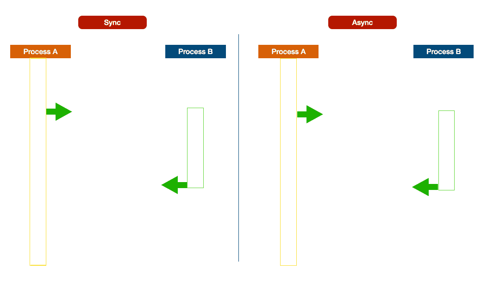
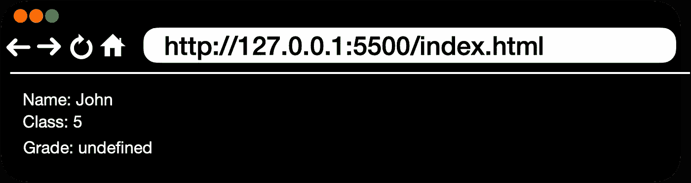

# 掌握 Javascript 中的异步代码:回调、承诺和异步/等待指南

> 原文：<https://javascript.plainenglish.io/javascript-callbacks-promises-async-await-3eb835ed76b2?source=collection_archive---------16----------------------->

JavaScript 最重要的特性之一是支持异步编程。JavaScript 提供了几种处理异步代码的方法，包括回调、承诺和 async/await。在本文中，我们将探索这些方法，并学习如何有效地使用它们。

## 同步/异步

在同步编程中，父进程将等待子进程完成后再继续。相反，在异步模式下，父进程不会等待子进程完成。

Sync — Async

## 异步的优点和缺点

异步编程的好处是您可以运行多个进程，而无需相互等待。

另一方面，也有一个缺点:如果操作之间存在依赖关系，则相关流程可能会在完成相关流程之前运行。

我用一个简单的例子来解释一下。假设您需要显示学生的详细信息，这涉及两个操作，

*   获取分数(子过程)—它在 2 秒钟内完成
*   显示学生数据(主流程)—它在 1 秒钟内完成

**输出:**

*成绩*显示为*未定义*的原因是 ***显示学生数据*** 在 ***计算成绩*** 完成之前完成。

如何解决这个问题？你答对了，答案是**回调**

## **回调**

回调是作为参数传递给另一个函数的函数。当父方法依赖于子方法返回时，回调是控制异步调用的方法。

对于我们的例子，***displayStudentData***是依赖于***calculated grade***返回。***displayStudentData***可以传递给***calculate grade***作为回调，在成绩计算后调用。

现在，由于回调，分数细节将按预期显示。

**输出:**

## 回调地狱

当我们有一个异步调用时，回调是好的。但是你不能在函数中停止现实世界中的多个异步调用。当你进行大量的回调时，你的代码会变得混乱和难以阅读。在 JavaScript 中，当有多个回调**时，我们称之为回调地狱。**

如何解决这个问题？你答对了，答案是**承诺**

## 承诺

ES6 中引入了更优雅地处理异步编程的承诺。

在我们的示例中，我们可以将 ***calculateGrade*** 更改为 return Promise，并在 ***calculateGrade 被*** 解析后调用 **displayStudentData** 。

***注意:*** *为了简单起见，我在上面的代码中没有处理 reject。*

**输出:**

## 异步/等待

Async / Await 是处理来自**承诺**的响应的另一种方式。

要使用*等待*，该功能应声明为*同步*。下面的代码将解释如何使用 Async / Await 来处理承诺。

**输出:**

> 总之，回调、承诺和异步/等待是 Javascript 开发世界中的三个基本概念。它们各有优缺点，用于以不同的方式处理异步代码。虽然回调是引入的第一个概念，但 promises 和 async/await 是显著的改进，使 Javascript 中的异步代码更易于管理、可读和高效。

*更多内容请看*[***plain English . io***](https://plainenglish.io/)*。*

*报名参加我们的* [***免费每周简讯***](http://newsletter.plainenglish.io/) *。关注我们关于*[***Twitter***](https://twitter.com/inPlainEngHQ)[***LinkedIn***](https://www.linkedin.com/company/inplainenglish/)*[***YouTube***](https://www.youtube.com/channel/UCtipWUghju290NWcn8jhyAw)*和* [***不和***](https://discord.gg/GtDtUAvyhW) *****

****有兴趣缩放你的软件启动*** *？检查* [***电路***](https://circuit.ooo?utm=publication-post-cta) *。**