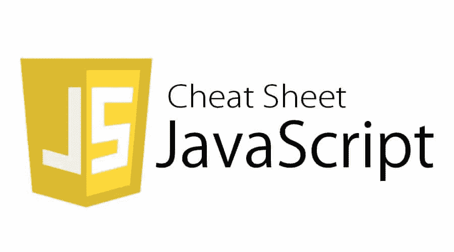

# 涵盖所有基础知识的 JavaScript 初学者备忘单

> 原文：<https://javascript.plainenglish.io/javascript-cheatsheet-fe4820a5a485?source=collection_archive---------13----------------------->

# JavaScript 基础知识

JavaScript 基本语法集，用于在 JavaScript 中添加、执行和编写基本编程范例。



# 页面脚本

向 HTML 添加内部 JavaScript

```
<script type="text/javascript"> //JS code goes here </script>
```

# 外部 JS 文件

向 HTML 添加外部 JavaScript

```
<script src="filename.js"></script>
```

# 功能

JavaScript 函数语法

```
function nameOfFunction () {
// function body 
}
```

# DOM 元素

更改 DOM 元素的内容

```
document.getElementById("elementID").innerHTML = "Hello World!";
```

# 输出

这将在 JavaScript 控制台中打印出`a`的值

```
console.log(a);
```

# 条件语句

条件语句用于根据某些条件执行操作。

# 如果语句

当指定的条件为真时，要执行的代码块。

```
if (condition) {
// block of code to be executed if the condition is true
}
```

# If-else 语句

如果 If 块的条件为假，那么将执行 else 块。

```
if (condition) {
// block of code to be executed if the condition is true
} else {
// block of code to be executed if the condition is false
}
```

# Else-if 语句

一个基本的 if-else 阶梯

```
if (condition1) {
// block of code to be executed if condition1 is true
} else if (condition2) {
// block of code to be executed if the condition1 is false and condition2 is true
} else {
// block of code to be executed if the condition1 is false and condition2 is false
}
```

# 交换语句

JavaScript 中的 Switch case 语句

```
switch(expression) {
case x:
// code block
break;
case y:
// code block
break;
default:
// code block
}
```

# 迭代语句(循环)

迭代语句便于程序员重复执行任何代码行块，并且可以根据程序员添加的条件进行控制。

# For 循环

JavaScript 中的 For 循环语法

```
for (statement 1; statement 2; statement 3) {
// code block to be executed
}
```

# While 循环

运行代码，直到指定的条件为真

```
while (condition) {
// code block to be executed
}
```

# Do-While 循环

不管条件是真还是假，do-while 循环至少执行一次

```
do {
// run this code in block
i++;
} while (condition);
```

# 用线串

字符串是用于存储和管理文本数据的字符序列。

# charAt 方法

返回指定索引中的字符。

```
charAt()
```

# concat 方法

将两个或多个字符串连接在一起。

```
concat()
```

# 方法索引

返回字符串中指定字符的第一个匹配项的索引。

```
indexOf()
```

# 匹配方法

在字符串中搜索与正则表达式匹配的内容。

```
match()
```

# 替换方法

在字符串中搜索与指定字符串或字符的匹配项，并通过替换指定值返回新字符串。

```
replace()
```

# 搜索方法

根据指定值搜索字符串。

```
search()
```

# 拆分方法

将字符串拆分成由子字符串组成的数组。

```
split()
```

# 子串方法

返回包含指定索引中的字符的字符串的子字符串。

```
substring()
```

# 数组

数组是同一类型数据项的集合。简单来说就是一个包含多个值的变量。

# 可变的

存储数据的容器。

```
var fruit = ["element1", "element2", "element3"];
```

# concat 方法

将两个或多个数组连接在一起。

```
concat()
```

# indexOf 方法

从数组中返回指定项的索引。

```
indexOf()
```

# 连接方法

将数组元素转换为字符串。

```
join()
```

# pop 方法

删除数组的最后一个元素。

```
pop()
```

# 反向方法

此方法反转数组元素的顺序。

```
reverse()
```

# 排序方法

以指定的方式对数组元素进行排序。

```
sort()
```

# toString 方法

将数组元素转换为字符串。

```
toString()
```

# 方法的值

返回保存传递的参数值的相关数字对象

```
valueOf()
```

# 数字方法

JS math 和 number 对象提供了几个常量和方法来执行数学运算。

# to 指数法

将数字转换为指数形式。

```
toExponential()
```

# 最高精确度方法

将数字格式化为指定的长度。

```
toPrecision()
```

# toString 方法

将对象转换为字符串

```
toString()
```

# 方法的值

返回一个数字的原始值。

```
valueOf()
```

# 数学方法

# 天花板法

将一个数字向上舍入到最接近的整数，并返回结果

```
ceil(x)
```

# exp 方法

返回 E^x.的值

```
exp(x)
```

# 对数方法

返回 x 的对数值。

```
log(x)
```

# 功率方法

返回 x 的 y 次方值。

```
pow(x,y)
```

# 随机方法

返回一个介于 0 和 1 之间的随机数。

```
random()
```

# sqrt 方法

返回数字 x 的平方根

```
sqrt(x)
```

# 日期

Date 对象用于获取年、月和日。它有获取和设置日、月、年、小时、分钟和秒的方法。

# 从日期对象中提取日期

从 date 对象返回日期

```
getDate()
```

# 从日期对象中提取日期

从 date 对象返回日期

```
getDay()
```

# 从日期对象中提取小时

从 date 对象返回小时

```
getHours()
```

# 从日期对象中提取分钟

从 date 对象返回分钟

```
getMinutes()
```

# 从日期对象中提取秒

从 date 对象返回秒

```
getSeconds()
```

# 从日期对象中提取时间

从 date 对象返回时间

```
getTime()
```

# 鼠标事件

对象状态的任何变化都称为事件。在 JS 的帮助下，您可以处理事件，即当用户做某事时，任何特定的 HTML 标记将如何工作。

# 点击

单击元素时激发

```
element.addEventListener('click', ()=>{
// Code to be executed when the event is fired
});
```

# oncontextmenu

右键单击元素时激发

```
element.addEventListener('contextmenu', ()=>{
// Code to be executed when the event is fired
});
```

# dblclick

双击元素时激发

```
element.addEventListener('dblclick', ()=>{
// Code to be executed when the event is fired
});
```

# 鼠标输入

当用鼠标箭头输入元素时激发

```
element.addEventListener('mouseenter', ()=>{
// Code to be executed when the event is fired
});
```

# 老鼠离开

当元素被鼠标箭头退出时激发

```
element.addEventListener('mouseleave', ()=>{
// Code to be executed when the event is fired
});
```

# 鼠标移动

当鼠标在元素中移动时激发

```
element.addEventListener('mousemove', ()=>{
// Code to be executed when the event is fired
});
```

# 键盘事件

# 按键

当用户按下键盘上的一个键时激发

```
element.addEventListener('keydown', ()=>{
// Code to be executed when the event is fired
});
```

# 按键

当用户按下键盘上的键时激发

```
element.addEventListener('keypress', ()=>{
// Code to be executed when the event is fired
});
```

# 击键

当用户释放键盘上的一个键时激发

```
element.addEventListener('keyup', ()=>{
// Code to be executed when the event is fired
});
```

# 错误

每当编译器或解释器在代码中发现任何错误时都会抛出错误，错误可以是任何类型的，如语法错误、运行时错误、逻辑错误等。JS 提供了一些函数来处理这些错误。

# 试着抓住

当抛出 err 时，尝试代码块并执行 catch

```
try {
Block of code to try
}
catch(err) {
Block of code to handle errors
}
```

# 窗口方法

窗口对象中可用的方法

# 警报方法

用来提醒屏幕上的某些东西

```
alert()
```

# 模糊方法

blur()方法将焦点从当前窗口移开。

```
blur()
```

# 设置间隔

以一定的时间间隔持续执行代码

```
setInterval(() => {
// Code to be executed
}, 1000);
```

# 设置超时

在一定的时间间隔后执行代码

```
setTimeout(() => {
// Code to be executed
}, 1000);
```

# 关闭

窗户。close()方法关闭当前窗口

```
window.close()
```

# 确认

window.confirm()指示浏览器显示一个带有可选消息的对话框，并等待用户确认或取消

```
window.confirm('Are you sure?')
```

# 打开

打开一个新窗口

```
window.open("https://www.codewithharry.com");
```

# 提示

用文本提示用户并接受一个值。第二个参数是默认值

```
var name = prompt("What is your name?", "Harry");
```

# scrollBy

```
window.scrollBy(100, 0); // Scroll 100px to the right
```

# scrollTo

将文档滚动到指定的坐标。

```
window.scrollTo(500, 0); // Scroll to horizontal position 50
```

# 间隙

清除 setInterval。var 是 setInterval 调用返回的值

```
clearInterval(var)
```

# 清除超时

清除 setTimeout。var 是 setTimeout 调用返回的值

```
clearTimeout(var)
```

# 停止

停止进一步的资源加载

```
stop()
```

# 查询/获取元素

每当加载网页时，浏览器创建一个 DOM(文档对象模型),在 HTML DOM 的帮助下，可以访问和修改 HTML 文档的所有元素。

# 查询选择器

选择器，用于选择第一匹配元素

```
document.querySelector('css-selectors')
```

# querySelectorAll

选择所有匹配元素的选择器

```
document.querySelectorAll('css-selectors', ...)
```

# getElementsByTagName

按标记名选择元素

```
document.getElementsByTagName('element-name')
```

# getElementsByClassName

按类名选择元素

```
document.getElementsByClassName('class-name')
```

# 按 Id 获取元素

按 id 选择元素

```
document.getElementById('id')
```

# 创建元素

在 DOM 中创建新的元素

# createElement

创建新元素

```
document.createElement('div')
```

# createTextNode

创建新的文本节点

```
document.createTextNode('some text here')
```

*更多内容看* [***说白了. io***](http://plainenglish.io/)