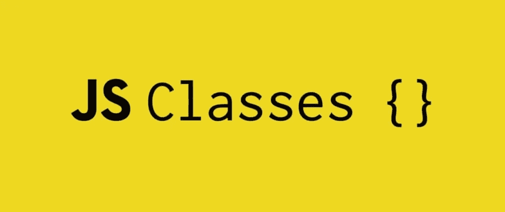
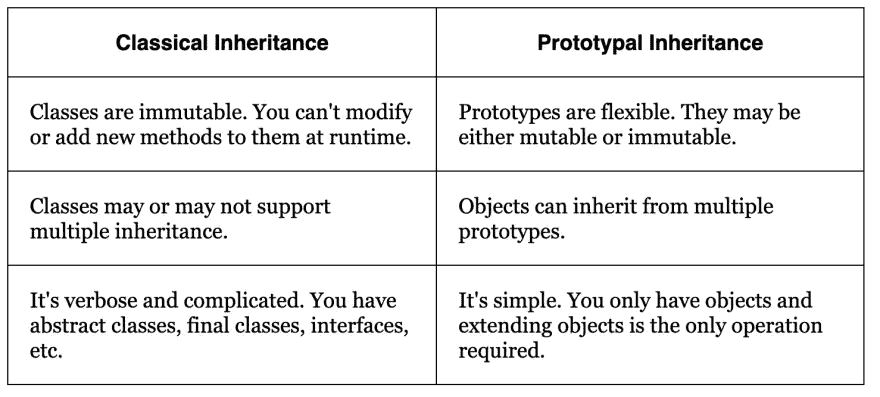

# JavaScript 类:基础知识

> 原文：<https://javascript.plainenglish.io/javascript-classes-the-basics-a9c95841a2c3?source=collection_archive---------9----------------------->



JavaScript 类是一种使用`Class`关键字声明的函数。类可以有实例*、*，这是创建自身副本的能力，每个`class`可以包含唯一的属性，通常在创建实例时设置。虽然我们可以使用`new function`创建许多对象，但是`class`提供了对面向对象编程有用的强大特性。

## 语法✍🏼

类的基本语法是:

```
class ExampleClass {
  constructor () { }
  method() { }
  another method() { }
  ...
}
```

构造函数是为`class`定义唯一属性的地方，并为每个新实例创建唯一属性。然后我们可以使用`new ExampleClass()`来创建一个新的对象及其方法。

比如说:

```
class ExampleClass { 
  constructor(title) { 
    this.title = title; 
  }   yourTitle() { 
    alert(this.title);
  } 
} let example = new Example(“First”); example.yourTitle();
```

坚持住。让我们首先揭开什么是真正的类！

`class ExampleClass {...}`真正做的是创建一个名为`ExampleClass`的函数，并将任何类方法存储在`ExampleClass.prototype`中。所以当我们调用`yourTitle()`方法时，它取自`prototype`。

让我们退一步来谈谈 JavaScript 中的`prototype`是什么。
JavaScript 对象可以有一个`prototype`对象，从中继承方法和属性。

那么上面的代码中发生了什么呢？让我们来分解一下:

*   `class ExampleClass`是一个**函数**(class 关键字更多的是语法上的甜言蜜语，你将在下一行看到为什么`ExampleClass`实际上是什么)**。**
*   `ExampleClass`更确切地说是构造函数方法(`ExampleClass === ExampleClass.prototype.constructor // true)`)。
*   该类的方法在`ExampleClass.prototype`中

## 静态方法⌛

说到方法，我们可以访问类中的`static`方法。这些方法不能在类的实例上调用，但是它们应该在类本身上调用。为什么使用它们？它们通常被用作创建或克隆对象的函数。

## 继承:阶级与原型⚔️

类从类继承，因此创建子类关系。这意味着类继承使用原型链将子`Constructor.prototype`连接到父`Constructor.prototype`。而对于原型继承，对象从对象继承。这允许容易的选择性继承，因为可以从不同的源对象创建实例。因此，最好使用原型继承，因为涉及的类越多，类继承就会变得非常复杂和抽象。

看一下这张包含两者关键方面的表格:



Source: dev.to

## 这👈🏼

JavaScript 有一个动态的 T2。这意味着它依赖于调用它的上下文。需要注意的是，如果一个对象方法在另一个上下文中被传递和调用，`this`将不再是对它的对象的引用。

在任何函数之外，`this`指的是全局对象，而在函数内部，`this`的值取决于函数是如何被调用的。

因为类和函数基本上是相同的东西，所以`this`的行为在两者中是相似的。

就一个`class` `constructor`而言，`this`指的是一个规则的物体。

所以，是的，类被称为“语法糖”,但对于面向对象编程来说是很棒的。它们是创建对象和保存数据以及处理这些数据的代码的绝佳模板。

我希望这能让您对 JavaScript 类有所了解，并且在使用它们时能够轻松自如！

*更多内容请看*[*plain English . io*](http://plainenglish.io/)