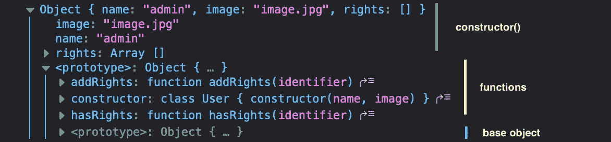
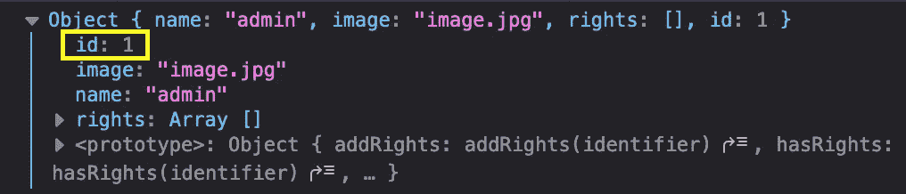

# 没有语法糖的 JavaScript 类

> 原文：<https://javascript.plainenglish.io/javascript-classes-without-the-syntactical-sugar-f894e4cf78b8?source=collection_archive---------13----------------------->

JavaScript 不是基于类的语言，它是基于对象(原型)的。但是我们可以和班级一起工作，对吗？所以问题是——这是怎么做到的？


这项新功能是随 JavaScript 的 ECMAScript 2015 版本一起发布的。对于那些喜欢使用类的人来说，这是语法上的糖。

下面你会看到一个简单的类，我们会看看，这个类的各个部分是如何在没有类语法的情况下实现的。

```
class User {
  constructor(name, image) {
    this.name = name;
    this.image = image;
    this.rights = [];
  } 

  addRights(identifier) {
    this.rights.push(identifier);
  }

  hasRights(identifier) {
    return this.rights.includes(identifier);
  }
}const user = new User('admin', 'image.jpg');
console.log(user);
```

例如，如果您在 [codepen.io](http://codepen.io) 上运行上面的代码，并在开发工具中打开控制台，您会看到下面的输出。



*用户*对象保存我们在类的*构造函数()*中初始化的属性。*用户*对象继承了一个包含我们类的函数的对象，这个对象继承了全局*对象的所有东西。*

让我们在没有类语法的情况下构建它…

首先，我们构建一个构造函数。这些是“普通的”函数，当它们被前缀 new 调用时，它们就变成了构造函数。

我们遵循惯例，用大写字母书写函数名。

*this* 关键字指的是我们调用 new User()时用这个函数创建的对象。

```
function User(name, image) {
 this.name = name;
 this.image = image;
 this.rights = [];
}
```

我们将方法添加到 *User.prototype* 中，这样我们从用户构造函数中创建的每个对象都将继承我们预定义的方法。

将方法附加到我们的 *User.prototype* 确保我们对于从我们的 *User* 构造函数创建的所有对象只有一个它们的副本。

```
User.prototype.addRights = function (identifier) {
  this.rights.push(identifier);
};User.prototype.hasRights = function (identifier) {
  return this.rights.includes(identifier);
};
```

使用 new 关键字，我们创建一个新的 User 实例，方法与之前使用 class 语法时相同。

```
const user = new User("admin", "image.jpg");console.dir(user);
// same output as above in the screenshot
```

我们现在可以用同样的方式处理这个用户对象，就像我们用类语法创建它一样。

```
user.addRights('super-admin');
const hasSuperAdminRights = user.hasRights('super-admin');console.log(hasSuperAdminRights);
// outputs: > true
```

## 从另一个类继承功能

我们创建了一个新类 BaseUser，并用 BaseUser 扩展了 User。

```
**class BaseUser {
  constructor() {
    this.id;
  }
}**class User **extends BaseUser** {
  constructor(name, image) {
    super();

    this.name = name;
    this.image = image;
    this.rights = [];
  } 

  addRights(identifier) {
    this.rights.push(identifier);
  }

  hasRights(identifier) {
    return this.rights.includes(identifier);
  }
}
```

我们如何用我们的原型方法实现这一点？

```
**function BaseUser() {
  this.id;
}**function User(name, image) {
  BaseUser.call(this);
  this.name = name;
  this.image = image;
  this.rights = [];
}**User.prototype = BaseUser.prototype;**User.prototype.addRights = function (identifier) {
  this.rights.push(identifier);
};User.prototype.hasRights = function (identifier) {
  return this.rights.includes(identifier);
};
```

现在，我们可以在用户对象中使用新的属性 id

```
const user = new User(“admin”, “image.jpg”);
user.id = 1;console.dir(user);
```



我希望您喜欢这篇文章，并在使用类时更好地理解 JavaScript 是如何工作的。

感谢您的反馈，请随意开始对话并发表评论。:)

*更多内容请看*[*plain English . io*](http://plainenglish.io/)