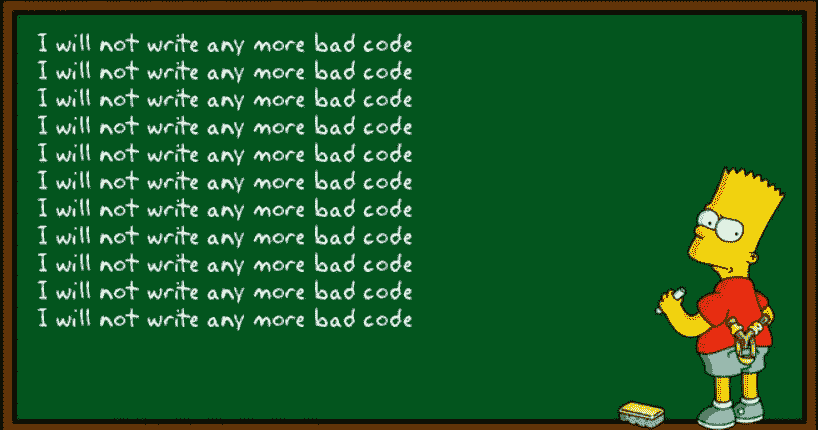
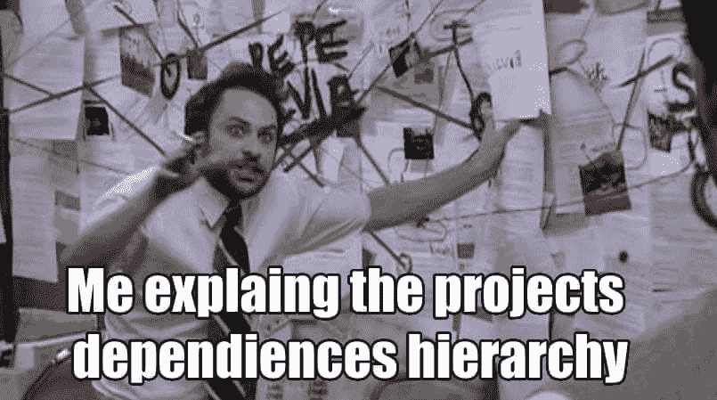
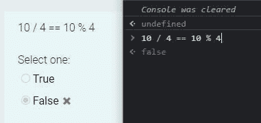

# 简单的 JavaScript 干净代码技巧和最佳实践

> 原文：<https://javascript.plainenglish.io/javascript-clean-code-tips-good-practices-f239b148523c?source=collection_archive---------1----------------------->



代码应该以这样一种方式编写，即自我解释、易于理解、易于修改或扩展新功能。因为代码读的比写的多，这就是为什么如此强调干净的代码。

我们的源代码越易读:

*   越容易维护
*   新开发人员理解实现所需的时间越少
*   就越容易发现哪些代码可以重用

在这篇博文中，我将分享一些我长期以来采用的通用干净编码原则，以及一些特定于 JavaScript 的干净代码实践。

# 0.命名

不要把命名变成谜语游戏。给你的变量和函数命名时，要揭示出最初创建它们的意图。

这样，如果有新的开发人员加入团队，他们就变得可以搜索，也更容易理解。

**糟糕👎**

```
let x = 10;let y = new Date().getFullYear();if (x > 30) {
 //…
}if (y — x >1990) {
 //…
}
```

**好👍**

```
let userAge = 30;let currentYear = new Date().getFullYear();if (userAge > 30) {
    //...
}if (currentYear - userAge >1990) {
    //...
}
```


另外，不要在变量名或函数名中添加多余的字母。

**糟糕👎**

```
let nameValue;
function theProduct();
```

**好👍**

```
let name;
function product();
```

# 1.条件式

避免否定条件句。消极比积极更难理解。

**不好👎**

```
if (!userExist(user)) {
  //...
}
```

**好👍**

```
if (userExist(user)) {
  //...
}
```

# 2.函数应该做一件事

**函数的平均行数不应超过 30 行(不包括空格和注释)**。函数越小，越容易理解和重构。试着确保你的函数要么修改，要么查询，但不能两者都做。

# 3.使用默认参数

使用默认参数，而不是短路或条件。

默认参数通常比短路更简洁。请记住，如果您使用它们，您的函数将只为未定义的参数提供默认值。其他 *falsy* 值，如“，”、false、null、0 和 NaN，将不会被替换为默认值。

**不好👎**

```
function getUserData(name) {
  const userName = userName || "Patrick Collision";
  // ...
}
```

**好👍**

```
function getUserData(name = "Patrick Collision") {
  // ...
}
```

# 4.单一抽象级别(SLA)

在编写任何函数时，如果你有不止一个抽象层次，你的函数通常会做不止一件事。将一个较大的功能划分为多个功能，可以提高可重用性，并简化测试。

> *职能要做一件事。他们应该做好这件事。他们应该只做这件事。——罗伯特·马丁*


**糟糕👎**

```
function checkSomething(statement) {
  const REGEXES = [
    // ...
  ];const statements = statement.split(" ");
  const tokens = [];
  REGEXES.forEach(REGEX => {
    statements.forEach(statement => {
      // ...
    });
  });const names= [];
  tokens.forEach(token => {
    // lex...
  });names.forEach(node => {
    // parse...
  });
}
```

**好👍**

```
function checkSomething(statement) {
  const tokens = tokenize(statement);
  const syntaxTree = parse(tokens);
  syntaxTree.forEach(node => {
    // parse...
  });
}function tokenize(code) {
  const REGEXES = [
    // ...
  ];const statements = code.split(" ");
  const tokens = [];
  REGEXES.forEach(REGEX => {
    statements.forEach(statement => {
      tokens.push(/* ... */);
    });
  });return tokens;
}function parse(tokens) {
  const syntaxTree = [];
  tokens.forEach(token => {
    syntaxTree.push(/* ... */);
  });return syntaxTree;
}
```

# 5.不要忽略捕获的错误

对捕获的错误不做任何事情并不能让您修复或应对特定的错误。

将错误记录到控制台(console.log)并没有好到哪里去，因为它经常会在打印到控制台的其他内容中丢失。

如果您在 try/catch 中包装了任何一点代码，这意味着您认为那里可能会发生错误，因此您应该对错误的发生有一个计划。

**糟糕👎**

```
try {
  functionThatMightThrow();
} catch (error) {
  console.log(error);
}
```

**好👍**

```
try {
  functionThatMightThrow();
} catch (error) {
  notifyUserOfError(error);   
  reportErrorToService(error);   
}
```

# 6.最小化评论

**只注释有业务逻辑复杂度的那部分代码**。注释不是必需的。好的代码通常会记录自己。

**糟糕👎**

```
function hashing(data) {
  // The hash
  let hash = 0;// Length of string
  const length = data.length;// Loop through every character in data
  for (let i = 0; i < length; i++) {
    // Get character code.
    const char = data.charCodeAt(i);
    // Make the hash
    hash = (hash << 5) - hash + char;
    // Convert to 32-bit integer
    hash &= hash;
  }
}
```

**好👍**

```
function hashing(data) {
  let hash = 0;
  const length = data.length;for (let i = 0; i < length; i++) {
    const char = data.charCodeAt(i);
    hash = (hash << 5) - hash + char;// Convert to 32-bit integer
    hash &= hash;
  }
}
```

> *“多余的评论只是收集谎言和误传的地方。”―罗伯特·马丁*

# 7.移除注释代码

**不要把注释掉的代码留在你的代码库中**，版本控制的存在是有原因的。在你的历史中留下旧代码。如果你需要它们，从你的 git 历史中捡起来。

**不好👎**

```
doSomething();
// doOtherStuff();
// doSomeMoreStuff();
// doSoMuchStuff();
```

**好👍**

```
doSomething();
```

# 8.仅导入您需要的内容

ES6 引入了析构。它使得将数组中的值或对象中的属性解包到不同的变量中成为可能。您可以将它用于任何类型的对象或模块。

例如，如果您只需要从另一个模块运行`add()`和`subtract()`:

**不好👎**

```
const calculate = require('./calculations')calculate.add(4,2);
calculate.subtract(4,2);
```

**好👍**

```
const { add, subtract } = require('./calculations')add(4,2);
subtract(4,2);
```

只导入文件中需要使用的函数而不是整个模块，然后从其中访问特定的函数是有意义的。



# 9.将函数参数保持在 3 个或更少(理想情况下)

限制函数参数的数量非常重要，因为这使得测试函数更加容易。拥有三个以上的参数会导致您用每个单独的参数测试大量不同的情况。

1-3 个参数是最理想的情况，如果可能的话，应该避免以上任何情况。

通常，如果你有三个以上的参数，那么你的函数会做得太多。这最终导致违反 SRP(单一责任原则)。

# 10.使用数组展开来复制数组。

严重的👎

```
const len = items.length;
const itemsCopy = [];
let i;for (i = 0; i < len; i += 1) {
  itemsCopy[i] = items[i];
}
```

好的👍

```
const itemsCopy = [...items];
```

# 11.编写线性代码

嵌套代码很难理解。**总是尽可能多写线性代码**。它使我们的代码简单、干净、易于阅读和维护，从而使开发人员的生活更加轻松。

例如，**在回调上使用承诺可以增加数倍的可读性**。

# 12.使用 ESLint 和更漂亮

总是使用 ESLint 和更漂亮的来在团队和开发人员之间强制通用的编码风格。

还可以尝试使用 JavaScript 的最新特性来编写代码，比如析构、扩展操作符、异步等待、模板文字、可选链接等等。

# 13.使用正确的括号

使用运算符时，请用括号将它们括起来。唯一的例外是标准算术运算符:+、-和 **，因为它们的优先级被广泛理解。强烈建议用括号将/、*和%括起来，因为当它们一起使用时，它们的优先级可能会不明确。

这提高了可读性，并阐明了开发人员的意图。

严重的👎

```
const foo = a && b < 0 || c > 0 || d + 1 === 0;if (a || b && c) {
  return d;
}
```

好的👍

```
const foo = (a && b < 0) || c > 0 || (d + 1 === 0);if (a || (b && c)) {
  return d;
}
```

确保您的代码不会导致这样的情况:



# 14.提前从函数中返回

为了避免 if 语句的深度嵌套，总是尽早返回一个函数的值。

严重的👎

```
function isPercentage(val) {
  if (val >= 0) {
    if (val < 100) {
      return true;
    } else {
      return false;
    }
  } else {
    return false;
  }
}
```

好的👍

```
function isPercentage(val) {
  if (val < 0) {
    return false;
  }if (val > 100) {
    return false;
  }return true;
}
```

这个特殊的例子甚至可以进一步改进:

```
function isPercentage(val) {
  var isInRange = (val >= 0 && val <= 100);
  return isInRange;
}
```

类似地，同样的事情也可以应用于循环。

在大的循环中循环肯定会消耗很多时间。这就是为什么你应该总是尽可能早地尝试跳出一个循环。

# 结论

在开发社区中有一种说法，你应该像下一个开发人员是连环杀手一样编写你的代码。

遵循这条规则，我在这里分享了 15 个小技巧，当你的开发伙伴检查你的代码时，这些小技巧可以(很可能)把你从他们那里解救出来。

如果你发现任何更新或更正来改进这 15 条建议，或者想添加一条你认为有用的建议，请在评论中分享。

对于进一步的阅读，我强烈建议你浏览以下三个资源:

*   [Airbnb JS 风格指南](https://github.com/airbnb/javascript)
*   [谷歌 JS 风格指南](https://google.github.io/styleguide/jsguide.html)
*   [Javascript 清理代码](https://github.com/ryanmcdermott/clean-code-javascript)

*最初发布于*[*apoorvtyagi . tech*](https://apoorvtyagi.tech/javascript-clean-code-tips-and-good-practices)

*更多内容看* [***说白了. io***](http://plainenglish.io/)