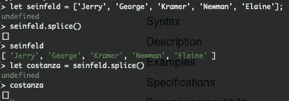

# 编码问题中使用的 JavaScript 常用方法(第 1 部分)

> 原文：<https://javascript.plainenglish.io/javascript-common-methods-used-in-coding-questions-part-1-slice-splice-with-tv-shows-a6ddac093f83?source=collection_archive---------7----------------------->

## 切片和拼接(电视角色示例)

数组和字符串是你在技术面试中会发现的最基本的东西(尤其是对于入门级)。我在在线评估中遇到过一些与数组和字符串相关的问题。处理这些问题最常见的方式是使用`slice`、`splice`、`substr`或`substring`。我为这篇文章选择这个主题是因为我不断地发现自己处于这样一个位置，我仍然必须一个接一个地搜索所有这些方法，直到我弄清楚如何使用它们。如果你正在读这篇文章，我相信你可能也和我一样。


Photo by [Natalie Rhea](https://unsplash.com/@natalie_rhea?utm_source=medium&utm_medium=referral) on [Unsplash](https://unsplash.com?utm_source=medium&utm_medium=referral)

本文涵盖`slice`和`splice`。检查`substr`和`substring`的[部分 2](https://meganslo.medium.com/javascript-common-methods-used-in-coding-questions-part-2-8cb7362c2060) 。

我们用`slice`、`splice`表示数组，用`slice`、`substr`、`substring`表示字符串。我们来分解一下

## 目录

`- [Array.prototype.slice()](#dab9)` [/](#dab9) `[String.prototype.slice()](#dab9)`

`- [Array.prototype.splice()](#b86a)`

`- [slice()](#b203)` [vs](#b203) `[splice()](#b203)`

# array . prototype . slice()/string . prototype . slice()

当你想⭐️复制一个数组/字符串的一部分而不修改原始的数组/字符串⭐️.时，你可以使用它

请随意在您的终端中复制下面的代码来尝试一下！

示例(数组):

array.prototype.slice()

示例(字符串):

string.prototype.slice()

**数组和字符串的语法:**

```
// array
array.slice(start[, end])// string
str.slice(start[, end])
```

**语法解释:**

⚡️ `start`:你想要开始切片数组/索引的第一个索引(或者根据 MDN 是从零开始的索引)。

在上面的数组示例中，`dunderMifflin.slice(1)`意味着我们将从索引 1 开始“切片”数组，也就是`[‘Pam’]`(因为我们知道字符串/数组中的第一个索引是 0)。

⚡️ `end`(可选):如果我们不包括结束索引，数组/字符串会一直切片到结尾。但是当我们包括结束索引时，切片将**停止到你指定的任何索引，但是不包括**。

例如，使用我们的字符串示例，`michael.slice(11,29)`意味着我们将从第 11 个索引`‘I’`开始切片到第 28 个索引`‘.’`(只是提醒一下，字符串的长度是 29，因此这将切片到索引(29–1 = 28))。

如果结束索引大于序列的长度，`slice`会一直走到序列的结尾而不管。

**如果你只是想复制一份，** `**array.slice()**` **就足够了。**但是要记住`slice`不会改变序列，也就是说，如果你想使用你做的这个拷贝，**确保将这个拷贝的数组/字符串赋值给一个变量**。

示例(数组):

```
// array
const dunderMifflin = ['Jim', 'Pam', 'Michael', 'Dwight', 'Creed', 'Stanley'];const employees = dunderMifflin.slice();console.log(employees);
// [ 'Jim', 'Pam', 'Michael', 'Dwight', 'Creed', 'Stanley' ]
```

示例(字符串):

```
// string
const michael = "People say I'm the best boss."const boss = michael.slice();console.log(boss);
// People say I'm the best boss.
```

在思考**负指数(** `**-n**` **)** 时，使用`sequence.length - n`的公式。例如，index `-2`在长度为 5 的数组中，索引将位于 index(5–2 = 3)处。

**返回值:**包含已移除元素的新数组

[](https://developer.mozilla.org/en-US/docs/Web/JavaScript/Reference/Global_Objects/Array/slice) [## Array.prototype.slice()

### slice()方法将数组的一部分的浅拷贝返回到一个从头到尾选定的新数组对象中…

developer.mozilla.org](https://developer.mozilla.org/en-US/docs/Web/JavaScript/Reference/Global_Objects/Array/slice) [](https://developer.mozilla.org/en-US/docs/Web/JavaScript/Reference/Global_Objects/String/slice) [## String.prototype.slice()

### slice()方法提取一个字符串的一部分，并将其作为一个新的字符串返回，而不修改原来的…

developer.mozilla.org](https://developer.mozilla.org/en-US/docs/Web/JavaScript/Reference/Global_Objects/String/slice) 

# Array.prototype.splice()

不能在字符串中使用:另一种方法是使用`[split(‘ ’)](https://developer.mozilla.org/en-US/docs/Web/JavaScript/Reference/Global_Objects/String/split)`(根据模式将字符串分割成一个数组——在这种情况下，是空的空间)和`[join(‘ ’)](https://developer.mozilla.org/en-US/docs/Web/JavaScript/Reference/Global_Objects/Array/join)` —如本文[堆栈溢出](https://stackoverflow.com/questions/20817618/is-there-a-splice-method-for-strings)中所述。

Example with Bridgerton’s Duke of Hastings

当你想删除或替换现有的元素和/或在数组中添加新的元素时，使用⭐️方法。还有，`splice()`是 ***易变*** ，相比`slice()`。⭐️

奇迹是这样发生的:

array.prototype.splice()

**语法:**

```
array.splice(start[, deleteCount[, insert1[, insert2...]]]])
```

语法解释:

(建议在深入解释之前阅读示例)

❾ `start`:你要开始拼接数组/索引的第一个索引。对于负指数`(-n)`，和指数`-2`一样，你可以用`array.length — n`的公式来思考(如`slice()`部分的快速注释 2 所述)。

❾ `deleteCount`(可选):指示您想要从`start`中移除多少个元素。如果省略(或大于数组长度)，所有来自`start`的元素都将被删除。

❾ `insert1`、`insert2`、…(可选):将从`start`添加到数组中的元素。如果省略，则没有插入。

`array.splice()`(即没有参数)将返回一个空数组，因为没有要移除的东西，这导致了我们的下一个注释。



A little experiment I did on my own terminal :)

**返回值:**包含被删除元素的数组。你可能会想…等等…那不是和`slice()`一样吗？？？是啊可是蛮厉害的，`splice()`变异了阵。

`slice()`返回的是复制的数组，因为那是`slice()` *从数组中提取*的内容，而`splice()`不返回任何内容，因为*没有要移除的内容。*

[](https://developer.mozilla.org/en-US/docs/Web/JavaScript/Reference/Global_Objects/Array/splice) [## Array.prototype.splice()

### 该方法通过移除或替换现有元素和/或在…中添加新元素来更改数组的内容

developer.mozilla.org](https://developer.mozilla.org/en-US/docs/Web/JavaScript/Reference/Global_Objects/Array/splice) 

# ✨Slice()对 splice()✨

我故意把这些放在一起作为比较，因为当它们放在一起时可能会很混乱。在我为这篇文章做研究的时候，我发现[另一篇文章](https://medium.com/@ensallee/javascript-array-methods-splice-vs-slice-722811d3d540)介绍了一个真正伟大的记忆战术:**在理解** `**splice**` **和** `**slice**` **的时候，认为“p”是永久的，即永久地改变数组。再次快速提醒一下，`splice`只能在`array`使用，而`slice`在`array`和`string`都可以使用。**

这里有一个使用`slice()`和`splice()`的算法脚本挑战:

[](https://medium.com/free-code-camp/how-to-slice-and-splice-arrays-in-javascript-72bbca45006) [## 如何在 JavaScript 中分割和拼接数组

### 。slice()和。splice()是 JavaScript 中类似的方法。它们看起来相似，听起来相似，做起来也相似…

medium.com](https://medium.com/free-code-camp/how-to-slice-and-splice-arrays-in-javascript-72bbca45006) 

唷，你已经完成了两部分系列的一半！给自己一个鼓励——或者和我✋击掌庆祝🏻！

查看[第二部分](https://meganslo.medium.com/javascript-common-methods-used-in-coding-questions-part-2-8cb7362c2060)，我们将在这里讨论`substring`和`substr`，以及它们与`slice`和`splice.`的相似和不同之处


Credit: [Pat Good Job GIF](https://giphy.com/gifs/3o6gbdUCgjRauJ3vLG) ([@winainamwong](https://giphy.com/channel/winainamwong)**)**

感谢阅读，成为一名优秀的读者🎉！