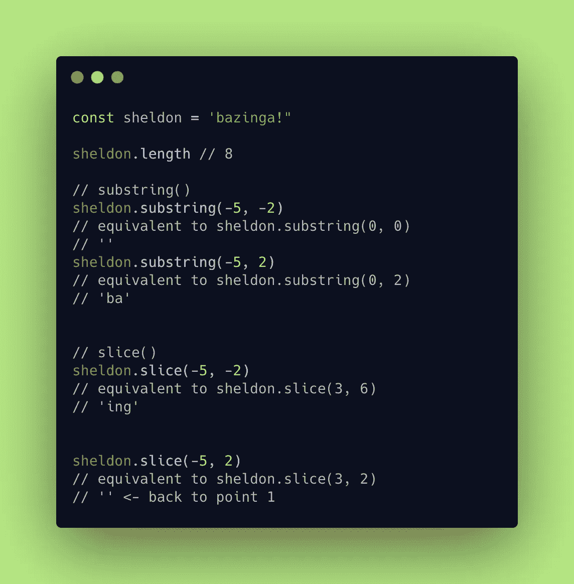

# 编码问题中使用的 JavaScript 常用方法(第 2 部分)

> 原文：<https://javascript.plainenglish.io/javascript-common-methods-used-in-coding-questions-part-2-8cb7362c2060?source=collection_archive---------16----------------------->

## 子串& Substr

如果您还没有查看我们讨论过`slice()`和`splice()`的第 1 部分，请点击此处的！

子串。Substr。说真的吗？怎么回事？后一个单词拼写时不带“-ing”JS 创造者不喜欢动名词吗？我非常困惑。随着我读得越来越多，我终于明白了其中的区别，我决定写这篇文章来分析这两者之间的区别。我们也会和`slice()`比较(我们在[第一部分](https://meganslo.medium.com/javascript-common-methods-used-in-coding-questions-part-1-slice-splice-with-tv-shows-a6ddac093f83)中讨论过——是的，我在自我推销 lol)。


Photo by [Massimo Sartirana](https://unsplash.com/@sarti46?utm_source=medium&utm_medium=referral) on [Unsplash](https://unsplash.com?utm_source=medium&utm_medium=referral)

## 目录

*   [**语法**](#7b78)
*   [**相似之处**](#b6ef)
*   [**差异**](#f8da)
*   [**子串()vs 切片()**](#fcbc)
*   [**汇总**](#ea7e)

## 子串& Substr 的语法

`substring()`和`substr()`用于当你想要提取具有特定长度和索引的字符串部分时。

`substring()`和`substr()`都有 2 个参数(1 个可选)和相似的输出，但是这两个参数之间的区别是第二个参数。怎么会？

**的语法为** `**substring()**`

```
str.substring(start[, end])
```

**语法为** `**substr()**`

```
str.substr(start[, length])
```

你看出第二个参数的区别了吗？

*   `substring()`的第二个参数代表**从**中排除的第一个指标；
*   `substr()`s 代表**从** `**start**` **索引**中提取的字符串的长度。

让我们看看这个例子:

Sheldon Cooper’s most well-known catchphrase

很直接，对吧？

## substring()和 substr()之间的相似之处

*   它们都返回字符串的*提取部分*，并且对字符串保持不变。
*   当省略第二个参数时，两种方法都会将字符提取到字符串的末尾。

```
sheldon.substring(2)
// 'zinga!'sheldon.substr(2)
// 'zinga!
```

## substring()和 substr()之间的区别

🎻`**str.substring(start[, end])**`

*   如果`start`大于`end`，返回值就好像两个参数被交换了。

```
sheldon.substring(5 , 2)
// 'zin'sheldon.substring(2 , 5)
// 'zin'
```


*   如果`start`= = = =(等于)`end`，返回值将是一个空字符串。

```
sheldon.substring(2, 2)
// ''
```


That’s how I feel when I see an empty string, even though it means a falsy value…

*   任何参数值**小于字符串**的 `**0**` **或者大于字符串**的 `**length**` **，它将被分别视为字符串**的`**0**`和**`**length**`**(后一个非常适用于很多方法，包括`slice()`)。****

*   **任何为`NaN`的参数值都被视为`0`。**

```
sheldon.substring('a', 2);
// 'ba', 'a' is a NaN therefore it's treated as 0.
```

**🎻`**str.substr(start[, length])**`**

*   **与`substring()`相反，当参数值小于`0`时，它将被视为`0`，`substr()`则完全相反——如果 `**start**` **值为负索引(** `**-n**` **)** `**substring()**` **)则从字符串末尾开始计数。**公式:`string.length - n`。**

```
sheldon.substr(-7, 2);
// az
// 'a' is at index 1 (8 - 7 = 1) and extract 2 indices from the string as indicated in the second parameter.
```

*   **另一方面，**如果** `**length**` **是一个负值，它将被视为** `**0**`，即`substr()`告诉你，“你在浪费我的时间耶，让我提取 0 指数 LOL”(不要听)**

```
sheldon.substr(2, 0)
// ''sheldon.substr(2, -1)
// ''
```

*   **如果`length`是`undefined`，它会把它当作不存在…开玩笑，这个方法会提取到字符串的末尾。**

```
sheldon.substr(2, undefined)
// 'zinga!'// no seriously, it would treat the undefined as if it is not there
sheldon.substr(2)
// 'zinga!'
```

*   **最后但同样重要的是，对于两个参数，`NaN`被视为`0`。**

```
sheldon.substr('a', 3) 
// equivalent to sheldon.substr(0 , 3)
// 'baz'sheldon.substr(3, 'a') 
// equivalent to sheldon.substr(3, 0))
// ''
```

**⚠️然而，根据 ECMAScript，`substr()`被认为是*遗留特性，*也就是说，它可能会从未来的版本中删除，所以我想**如果可能的话，最好避免**。⚠️**

****

**Credit: [doc.looker.com](https://docs.looker.com/admin-options/settings/legacy)**

## **子串()与切片()**

**两者之间的用法几乎相同(MDN 是这么说的)。有两件事很突出，使他们略有不同。(也回顾一下我们之前讨论的内容。)**

1.  **`substring()`交换两个论点如果`start` > `end`而`slice()` …呃…**

```
sheldon.substring(5, 2)
// 'zin'sheldon.slice(5, 2)
// ''
```

**2a。`NaN`:将`substring()`和`slice()`都视为`0`；**

**2b。负的索引:`substring()`将作为`0`处理，而`slice()`将从字符串开始向后计数以找到索引。**

****

## **摘要**

*   **`substring()`和`substr()`:相同的发音，不同的拼法(就像 Sarah 和 Sara——如果你还没有看过英国喜剧演员 Michael Mcintyre 的视频,可以看看这个视频🤣)，除非你故意不带“-ing”发音**
*   **`substring()`的第二个参数代表**从**中排除的第一个索引，而`substr()`的参数代表**该方法从** `**start**` **索引**中提取多少个字符。**
*   **我们还了解到最好避免使用`substr()`,因为它被认为是遗留特性😢**
*   **`substring()`和`slice()`几乎相同，除了一些差异，包括对负指数的处理。**
*   **说到`slice()`，如果你还没有看完第一部，可以看看这里的[和我们讨论过的`slice()`和`splice()`的](https://meganslo.medium.com/javascript-common-methods-used-in-coding-questions-part-1-slice-splice-with-tv-shows-a6ddac093f83)。**

**今天就到这里吧！**

# **资源**

**[](https://developer.mozilla.org/en-US/docs/Web/JavaScript/Reference/Global_Objects/String/substring) [## String.prototype.substring 字符串()

### 方法返回开始和结束索引之间的字符串部分，或者返回到字符串的结尾。的索引

developer.mozilla.org](https://developer.mozilla.org/en-US/docs/Web/JavaScript/Reference/Global_Objects/String/substring) [](https://developer.mozilla.org/en-US/docs/Web/JavaScript/Reference/Global_Objects/String/substr) [## String.prototype.substr()

### substr()方法返回字符串的一部分，从指定的索引开始，延伸到给定的数字…

developer.mozilla.org](https://developer.mozilla.org/en-US/docs/Web/JavaScript/Reference/Global_Objects/String/substr) [](http://net-informations.com/js/iq/substr.htm) [## JavaScript 中 substr()和 substring()的区别？

### JavaScript 字符串是一个表示字符序列的对象。substr()方法提取一个…

net-informations.com](http://net-informations.com/js/iq/substr.htm) 

如果你对我从哪里得到的漂亮的源代码片段感兴趣，我从一个叫做 [carbon](https://carbon.now.sh/) 的网站上得到所有的片段，这个网站是由 [@carbon_app](https://twitter.com/carbon_app) 制作的。**