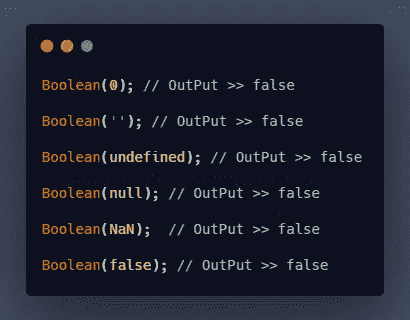
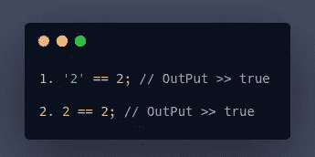
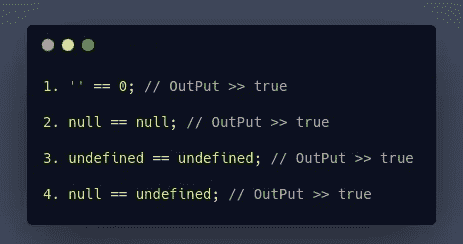
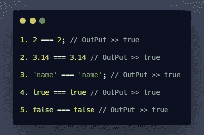
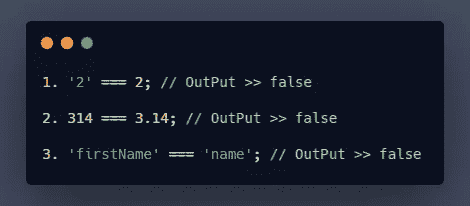

# JavaScript 比较操作符:宽松相等(==)与严格相等(=== ),用例子解释

> 原文：<https://javascript.plainenglish.io/javascript-comparison-operators-loose-equality-vs-strict-equality-explained-w-3d4004625c7f?source=collection_archive---------14----------------------->

## 你想知道 JavaScript 中的双倍等于和三倍等于比较运算符的区别吗？那么这篇文章可能会对你有所帮助。

Photo by [NeONBRAND](https://unsplash.com/@neonbrand?utm_source=unsplash&utm_medium=referral&utm_content=creditCopyText) on [Unsplash](https://unsplash.com/s/photos/boxing?utm_source=unsplash&utm_medium=referral&utm_content=creditCopyText)

在 JavaScript 中，有两种不同类型的比较运算符可用于执行相等运算。

但是首先，你需要理解真值和假值的概念。

# **真值和假值的概念:**

**假值**:我们试图用布尔来转换值，结果总是变成**假值**。

**真值**:我们使用布尔运算来转换值，然后结果总是变成**真值**。

在 JavaScript 中，只有六种类型的 **Falsy 值。**

*   **假:**当不为真且结果为假(布尔值)时。
*   **0** :零。
*   **""** :如果我们没有在字符串中传递任何值，就称为空字符串。
*   **null:** 为空或未初始化或未定义的值，或者为 0 值。
*   **未定义:**是一个变量，在其创建阶段没有被赋予任何值。
*   **NaN** :非数字，用于表示输入有效数字时出错。

***举例:***

# 双相等或宽松相等(==):

在松散相等中，比较两个不同类型或相同的值来执行相等操作。首先，使用隐式类型强制方法将两个操作数中的任何一个转换为所需的类型。

它也被称为抽象等式。

***例 1 :***

在上面的第一个例子中，首先，JavaScript 自动将字符串值**‘2’**转换为数字 **2** ，然后 JavaScript 使用松散相等(==)运算符比较两个值。

如果两个值相同，并且不需要在第二个示例中键入强制。

***例二:***

JavaScript 使用**强制**将空字符串(“”)转换为 **0** ，然后 JavaScript 转到等式运算，然后输出为**真**。

相同操作数之间的比较为**空**和**未定义**总是**真**。

# 三重等于或严格等于(===):

如果两个操作数具有相同的类型和相同的值，则称这两个值相等，即输出为真。

在严格相等中，不执行强制操作。如果一个值与另一个值完全不同，那么输出将总是假的。

***例 1 :***

在给出的例子中，输出是**真。**因为它们类型相同，值相同。

***例二:***

如果两个操作数值相同，但是类型不同，JavaScript 引擎将输出显示为 **false** 。

# 结论:

宽松等式和严格等式运算符是完全不同的。这取决于您选择哪种类型最适合您的代码。

如果你使用松散的等式，那么你肯定会在代码中遇到意想不到的错误。因为隐式强制发生在 JavaScript 转到代码中的比较之前。

记住六种错误的价值观是相当混乱和难以理解的，松散的平等。

总是建议在代码中使用严格的等式或三重等式来避免错误。

要了解有关类型转换和强制的更多信息，请阅读下面的文章。

 [## 类型转换和强制

### 深入解释 JavaScript 概念

medium.com](https://medium.com/theleanprogrammer/type-conversion-and-coercion-8974afe03b85) 

如果你喜欢这篇文章，请随意鼓掌、评论并与你的朋友分享。别忘了关注我，获取更多与 JavaScript 相关的文章。

**感谢您的阅读！**

*更多内容请看*[*plain English . io*](http://plainenglish.io/)