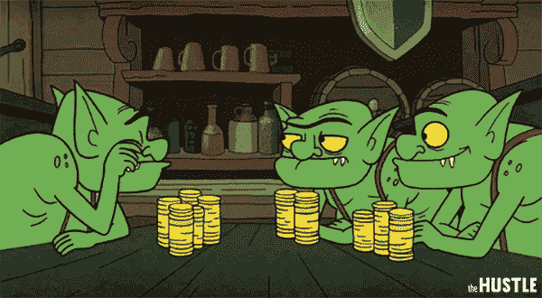

# JavaScript Const vs. Var vs. Let:一个全面的指南

> 原文：<https://javascript.plainenglish.io/javascript-const-vs-var-vs-let-a-comprehensive-guide-for-all-time-d6d836c8bbd7?source=collection_archive---------4----------------------->

## 你应该使用什么以及为什么常量变量不总是常量

Image made by the [Author](http://www.arnoldcode.com) with assets from ([pngkey](https://www.pngkey.com/download/u2q8e6r5u2e6t4u2_image-black-and-white-stock-lavapotion-potion-bottle/) & [Pinterest](https://pin.it/4LcP11V))

用`var`创建的变量似乎与用`let`创建的变量相同？你已经创建了一个`const`变量，但是属性已经被改变了，嗯？
`var``let``const`对你来说还是个谜吗？

在 ECMAScript6 诞生之前，声明统治了世界。存在与用`var`声明的变量相关的问题。谣言四起，是时候出现声明变量的新方法了。作为 [ES6](https://en.wikipedia.org/wiki/ECMAScript) 的一部分，增加了`let`和`const`来声明变量。

关于`var`、`let`、`const`的**范围**、**使用**、**吊装**，你会有一个非常清楚的了解。当你阅读时，记下不同之处，然后像专业人士一样编码。

# 定义变量

> 想象一下，你正在玩一个 RPG 中的角色，你想从一个妖精商人那里买一些药水。有人不知道`*var*`、`*let*`和`*const*`之间的区别，却开发了这个商店，例子解释了我们没有错的地方和实际上好的地方以及原因。

在我们讨论上述问题之前，你必须了解更多。

## 风险值的范围

Image made by the [Author](http://www.arnoldcode.com) with asset from [freepik](https://www.freepik.com/free-vector/what-is-witchcraft-horizontal-banner-with-ancient-manuscripts-glass-bottles-magical-potion_15078063.htm#page=1&query=potion&from_query=health%20potion&position=8&from_view=search)

**作用域**表示可以使用这些变量的地方。`var`声明是全局作用域或函数/局部作用域。

当一个`var`变量在函数外被声明时，全局作用域“发生”。在功能块外用`var`声明它，那么它可以在整个窗口中使用。

当你把一个用`var`声明的变量放入一个函数中时，它就是函数范围的。它仅在该功能中可用和可访问。

为了进一步理解，请看下面的例子。

这里，`priceTag`是全局范围的，因为它是在函数`newFunction()`之外声明和初始化的，而`name`是函数范围的。

您不能在`newFunction()`之外访问变量`name`。尝试访问它并…

…您刚刚创建了一个错误。`name`的结果在`newFunction()`之外不可用。

## 重新声明和更新 Var 变量

您可以在相同的范围内这样做，并且不会得到错误。

那个肮脏的小贩提高了价格！

在不引发错误的情况下，也可以执行以下操作:

## Var 的吊装

提升是一种 JavaScript 机制，在代码执行之前，变量和函数声明被移动到它们作用域的顶部。这意味着如果你这样做:

JavaScript 将其解释如下:

最后，在第一个例子的第 2 行中放入一个`console.log(priceTag)`并调用该函数，然后您将得到`undefined`来访问`priceTag`。

代码似乎在工作，没有出现错误。但是变量稍后被初始化(将一个值放入变量中)。

> 一个变量在被声明之前就存在并不直观，但是在 JavaScript 中，这是事实。这个变量可以在这个函数的开始使用，尽管它可以在函数体的最后一行声明。请记住，在执行初始化代码行之前，变量是未定义的。

## 风险值的问题是

Image made by the [Author](http://www.arnoldcode.com) with asset from [freepik](https://www.freepik.com/free-vector/what-is-witchcraft-horizontal-banner-with-ancient-manuscripts-glass-bottles-magical-potion_15078063.htm#page=1&query=potion&from_query=health%20potion&position=8&from_view=search)

`var`的缺点是在第二个作用域中覆盖了一个已经定义的全局变量:

*这个可疑的卖主不给我们购买四种药剂的折扣。他玩了个小把戏，所以我们每瓶药水要付 45 金币！*

所以，由于`amountToBuy > 3`返回 true，所以`priceTag`被重新定义为`45`。虽然如果你有意想要重新定义`priceTag`这不是问题，但是当你没有意识到一个变量`priceTag`之前已经被定义了，这就成问题了。

> 对于本文中的一小段，您可能会直接发现问题。想象一下在一个更大的代码库中…

如果您已经在代码的其他部分使用了`priceTag`，您可能会对您可能得到的输出感到惊讶。这可能会导致代码中出现错误。

*这就是为什么*`*let*`*`*const*`*是必要的。**

## *Star Vars —吊装专业角*

**

*Image made by the [Author](http://www.arnoldcode.com) from [dafont.com](https://www.dafont.com/de/star-jedi.font)*

> *这是额外的信息，你需要知道什么是块，但没有必要理解 let & var & const 的区别。直接进入第**章，让**通过，不要领取 200 美元。*

*对于循环，此**提升**与*相关。*很快导致 bug，照顾你在屏幕前疑惑的脸。*

*这段代码不会像您可能假设的那样打印出两个项目`Healing Potion`和`Gold`。*

*你得到的反而是两倍的`undefined`。这就是证据:*

**

*Console Printout of Code From hoistingPro.js*

***它是怎么来的？***

*函数定义了变量的作用域。一个块(也就是我们的 for 循环)不能为用`var`声明的变量定义范围。*

*只有函数允许这样做。运行指数`i`存在于全局空间中，并且只有一次。不是块的每次迭代一次。由于`setTimeout`将暂停执行`i`乘以 1000 毫秒，在打印输出之前，运行索引`i`将具有`2`的值。*

*数组`items`只得到两个元素，它们的索引分别是`0`和`1`。结果以`undefined`作为返回。*

*一个[闭包](https://en.wikipedia.org/wiki/Closure_(computer_programming))帮助你将循环的内容放入一个匿名函数中，并用运行索引作为参数调用它。它将外部块的状态保存到 setTimeout 的内部块中，即匿名函数。*

**

*Console Printout of Code From hoistingClosure.js*

# *让*

*对于变量声明，你应该总是选择`let`。这并不奇怪，因为它是对`var`声明的改进。它也解决了我们在`var`中提到的托管问题。*

## *Let 是块范围的，这是块的信条*

1.  *一个**块**是由`{ }`界定的一段代码。*
2.  *一个**块**住在花括号里。*
3.  *花括号内的任何内容都是一个**块**。*

**

*Image made by the [Author](http://www.arnoldcode.com) with asset from [freepik](https://www.freepik.com/free-vector/what-is-witchcraft-horizontal-banner-with-ancient-manuscripts-glass-bottles-magical-potion_15078063.htm#page=1&query=potion&from_query=health%20potion&position=8&from_view=search)*

*在块内用`let`声明的变量只能在该块内使用。让我用一个例子来解释这一点:*

> *那个见不得人的小贩不会再骗我们了！*

*您可以看到，在其块外使用`priceTag`会返回一个`30`。这是因为`let`变量是块范围的。*

*为什么这没有引发错误？因为这两个实例被视为不同的变量，因为它们具有不同的作用域。与上面的`shadyVendor.js`进行比较，以完全理解不同之处。*

*这使得`let`比`var`更好。当你使用`let`时，你不必在变量存在之前就为变量命名。只有在它的范围内，你才必须小心谨慎。*

## *用字母更新但不重新声明*

*就像`var`一样，用`let`声明的变量可以在其作用域内更新。*

*与`var`不同，`let`变量不能在其作用域内重新声明。所以尽管这行得通:*

*这将返回一个错误:*

*如果同一个变量在不同的作用域中定义，就不会有错误，正如你在`notThisTime.js`中看到的。*

*从外部访问块范围的变量怎么样？*

*此外，由于一个变量不能在任何范围内被声明超过一次，那么前面讨论的关于`var`的问题就不会发生。*

## *左起重*

*与`var`一样，`let`申报被吊到最上面。*

*与初始化为`undefined`的`var`不同，`let`关键字没有初始化。如果你试图在声明前使用一个`let`变量，你会得到一个`Reference Error`。*

# *常数*

*用`const`声明的变量保持恒定值。`const`声明与`let`声明有一些相似之处。*

## *具有常量的块范围声明*

*`const`声明只能在声明它们的块中被访问。类似于`let`声明。*

## *没有用 Const 更新或重新声明*

*这意味着用`const`声明的变量的值在其作用域内保持不变。它不能更新或重新声明。用`const`声明变量，你既不能这样做:*

*也不是这个:*

*因此，每个`const`声明都必须在声明时初始化。*

*对于用 `const` **声明的对象，这种行为有些不同。***

**

*Image made by the [Author](http://www.arnoldcode.com) with asset from [freepik](https://www.freepik.com/free-vector/what-is-witchcraft-horizontal-banner-with-ancient-manuscripts-glass-bottles-magical-potion_15078063.htm#page=1&query=potion&from_query=health%20potion&position=8&from_view=search)*

*虽然不能更新整个对象的引用，但可以更新对象的属性。*

*因此，如果您像这样声明一个`const`对象:*

*虽然您不能这样做(在源代码的另一部分):*

*您可以这样做:*

*这将更新`potion.priceTag`的值，而不会返回错误。*

*黑幕妖精又耍我们了！现在我们不得不花 60 金币买一瓶简单的健康药水，而不是 30 金币…*

**

*Gif from [theHustle](https://thehustle.co/gold-on-gold-on-goldddd/)*

## *建筑吊装*

*就像`let`，`const`声明被提升到顶部，但是没有被初始化。*

# *外卖食品*

*   *`var`声明存在于全局作用域或函数作用域中。*
*   *`let`和`const`是块范围的。*
*   *您可以更新`var`变量，并在其作用域内重新声明它们。*
*   *您也可以更新但不能重新声明`let`变量。*
*   *`const`变量既不能更新也不能重新声明。*
*   *所有都被提升到其范围的顶部。*
*   *当`var`变量用`undefined`初始化时，`let`和`const`变量不初始化。*
*   *`var`和`let`无需初始化即可声明*
*   *`const`必须在声明期间初始化。*

*有任何问题或补充吗？请让我知道。*

# *结论*

*`var`是一个遗产，但主要由新人使用，因为它似乎是最好的/第一选择，或者你在没有选择的时候就开始编写 JavaScript 代码。*

*然而，`var`很容易被误解为`variable`或`variant`的简称，我在 2015 年刚接触 JavaScript 时，甚至不知道自己在做什么就用了这个词。*

****今天已经不宜再用了。从你的工具集中禁止它，或者至少将它锁定在遗留代码中，那里的损害可能已经造成了，哈哈哈！****

*要处理遗留代码，必须具备提升和`var`方面的知识。*

*如今，当配置正确时，棉绒使我们的生活变得更容易，即使不正确，也可以慢慢使用`const` > `let` > `var`。*

*感谢您的阅读:)*

*获取 26 份备忘单，只研究你真正需要的东西，以获得你的第一份网络开发工作！*

**

*[Arnold Code Academy 26 Web Developer Cheatsheets](https://arnoldcodeacademy.ck.page/26-web-dev-cheat-sheets)*

**更多内容尽在*[***plain English . io***](http://plainenglish.io/)*