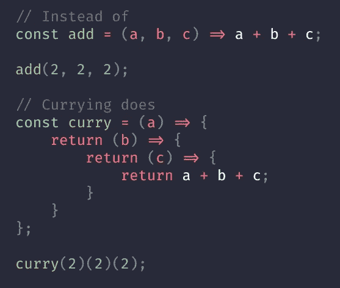

# JavaScript Currying:综合指南

> 原文：<https://javascript.plainenglish.io/javascript-currying-comprehensive-guide-e69c47497309?source=collection_archive---------0----------------------->

## Curry &局部应用，高级 Curry 实现，无限 Curry 和 Curry 的优点

Currying 是一种使用函数的高级技术。它不仅在 JavaScript 中使用，也在其他语言中使用。



> Currying 是函数式编程中的一个过程，在这个过程中，我们可以将一个具有多个参数的函数转换成一系列嵌套函数。它返回一个新函数，该函数需要内联的下一个参数。

*   换句话说，当一个函数不是一次接受所有参数，而是接受第一个参数并返回一个接受第二个参数的新函数，然后返回一个接受第三个参数的新函数，以此类推，直到满足所有参数。
*   Currying 是一种函数转换，它将一个函数从可调用的 as `f(a, b, c)`转换成可调用的 as `f(a)(b)(c)`。Currying 不调用函数。它只是改变了它。
*   函数接受的参数数量也称为`**arity**`。

```
function sum(a, b) {
    // do something
}
function _sum(a, b, c) {
    // do something
}
```

函数`sum`有两个参数(2-arity 函数)，而`_sum`有三个参数(3-arity 函数)。

Curried 函数是通过同时定义和立即返回它们的内部函数来链接闭包而构造的。示例:

```
function sum(a, b, c) {
    return a + b + c;
}sum(1,2,3); // 6
```

正如我们所见，函数带有完整的参数。让我们创建一个函数的简化版本，看看我们如何在一系列调用中调用同一个函数(并获得相同的结果):

```
function sum(a) {
    return (b) => {
        return (c) => {
            return a + b + c
        }
    }
}

console.log(sum(1)(2)(3)) // 6
```

我们可以把这个和(1)(2)(3)分开来更好地理解它:

```
const sum1 = sum(1);
const sum2 = sum1(2);
const result = sum2(3);
console.log(result); // 6
```

让我们来了解一下它是如何工作的:
我们将 1 传递给了`sum`函数:`let sum1 = sum(1);`

`sum`返回函数:

```
return (b) => {
   return (c) => {
       return a + b + c
   }
}
```

现在，`sum1`保存了上面的函数定义，它带有一个参数`b`。我们调用了`sum1`函数，传入了`2` : `let sum2 = sum1(2);`

`sum1`将返回第三个函数:

```
return (c) => {
   return a + b + c
}
```

返回的函数现在存储在`sum2`变量中。`sum2`将:

```
sum2 = (c) => {
     return a + b + c
}
```

当用 3 作为参数调用`sum2`时，`const result = sum2(3);` 用之前传入的参数进行计算:a = 1，b = 2，返回 6。

```
console.log(result); // 6
```

作为嵌套函数，`sum2`可以访问外部函数`sum`和`sum1`的变量范围。这就是`sum2`如何用已经定义好的`exit`函数中的变量执行求和运算。虽然函数早已从内存中返回`garbage collected`，但它的变量却不知何故还保留着`"alive"`。

您可以看到，这三个数字一次一个地应用于该函数，并且每次都返回一个新的函数，直到用完所有的数字。最后一个函数只接受`c`变量，但会对其封闭函数范围早已返回的其他变量执行操作。因为有了`Closure.`，它仍然可以工作

# 固化和部分应用

有些人可能会认为一个 curried 函数拥有的嵌套函数的数量取决于它接收的参数的数量。是的，那使它成为一道咖喱菜。让我们举同一个`sum`例子:

```
function sum(a) {
    return (b, c) => {
        return a + b + c;
    }
}
```

可以这样称呼:

```
let x = sum(10);
x(3,12);
x(20,12);
x(20,13);// ORsum(10)(3,12);
sum(10)(20,12);
sum(10)(20,13);
```

上面的函数需要 3 个参数，有 2 个嵌套函数，不像我们以前的版本需要 3 个参数，有 3 个嵌套函数。这个版本不是咖喱。我们只是做了`sum`函数的部分应用。

Currying 和 Partial Application 是有联系的(因为闭包)，但它们是不同的概念。**部分应用**将一个函数转换成另一个 arity 更小的函数。

```
function sum1(x, y, z) {
    return sum2(x,y,z)
}// tofunction sum1(x) {
    return (y,z) => {
        return sum2(x,y,z)
    }
}
```

对于阿谀奉承，应该是这样的:

```
function sum1(x) {
    return (y) = > {
        return (z) = > {
            return sum2(x,y,z)
        }
    }
}
```

**Currying** 根据函数的参数个数创建嵌套函数。每个函数都接收一个参数。如果没有争论，就没有奉承。

更高级的 currying 实现，比如 [_。curry](https://lodash.com/docs#curry) 从 lodash 库中，返回一个允许函数被正常和部分调用的包装器:

```
function sum(a, b) {
  return a + b;
}let curriedSum = _.curry(sum); // using _.curry from lodash libraryalert( curriedSum(1, 2) ); // 3, still callable normally
alert( curriedSum(1)(2) ); // 3, called partially
```

> 注意:我们可以使用 bind 实现同样的行为。这里的问题是我们必须修改 `*this*` *绑定。*

```
function sum(a, b) {
  return a + b;
}var addBy4 = sum.bind(this,2);
console.log(addBy4(4));
// => 6
```

# 高级 Curry 实现

让我们开发一个函数，它接受任何函数并返回该函数的一个简化版本。这是我们可以在上面使用的多参数函数的“高级”curry 实现。

新的`curry`可能看起来很复杂，但实际上很容易理解。调用`curry(func)`的结果是包装器`curried`,如下所示:

```
// func is the function to transform
function curried(...args) {
  if (args.length >= func.length) { // (1)
    return func.apply(this, args);
  } else {
    return function(...args2) { // (2)
      return curried.apply(this, args.concat(args2));
    }
  }
};
```

当我们运行它时，有两个`if`执行分支:

1.  如果传递的`args`计数等于或大于原始函数定义中的计数(`func.length`，那么就使用`func.apply`将调用传递给它。
2.  否则，得到一个部分:我们还没有调用`func`。相反，返回另一个包装器，它将重新应用`curried`，提供以前的参数和新的参数。

然后，如果我们再次调用它，我们将得到一个新的部分(如果没有足够的参数)，或者，最后，结果。

# 无限咖喱

现在，我们将建立一个无限的 curring 函数，即 curring 一个函数，而不知道它的 arity。你可以通过无限返回一个接受一个参数并累加结果直到你说够了的函数来实现上面的库里技术。类似于，

```
sum(a)(b)(c)...(n)()
//Output sum of n numbers -> sum of a + b + c...+ n;Example: sum(1)(2)(3)(4)(); //10
```

# Currying 的优点

*   currying 的主要好处是当你需要用一些相同的参数大量使用同一个调用时，也就是说，它有助于避免一次又一次地传递相同的变量。在这种情况下，奉承成为一种很好的技巧。
*   Currying 会让你的代码更容易重构。Currying 还创建了一个更具声明性的代码库，例如，更容易阅读代码和理解它在做什么。
*   它有助于创建高阶函数。

# 结论

Currying 是一种非常方便的技术，它允许我们通过传递较少的参数来创建有用的函数。闭包使得 JavaScript 中的 currying 成为可能。它保留已经执行的函数状态的能力使我们能够创建工厂函数——可以为参数添加特定值的函数。

希望现在你知道 currying 是如何工作的，或者至少对它有了更好的理解。

*更多内容请看*[***plain English . io***](http://plainenglish.io/)