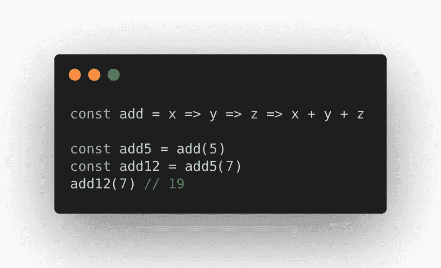

# JavaScript Currying:一个实际例子

> 原文：<https://javascript.plainenglish.io/javascript-currying-practical-example-512cf1099e81?source=collection_archive---------2----------------------->


Photo by [Emile Perron](https://unsplash.com/@emilep?utm_source=medium&utm_medium=referral) on [Unsplash](https://unsplash.com?utm_source=medium&utm_medium=referral)

在数学和计算机科学中，currying 是一种将带有多个参数的函数转换成一系列带有单个参数的函数的技术。

下面的 add 函数接受三个参数并返回它们的和。

```
const add = (a,b,c) => {
   return a+b+c
}add(1,2,3) // 6
```

如果三个参数不在同一个范围内呢？如果我们可以像在校车上挑选孩子一样挑选他们呢？

首先， ***让我们咖喱一下*** 上面的功能。

```
const add = a => b => c => a+b+c
add(1)(2)(3) // 6
```

## 切线:箭头函数速记

以上，如果你想知道，有**隐含返回语句**。例如，我们可以像这样编写前面的 add 函数。

```
// const add = (a,b,c) => {
//    return a+b+c
// }const add = (a,b,c) => a+b+cadd(1,2,3) // 6
```

我们不需要主体括号和 return 关键字。

如果我们不能使用大括号，如何返回一个**对象文字**？我们可以用括号来括起来。

```
const obj = (a,b,c) => ({a:a, b:b, c:c})
obj(1,2,3) // { a: 1, b: 2, c: 3 }
```

在以下两个版本的 curried function 中，你更喜欢哪一个？

```
const addNew = a => b => c => a+b+c// vsconst addOld = (a) => {
  **return** (b)=> {
    **return** (c)=> {
      **return** a+b+c
    }
  }
}
```

第一种可能最初看起来可读性较差，但是一旦我们习惯了，我们的代码会看起来更优雅。

## 一流的功能

回到 currying 之前还有一个话题。

> 当一种编程语言中的**函数**被视为任何其他变量时，该语言被称为具有**一级函数**。— MDN 网络文档

当我第一次遇到回调时，这个概念产生了对编程的不同理解。我认为一级函数的概念是 OOP 人们抱怨 JavaScript 怪异的主要原因。我们可以像传递其他变量或对象一样传递函数。

```
const add = (a,b) => a+b
const sub = (a,b) => a-bconst calc = (a, b, cb) => cb(a,b)calc(3,4, add) // 7
calc(3,4, sub) // -1
```

太解放了！

## **高阶** - **阶函数**

顺便说一下，上面例子中的 calc 函数是一个高阶函数。

> 对其他**函数**进行操作的**函数**，无论是将其作为自变量还是将其返回，都被称为**高阶** - **函数**。**——**雄辩的 JavaScript。

```
function getName(name) {
  return function greet(){
    console.log('Hello, ', name)
  }
}const **greet** = getName('Karthick')
greet() // Hello,  Karthick
```

我们从 getName 得到的问候是我们在下一行调用的函数。我们显然可以用 arrow 函数速记来转换上面的内容。试试看。

## 部分应用

回到问题上来。如果参数不在同一个范围内会怎样？我们也明白我们可以像传递变量一样传递函数。

有一种解决方案叫做局部应用。

```
function add(x, y, z){
  return x + y + z;
}const plus5 = add.bind(this, 5)
console.log(plus5(3,9)) // 17const plus12 = plus5.bind(this,7)
plus12(9) // 21
```

我们通过将 5 绑定到第一个参数来构建一个名为 plus5 的函数。现在, **plus5** 函数可以为结果多带两个参数。

我们可以通过绑定 7 作为 plus5 的第一个参数，从组合的 **plus5** 中选择组合另一个函数。这给了我们**加 12** 。

这是使用 bind 的部分应用程序。

```
bind(thisArg, arg1, ... , argN)
```

## Currying:构造函数的更简单方法

我们看到了一个使用 ***绑定*** 函数部分应用参数的例子。

用于改变 ***上下文*** 的方法 call、apply、bind 与 Arrow 函数无关。

让我们用 curry 来试试上面的例子。

```
const add = x => y => z => {
  return x + y + z;
}const add5 = add(5)
const add12 = add5(7)
add12(7) // 19
```

这要简单得多，根本不用担心上下文。

同样，看看上面例子中的 ***闭包*** 是如何工作的。当我们调用 add5(7)时，在前面的执行中传递的值 5 在作用域链中被记住了！

更多关于闭包[的信息，请点击](https://karthickragavendran.medium.com/javascript-understanding-closures-with-the-dragon-warrior-f5ed13b7df94)。

# Currying:实际例子

编造的例子够多了。让我们把这个 ***功能组合*** 技术好好利用起来。

下面的代码是从 redux 切片中提取的。extraReducers 中的属性将在解析 thunks 时被调用。

**[sign up . pending . tostring()]**只是我们从 redux 操作中获得的动态属性键。

非常多余。

我们可以创建一个函数，使 fulfilled、loading 和 error 可选，默认值为 false。

```
const setStatus = ({fulfilled = false,loading = false,error = false}) => {
  console.log(fulfilled, loading, error)
}setStatus({fulfilled:true}) // true, false, false
```

很好。但是状态对象在哪里更新呢？让 ***柯里*** 这个函数带着状态和动作对象。

```
const setStatus = **(**state, action**) =>** **(**{fulfilled = false,loading = false,error = false}**)** **=>** {
  state.fulfilled = fulfilled
  state.loading = loading
  state.error = error}setStatus(state)({fulfilled:true}) 
// This will set state.fulfilled to true and remaining to false
```

现在，早期的 extraReducer 将如下所示。

您可能认为,{fullfilled: true}对象可以作为第二个参数传递给 setStatus 函数。为什么要奉承呢？

魔法还没有完成。

## 复试

让我们看看回调在 JavaScript 中是如何工作的。

```
onClick(**updateState**) // updateState is a function/callback// We can pass arguments too right? JavaScript should not complain.onClick(**updateState('Hello!')**)  // Wrong. JavaScript will immediately execute updateState and won't wait for the click.onClick(**()=>** **updateState('Hello!')**)  // Good.
```

如果 onClick 提供的参数与 updateState 传递的参数相同怎么办？

```
onClick(**(state)=>** **updateState(state)**)  // Okay...
```

现在，这看起来非常类似于

```
onClick(**()=>** **updateState()**)  // Yes...
```

有一个简写。

```
onClick(**()=>** **updateState()**) // can be written as 
onClick(**updateState**)// because they share the same arguments (which is nothing)!// So,
onClick(**(state)=>** **updateState(state)**)// can be written as
onClick(**updateState**)
```

没错。那是一件事。

让我切换一下 setStatus 上函数的顺序。

现在可以简化 extraReducer 中的属性。

```
fulfilled: **(state,action) =>** setStatus({ fulfilled: true })**(state,action)**
```

这可以写成

```
fulfilled: setStatus({ fulfilled: true })
```

多酷啊。

看看 extraReducers 属性的区别。

看起来很干净。这表明了意图。我们可以走得更远，但是抽象是有代价的。过一段时间后，我们应该能够理解自己的代码。

因此，使用这些函数式编程技术来寻找抽象中的最佳点有助于我们编写优雅且可读的代码。

谢谢你。下次见。



currying example

*更多内容请看*[***plain English . io***](http://plainenglish.io/)