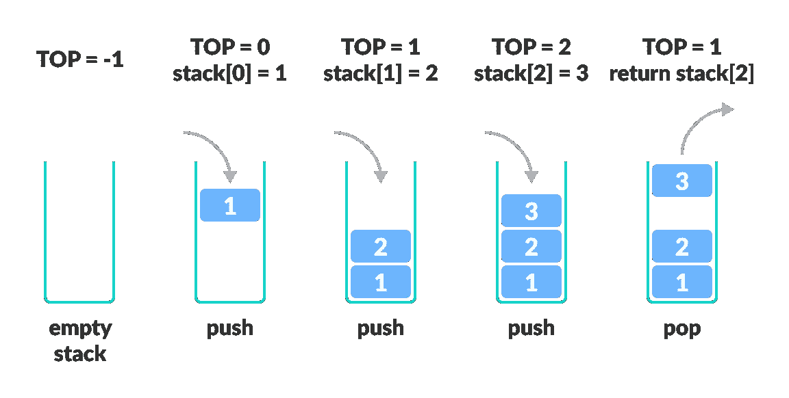

# JavaScript 数据结构:堆栈实现

> 原文：<https://javascript.plainenglish.io/javascript-data-structures-stack-implementation-bb85141a3f78?source=collection_archive---------16----------------------->

## JavaScript 中的堆栈数据结构实现

Image by [**Programix**](https://www.programiz.com/)

在本文中，我们将了解什么是堆栈，以及它们是如何在 JavaScript 中实现的。堆栈是最常见的数据结构之一。

## **什么是堆栈？**

堆栈是一种线性数据结构，它包含元素或项的堆栈。堆栈数据结构实现了**L**ast**I**n**F**first**O**ut(**LIFO**)的原则和方法。这意味着进入堆栈的最后一项是要从堆栈中移除的第一项。

拿一叠书来说，一叠叠在一起的书。最后一本书将被放入书堆，而第一本书将被从书堆中取出。

堆栈有两个发生的主要操作，即推送和弹出。我们可以执行其他操作，例如峰值、大小为空等操作。

需要注意的是，堆栈中输入的最后一项是要从堆栈中取出的第一项。

在本文中，我们将研究如何在 JavaScript 中实现堆栈的使用。

# **方法**

所以，让我们看看如何在具有基本功能的 JavaScript 中实现堆栈的使用。因此，首先，我们需要创建一个类对象，并在其中实例化操作。

**1。在我们的堆栈中添加项目**

现在我们已经实例化了堆栈的实例，现在我们希望它能够存储传递给它的信息。我们可以使用 *push()* JavaScript array 方法，但是我希望我们对它进行硬编码，看看一切是如何发生的。

因此，让我们实现一个 Push 方法，向数组中添加一个新项，并返回返回的新数组的位置。

**2 .从堆中取出物品**

既然我们已经在堆栈中添加了元素，那么当我们想要移除堆栈中的元素时，该怎么办呢？请记住，堆栈实现了“后进先出”(LIFO)方法。

因此，在我们的方法中，我们需要确保只移除最后一个进入堆栈的项目。此外，确保您返回并移除堆栈中最顶层的元素。如果堆栈是空的，它应该返回 undefined。

我们可以在堆栈中实现一个弹出方法，如下所示。

**3 .返回堆栈中的顶部项目**

当我们想知道堆栈中最顶层元素的位置时，该怎么办？我们可以用一个叫做 Peek 的方法来实现。

这个方法不移除或添加任何东西，但是它返回堆栈中最顶层的元素。

我们可以实现 Peek 方法，如下例所示。

**4。堆栈中项目的大小**

我们可以进一步实现其他方法，比如查看堆栈的大小。获取堆栈的大小要简单得多，我们只需检查堆栈中的计数，就可以了。因为计数总是跟踪在堆栈中添加和移除的元素。

我们可以实现如下所示的 size 方法。

**最终堆栈实现方法。**

我们的堆栈实现方法应该采用如下所示的形式。

**栈的用例**

我们已经看到了堆栈中的各种实现和方法，我们来看看堆栈的各种实现如何。

Stack 在很多方面都非常方便，我们几乎在日常工作中都会用到它。现在，我们可以在哪里以及如何实现堆栈。

**网络浏览器中的后退按钮**

你经常使用浏览器，你知道后退按钮，它可以带你回到你以前访问过的链接。

这是栈的实现之一。当您在选项卡中访问浏览器时，已访问的 URL 链接会添加到堆栈顶部，并移除已访问的 URL，以便您可以无缝地来回导航。

**字符串反转**

假设你有一个问题，你想扭转给定的词。您可以利用先进先出堆栈原则来利用堆栈。实现这个，你可以用它来反转字符串。

**编译器**

编译器可以实现使用堆栈来执行计算和操作。

**结论**

感谢您阅读这篇文章。此外，如果您发现我的内容有用，并且您不是媒体会员，您可以在此处[获得您的媒体会员资格](https://amjohnphilip.medium.com/membership)(媒体推荐链接)以无限制地访问所有内容并支持我们作为作者。

**更多阅读内容**

 [## JavaScript 挑战:找到数组中缺少的数字

### 在给定的按 1 排序的自然数数组中查找缺失数字的 JavaScript 挑战

javascript.plainenglish.io](/javascript-challenge-find-the-missing-number-in-an-array-67689a10a74e)  [## 我用来最大化和超越教程的 3 个技巧

### 我如何充分利用编程教程？

javascript.plainenglish.io](/3-tips-i-use-to-maximize-move-beyond-tutorials-b1b2f59322c0) 

*更多内容请看*[***plain English . io***](http://plainenglish.io/)