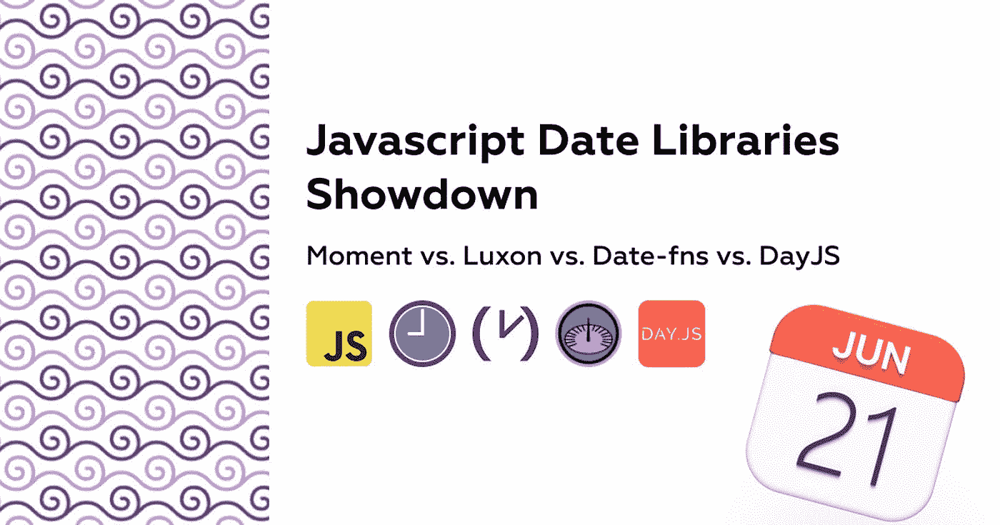
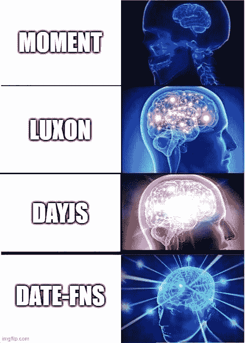
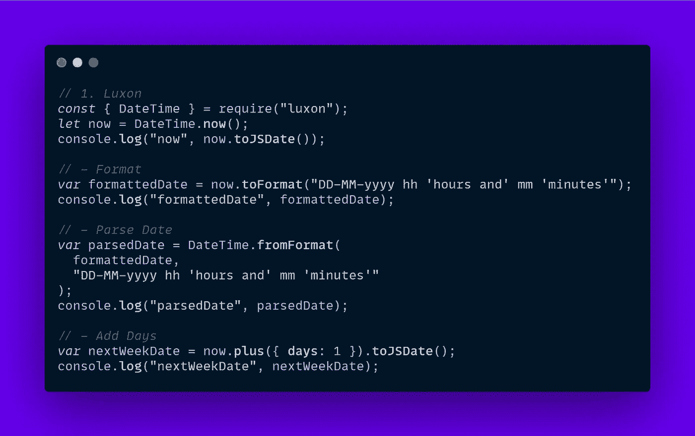
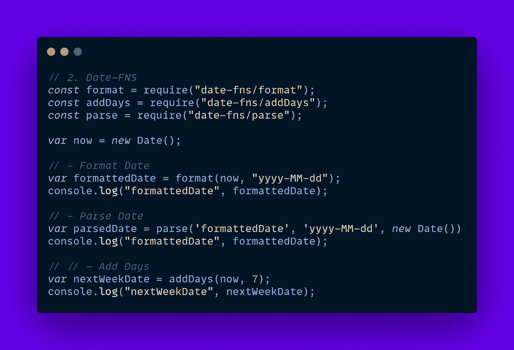
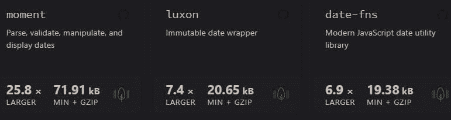
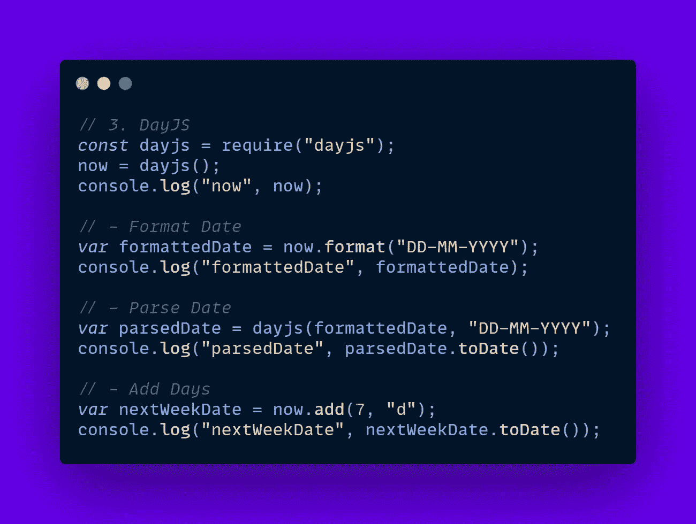
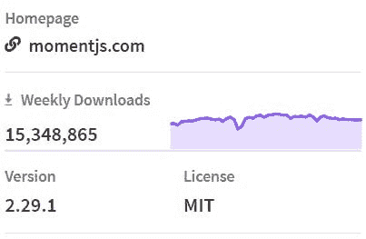
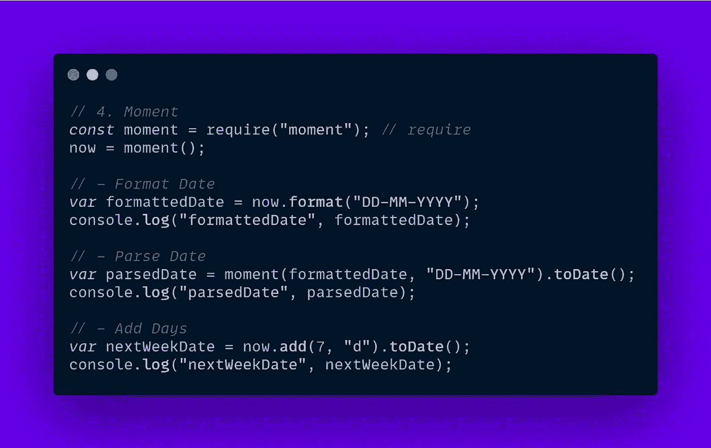

# JavaScript 日期库对决

> 原文：<https://javascript.plainenglish.io/javascript-date-libraries-showdown-228adb151b09?source=collection_archive---------8----------------------->

## moment vs Luxon vs Date-fns vs day js

操作日期是任何应用程序中要处理的最复杂的主题之一。时区、本地化和格式化日期是日期库应该提供的几个任务，现在我将列出几个使日期操作成为一部分的包🎂。

# 1.[卢克森](https://github.com/moment/luxon)

由维护 Moment 的一些人开发，它是一个更轻、不可变的库，自从 Moment 被“弃用”以来，它的受欢迎程度翻了一番，因为它在 NPM 每周下载量超过 170 万次。

它提供了许多操作日期、时间间隔和时区的方法，但是对于较小的项目来说可能会相当繁重。

# 2.[日期——FNS](https://date-fns.org/)

基本上 lodash 用于日期，小的包大小，和易于使用的函数用于任何可能的场景。

我非常喜欢 date-fns，因为它的 API 类似于 lodash 实用程序，而且所有操作都直接应用于 JS 日期对象。

# 3. [DayJS](https://day.js.org/)

极小，仅捆绑了 2Kb，根据 bundlephobia 的说法，它比 moment 小 26 倍，这是令人难以置信的，比该列表中的其他 2 个小几个计数。

# 4. [MomentJS](https://momentjs.com/)

截至撰写本文时，下载量已超过 1500 万次，Moment 可能看起来仍是一只山羊，但由于可变的设计，它的 API 属于不同时代的 JS。

尽管如此，仍有许多老项目将 Moment 列为依赖项，因此，其状态已更改为**维护**，并且根据 [Moment 项目状态](https://momentjs.com/docs/#/-project-status/)将不再接收任何更新。

让我们来看看如何使用 old lad moment 进行一些基本操作:

如果你想检查这个演示项目，这里是 [CodeSandbox](https://codesandbox.io/s/date-manipulation-libraries-sxxir?file=/src/index.js:561-1062) 。

> *在*[*alexstreza . dev*](https://alexstreza.dev/)*查看更多我的作品。*
> 
> 我希望你喜欢这个关于 4 大 JS 日期管理库的简短教程🦄！

*更多内容请看*[***plain English . io***](http://plainenglish.io/)