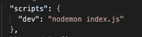
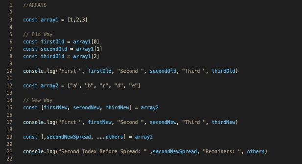
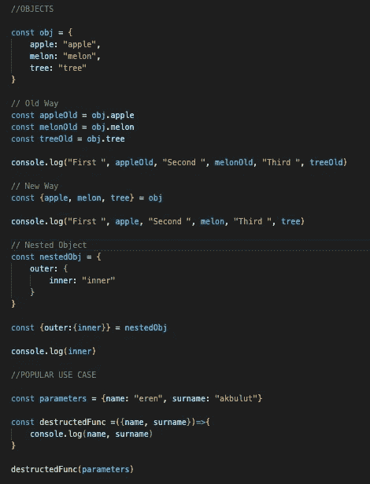
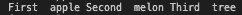

# JavaScript 析构解释

> 原文：<https://javascript.plainenglish.io/javascript-destructuring-7742e43ce194?source=collection_archive---------15----------------------->

我将分两部分解释析构；数组和对象，但在我们开始之前，如果您想使用相同的设置和我使用的工具，您可以继续在这里下载 repo，或者您可以跟随我至少初始化“nodemon”以进行热重装，当然，这是可选的。

这个职位的代码是[这里是](https://github.com/eren23/js-destructuring-blog-post)。

# 可选 NPM 套餐

在这篇文章中，我们将使用节点时间，所以如果你喜欢跟随，你需要在你的本地。你可以在这里下载[。](https://nodejs.org/en/)

如果你想在你的项目中有一个热重装特性，就像我在教程中使用的那样，你可以继续从 GitHub 安装代码，只需在根目录中运行命令“npm install ”,或者如果你想在根目录中手动完成，你应该按顺序运行下面的命令:

`npm install -D nodemon`

之后，您可以在 package.json 文件中创建一个新脚本:



现在，您可以通过运行以下命令，使用热重装启动节点运行时:

# 数组

我将把创建变量的新旧语法和数组元素放在一个图像中，然后逐行解释。



*   首先，我们用元素 1、2 和 3 创建数组。
*   正如你在上面的旧语法中看到的，我们应该将每个变量分配到它自己的行中，以便能够从数组中提取每个值。之后的输出应该是这样的。


# 目标

正如我对数组所做的那样，我将首先把所有工作放在这里，然后我们将一起浏览它。对于 object，我们对新旧语法使用了相同的对象，也许这样可以更好地显示结果基本相同。



*   正如你在上面看到的，我们也可以对嵌套对象使用析构。当我们打印内部属性时，我们应该期望看到只有“内部”文本的输出。
*   我还在最后添加了一个带有函数的流行用例，特别是对于 ReactJs 开发人员来说。基本上和我们上面做的没什么不同，我们只是析构传递给函数的变量的属性，然后我们打印它们。预期输出如下所示。

```
eren akbulut
```

## 结论

这就是所有人，这是非常基本的，我只是想用一种每个人都能理解的方式简单解释一下析构。

下次见，照顾好自己:)

*原载于*[](https://blog.akbuluteren.com/blog/javascript-destructuring)**。**

**在*[*https://margin.io/blogs*](https://margin.io/blogs)结账加密相关物品*