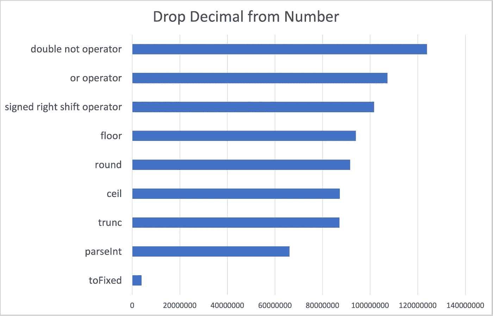

# JavaScript 从数字中删除小数

> 原文：<https://javascript.plainenglish.io/javascript-drop-decimal-from-number-870d70b9ae0d?source=collection_archive---------11----------------------->


Photo by [PAUL SMITH](https://unsplash.com/@sumo?utm_source=medium&utm_medium=referral) on [Unsplash](https://unsplash.com?utm_source=medium&utm_medium=referral)

如何删除一个小数，考虑到性能？

在下面的例子中，我将使用`Math.PI`作为数字:`3.14159`

## 按位双非运算符

这将删除小数点后的所有内容，因为按位运算符将操作数转换为有符号的 32 位整数。这适用于数字或字符串，返回一个数字。

```
~~Math.PI
```

## 按位 or 运算符

同样，按位运算符将操作数转换为有符号的 32 位整数。

```
Math.PI | 0
```

## 有符号右移位运算符

同样，任何数字操作数都被转换为整数。

```
Math.PI >> 0
```

## parseInt

将值解析为整数——注意，如果值不是字符串，首先使用`toString()`抽象操作将其转换为字符串。

```
parseInt(Math.PI)
```

## Math.trunc

Math 的截断方法会截断小数点右边的任何数字。

```
Math.trunc(Math.PI)
```

## 数学.圆

与上述截断数字小数的方法不同，Math 的 round 参数被舍入到正无穷大方向的下一个更高的绝对值。如，0.5 舍入到 1，但请注意-0.5 舍入到 0。

```
Math.round(Math.PI)
```

## 数学.地板

此函数返回小于或等于参数的最大整数。例如，0.9 返回 0，-0.1 返回-1。

```
Math.floor(Math.PI)
```

## 数学.细胞

与 floor 相反，math 的 ceiling 函数返回大于或等于参数的最小整数。例如，0.1 返回 1，-0.9 返回 0。

```
Math.ceil(Math.PI)
```

## toFixed

这个函数将一个数字转换成一个字符串，保留指定的位数，默认情况下是零位数。虽然这去掉了小数，但请注意，你最终得到的是一个字符串。例如，这里的值是“3”。

```
Math.PI.toFixed()
```

## 表演

下面是一个用于比较性能的 JSBenchmark 测试套件:

```
import * as JSBench from "jsbenchmark";

new JSBench.TestSuite({
  async: true,
  passes: 25,
  operations: 1000000,
  maxRuntime: 1000,
})
  .add("double not operator", () => {
    ~~Math.PI;
  })
  .add("or operator", () => {
    Math.PI | 0;
  })
  .add("signed right shift operator", () => {
    Math.PI >> 0;
  })
  .add("parseInt", () => {
    parseInt(Math.PI);
  })
  .add("round", () => {
    Math.round(Math.PI);
  })
  .add("floor", () => {
    Math.floor(Math.PI);
  })
  .add("ceil", () => {
    Math.ceil(Math.PI);
  })
  .add("trunc", () => {
    Math.trunc(Math.PI);
  })
  .add("toFixed", () => {
    Math.PI.toFixed();
  })
  .on("test", (event) => {
    const test = event.test;
    const resultSet = event.resultSet;
    console.log(test.name);
    resultSet.log();
  })
  .on("suite", (event) => {
    const result = event.result;
    result.log();
  })
  .run();
```

结果:



Operations per second — higher is better

由于字符串转换，`toFixed()`大量出现是有道理的，内联位运算比`Math`静态方法稍快。