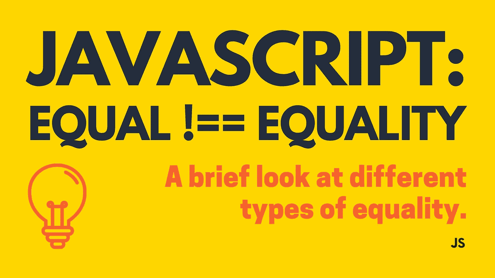

# JavaScript:相等！==平等

> 原文：<https://javascript.plainenglish.io/javascript-equal-equality-54d2d8dc70bc?source=collection_archive---------16----------------------->



今天的意识流博客将我带进了 JavaScript 兔子洞，这是我在最近几篇博客中陷入的主题。毫不奇怪，JavaScript 包含多种等式。根据 MDN 关于[平等性比较和相同性](https://developer.mozilla.org/en-US/docs/Web/JavaScript/Equality_comparisons_and_sameness)的文件:

> ES2015 中有四种等式算法:
> 
> -抽象相等比较(`==` )
> -严格相等比较(`===`):由`Array.prototype.indexOf`、`Array.prototype.lastIndexOf`、`case`使用-匹配
> - SameValueZero:由`%TypedArray%`和`ArrayBuffer`构造函数使用，以及`Map`和`Set`操作，以及从 ES2016
> 开始的`String.prototype.includes` 和`Array.prototype.includes`-same value:在所有其他地方使用

这很好，但我真正想说的是我们调用这些等式算法的不同方式。更具体地说，我想谈谈三种不同的值比较操作`===`、`==`和`Object.is()`。下面我们来探讨一下这三种操作的异同。

## [Object.is()](https://developer.mozilla.org/en-US/docs/Web/JavaScript/Reference/Global_Objects/Object/is)

这对我来说是一个新的操作，所以我想我应该先投入进去。事实上，在我开始写这个主题之前，我从来没有听说过它，而且我发现我看过的大多数教程都没有深入这个主题。此方法比较括号内的两个值，并确定两个值是否相同。

```
Object.is(7, 7); *//* ***true***
Object.is('foo', 'foo'); *//* ***true*** Object.is('foo', 'bar'); *//* ***false*** Object.is({}, {}); *//* ***false***
```

你明白了。记住`Object.is()`如何工作的关键在于记住你正在比较的价值观。例如，看看上面的第一行代码，用变量重写它，看起来像:

```
let a = 7;
let b = a;Object.is(a, b); *//* ***true***
```

上述两个变量指向同一个值，`7`，并且它们具有相同的原始数据类型，[编号](https://developer.mozilla.org/en-US/docs/Web/JavaScript/Reference/Global_Objects/Number)。在[之前的博客](/javascript-everything-is-an-object-or-is-it-2f1092403dc3)中，我简单地提到了原始数据类型的主题，也就是原始值，以及*类型的*对`Object.is()`而不是`==`操作符很重要。`**Object.is()**` **不执行** [**式强制**](https://developer.mozilla.org/en-US/docs/Glossary/Type_coercion) 。下面是当`Object.is()`返回 true 时的 MDN 分解:

> 如果下列条件之一成立，则两个值相同:
> 
> -两个`[undefined](https://developer.mozilla.org/en-US/docs/Web/JavaScript/Reference/Global_Objects/undefined)` -两个`[null](https://developer.mozilla.org/en-US/docs/Web/JavaScript/Reference/Global_Objects/null)` -两个`true`或两个`false` -两个字符串长度相同，字符顺序相同
> -两个对象相同(意味着两个值都引用内存中的同一个对象)
> -两个数字**和
> —**—两个`+0`—两个`-0` —两个`[NaN](https://developer.mozilla.org/en-US/docs/Web/JavaScript/Reference/Global_Objects/NaN)` —或者两个都不为零且都不为`[NaN](https://developer.mozilla.org/en-US/docs/Web/JavaScript/Reference/Global_Objects/NaN)`，并且两个值相同

与`===`和`==`相比，它们有相似之处，但更重要的是，它们有一些关键的区别。让我们来看看。

## [严格相等比较(“严格相等”、“相同”、“三重相等”)——= = =](https://developer.mozilla.org/en-US/docs/Web/JavaScript/Equality_comparisons_and_sameness#strict_equality_using)

我们已经简要地看了一下`Object.is()`，但是让我们看看同值比较……如何与严格相等比较进行比较(*这是很多比较……*)。要使用严格的相等比较，您可以使用三重等于运算符，`===`。事实上，这是您应该比任何其他比较操作更多使用的比较运算符。事实上，MDN 认为'*严格相等几乎总是正确的比较操作。*

与`Object.is()`一样，`===`在比较值时不执行类型强制。 [' *如果值有不同类型，则认为值不相等。*’](https://developer.mozilla.org/en-US/docs/Web/JavaScript/Equality_comparisons_and_sameness#strict_equality_using)基本上，上面的虚线列表几乎完全适用于严格的等式比较。差不多了。在两种特殊情况下，triple equals 的行为可能与您预期的不同。那两个特例涉及[特殊号](/javascript-special-numbers-404dd5bf5f20)、`NaN`和`-0`。

```
NaN === NaN; *//* ***false***
Object.is(NaN, NaN); *//* ***true***-0 === 0; *//* ***true***
0 === -0; *//* ***true***
Object.is(-0, 0); *//* ***false***
Object.is(0, -0); *//* ***false***
```

`NaN`与`NaN`的值相同，这也是`Object.is(NaN, NaN)`返回`true`的原因。`-0`与`+0`或`0`不是同一个值，这就是`Object.is(-0, 0)`返回`false`的原因。如果这对你来说没有意义，我明白了，但还是用在 JavaScript 还是一个东西*之前制定的[**IEEE 754**](https://en.wikipedia.org/wiki/IEEE_754#Comparison_predicates)*标准吧。如果你正在使用`===`操作符，这两个特殊的数字可能会让你头疼，既然你应该头疼，只要记住上面的代码行是仅有的两个特例，你就会没事。**

****边注*** *:如果你曾经想使用严格的相等比较来检查一个值是否为* `*NaN*` *我建议使用* `*!==*` *。* `*NaN*` *总是不等于其他每一个值，包括* `*NaN*` *。唯一能让* `*NaN*` *返回真的方法是比较* `*NaN !== NaN*` *。还有，可以用*[*number . isnan()*](https://developer.mozilla.org/en-US/docs/Web/JavaScript/Reference/Global_Objects/Number/isNaN)*。**

## *[抽象相等比较(“宽松相等”、“双重相等”)——= =](https://developer.mozilla.org/en-US/docs/Web/JavaScript/Equality_comparisons_and_sameness#loose_equality_using)*

*现在，我已经在前面的章节中提到了[类型强制](https://developer.mozilla.org/en-US/docs/Glossary/Type_coercion)以及之前的比较是如何执行类型强制的。这就是它发挥作用的地方。Double equals 就像是 JS 中比较的狂野西部。很难预测，这是因为类型强制。我不会在这种类型的比较上花太多时间，因为使用宽松的等式通常是“不鼓励的”。但是，它是有效的 JS，所以你应该知道它。MDN 将其细分如下:*

> *相等运算符(`==`和`!=`)使用[抽象相等比较算法](http://www.ecma-international.org/ecma-262/5.1/#sec-11.9.3)来比较两个操作数。这可以大致概括如下:*
> 
> *-如果操作数都是对象，仅当两个操作数引用同一个对象时才返回`true`。
> ——如果一个操作数是`null`，另一个是`undefined`，则返回`true`。
> -如果操作数是不同的类型，在比较之前尽量把它们转换成相同的类型:
> -在比较一个数字和一个字符串时，尽量把字符串转换成数值。
> —如果操作数之一是`Boolean`，如果是`true`，则将布尔操作数转换为 1，如果是`false`，则转换为+0。
> —如果一个操作数是对象，另一个是数字或字符串，尝试使用对象的`valueOf()`和`toString()`方法将对象转换为原语。*
> 
> *-如果操作数具有相同的类型，则进行如下比较:
> — `String`:仅当两个操作数具有相同顺序的相同字符时，返回`true`。
> — `Number`:仅当两个操作数的值相同时，返回`true`。`+0`和`-0`被视为相同的值。如果任一操作数为`NaN`，则返回`false`。
> — `Boolean`:仅当操作数都是`true`或都是`false`时，返回`true`。*

*就像我说的，小心使用这个。最好的做法总是坚持严格的平等而不是宽松的平等。*

*现在你知道了！总之，在确定两个值是否相等时，使用严格比较。它将永远是你最安全的赌注，只要你记住这两个特例，它的表现将是最可预测的。这里还有一个[有用的 github 演示](https://dorey.github.io/JavaScript-Equality-Table/)JS 比较！*

*快乐编码🤓*