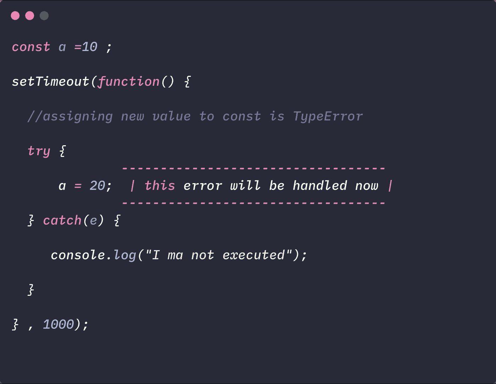
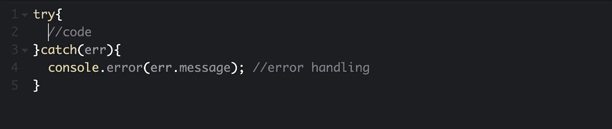
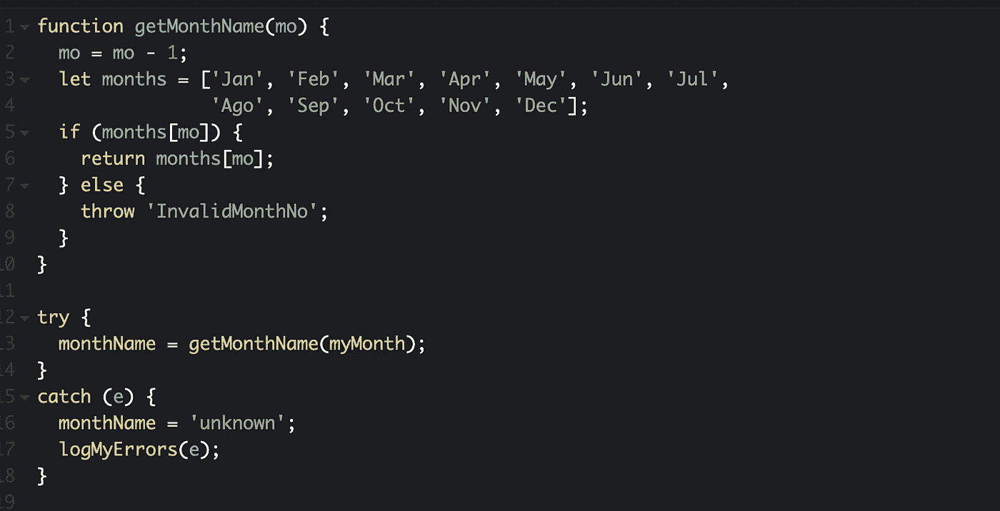
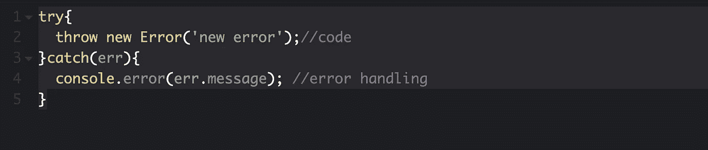
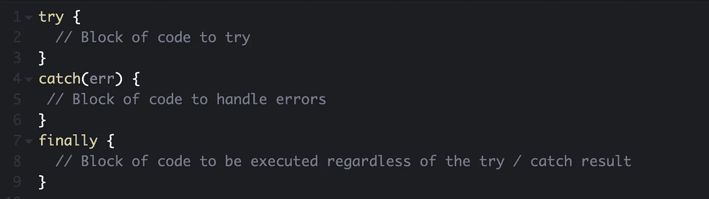
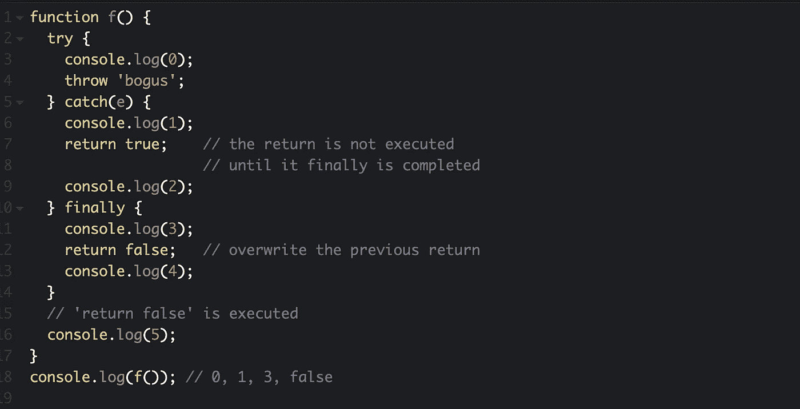
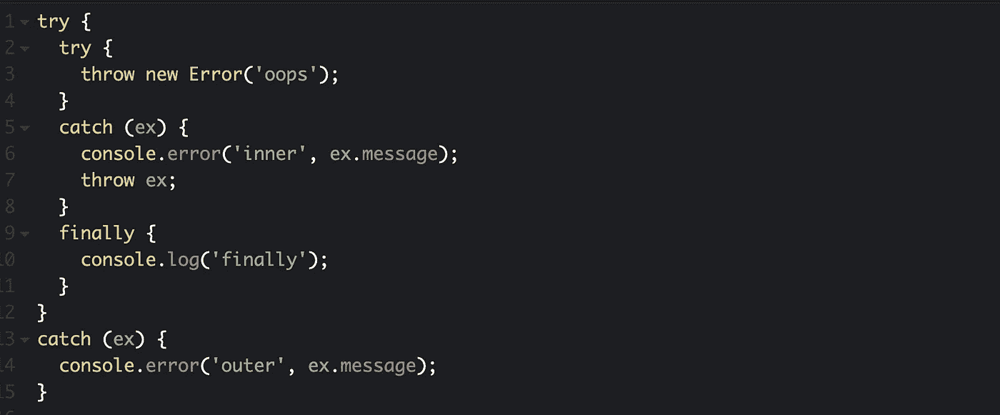

# JavaScript —错误和异常处理

> 原文：<https://javascript.plainenglish.io/javascript-errors-exceptions-handling-43ae983cbbb3?source=collection_archive---------2----------------------->

## 嘿先生/小姐，我的剧本有个错误！

错误是可能发生的，在 JavaScript 中，大多数时候都会发生错误！出现这条恼人的红色信息有多种原因:

*   语法错误:我们可以花时间审查我们的代码，我们从来没有意识到有一个丢失的分号或括号。
*   范围错误:该错误超出范围或未定义。它可以是无效的日期或无效的数组长度。
*   引用错误:当我们给一个不存在的变量赋值时，就会出现这个错误。它可能是一个未定义的 x 或者一个未声明的变量 x 的赋值。
*   类型错误:当值为意外类型时会出现错误。

*注意:如果我们愿意，也可以使用一些* [*JavaScript 异常解决器*](https://fixjserror.com/) *。*

诸如此类。我们稍后会看到这一点。

因此，当这种情况发生时，代码不会运行，并且会被卡住。我们如何修复这些错误？用这个！

## **试试……接住可以保存的代码**

当错误发生时，JavaScript 代码停止运行并显示一条错误消息。 *Try… catch* 是一段代码，它将是解决方案。

当测试一段代码时，我们使用 *try* 来查看它的执行过程中是否有错误。然后，如果出现错误，将执行 *catch* 语句。 *catch(err)* 中的*err*——您可以随意命名——定义了一个错误对象，并提供了如何处理该错误的详细信息。当 catch 记录一个错误时，我们将使用 console.error()而不是 console.log()。这是报告错误并将其添加到页面上出现的错误列表中的正确方法。

当出现错误时，JavaScript 停止运行并抛出异常或错误。错误对象可以有两个属性:

*   错误名称可以返回不同的值:

Eval()函数中出现 eval 错误。然而，新的 Javascript 版本不使用这个错误。相反，我们可以使用 SyntaxError。

范围误差:当一个数字超出范围时。

引用错误:变量未声明时。

语法错误:当出现语法错误时。例如，错过分号是很典型的。

类型错误:当值由于变量的类型而超出范围时。比如一个数字不能大写。

URI 错误:当统一资源标识符 encodeURI()出错时。URI 是识别 aweb 技术使用的资源的字符序列。

*   错误消息提供了有关错误的信息。

如果不需要 error 对象，我们可以用 *catch{}* 代替 *catch(err){}。*

如果我们想让 try… catch 工作，您必须确保代码是有效的和可运行的——没有语法错误，比如不匹配的花括号。一旦可读，引擎读取并运行代码。然后，它会在看不懂这段代码的时候执行 *try… catch* 。

Try… Catch structure

这是一个我们如何使用 try…catch 的例子。此示例调用一个函数，该函数根据函数的上一个值返回月份数组。如果该值不是 1 到 12 之间的月份数，它将引发一个名为“InvalidMonthNo”的异常，catch 块会将变量 monthName 转换为“unkown”。

Example from developer.mozilla.org

## 哦，等等！*抛出—新错误—* 是什么意思？

Try… Catch with throw an error structure

正如我们之前看到的，当代码中出现错误时，代码就会停止运行。当使用 throw 语句时，我们可以通过抛出一个错误或异常来控制流并定制我们自己的错误和错误消息。您可以将其自定义为字符串、对象、布尔值或数字。

## **最后，最后声明**

尽管进行了*尝试…捕捉*，我们最终还是执行了*。这个块总是在 try… catch 之后执行。这个块将以两种方式执行:是否有异常。最后总是确保代码将被执行，即使有一个错误。*

Try… Catch… Finally structure

如果 finally 返回值，这个值将是整个 T *ry… Catch… Finally* 块中的返回值，而 *Try… Catch* 块中的返回值是什么并不重要。

Example for Try… Catch… Finally

## 嵌套的 Try… Catch 块

嵌套 Try… Catch 是可能的。如果 *try* 没有自己的 *catch* ，它必须有一个 finally 程序块和 catch 程序块连接到 try… catch 进行测试，以确保一致性。这里有一个结构和工作原理的例子。

该异常将被最近的 catch 捕获。内部块中的任何新异常都将被外部块捕获。

## 结论

Try… Catch 模块处理运行时错误。这意味着，如果您尝试运行第一个代码块，第二个代码块会捕获其中发生的错误。

错误对象有这两个属性:

*   名字
*   消息

如果不需要错误对象，我们可以使用 catch{}。

使用 throw——一个错误对象，我们可以生成自己的异常。

如果使用 finally，这个块的返回值才有效。

*更多内容请看*[*plain English . io*](http://plainenglish.io/)