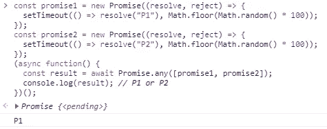

# JavaScript ES2021 (ES12)认可的功能

> 原文：<https://javascript.plainenglish.io/javascript-es2021-es12-approved-features-24451e9591f8?source=collection_archive---------8----------------------->

## Ecma 大会批准的 JavaScript ES2021 (ES12)中的新特性

JavaScript 2021 (ES12) picture

大约一年前，我写了一篇关于 JavaScript 将在其 ES2021 规范中包含的新特性的文章。

今天，2021 年 6 月，这些功能以及其他功能都已获得批准。在这篇文章中，我详细阐述了我一年多前写的东西，但是添加了已经被批准的最终特性。

# 索引

*   String.prototype.replaceAll()
*   Promise.any()和 AggregateError
*   WeakRefs 和终结注册表
*   逻辑赋值运算符
*   数字分隔符

# String.prototype.replaceAll()

`String.prototype.replaceAll()`用另一个字符串值替换字符串中某个子字符串的所有实例，而不使用全局 regexp。

到目前为止，最常见的方法是使用全局 regexp。

考虑下面的代码，其中我们使用正则表达式将“+”字符替换为空字符:

这种方法的缺点是需要使用特殊字符的正则表达式来实现这一点。但是正则表达式的使用并不容易，而且容易出错，是常见的错误来源。

实现这一点的更直接的解决方法是将 String#split 与 Array#join 结合起来:

这个过程避免了正则表达式，但代价是将字符串分割成一组部分，然后再将它们粘在一起。

Mathias bynens 的提议解决了这些问题，并给出了一种执行全局子串替换的简单方法:

📌注意，为了与语言中预先存在的 API 保持一致，`String.prototype.replaceAll(searchvalue, newvalue)`的行为类似于`String.prototype.replace(searchvalue, newvalue)`,但有两个主要例外:

*   如果`searchvalue`是一个字符串，那么字符串#replaceAll 替换所有出现的子串，而字符串#replace 只替换子串的第一个出现的子串。
*   如果`searchValue`是非全局正则表达式，`String.prototype.replace`只替换单个匹配。另一方面，`String.prototype.replaceAll`在这种情况下抛出一个异常，以避免在缺少全局标志(这意味着“不要全部替换”)和被调用方法的名称(这意味着“全部替换”)之间产生混淆。

# Promise.any()和一个**聚合错误**

任何承诺一兑现就解决，否则就全部拒绝。在这种情况下，用`AggregateError`拒绝。

考虑下面的例子:

结果以`Promise.any()`首先解析的结果为准。

Example in Google Chrome dev tools.

如果没有一个承诺被解决，`Promise.any()`抛出一个`AggregateError`异常。

📌请记住与`Promise.race()`的不同之处，在这里，只要任何一个承诺被解决，承诺就被解决，不管它们是被实现还是被拒绝。

## 聚合错误

当各种错误需要包装在单个错误中时，`AggregateError`对象表示一个错误。如果传递给它的所有承诺都被拒绝，与`Promise.any()`一起使用很有帮助。

我们使用`AggregateError()`构造函数来创建一个新的`AggregateError`对象。

属性:

*   `message`:我们使用这个属性来显示错误消息。默认值为”。
*   `name`:我们使用这个属性来显示错误的名称。默认值为 AggregateError。

捕获聚合错误:

如何创建聚合错误:

# WeakRefs 和**终结注册表**

武器在很多情况下都很有用。例如，我们可以使用一个 Map 对象来实现一个包含许多键值的缓存，这些键值需要大量的内存。在这种情况下，对我们来说方便的是尽快释放键值对占用的内存，WeakRefs 允许我们这样做。

WeakRef 对象包含对对象的弱引用。对对象的弱引用是一种阻止对象被垃圾收集器恢复的引用。另一方面，标准引用将对象保存在内存中。

JavaScript 中对对象的引用被保存。也就是说，只要你有一个对象的引用，它就不会被垃圾收集。

示例:

目前，我们有 WeakMap()和 WeakSet()使用 WeakRefs:

WeakMap 对象是键-值对的集合，其中的键被弱引用。

让我们考虑下面的例子:

使用前一个对象的函数:

我想记录某个特定对象调用该方法的次数，并在超过 1000 次时进行报告:

这个解决方案是可行的，但是它存在内存泄漏，因为传递给函数的每个对象都永远保留在映射上，并且没有被垃圾收集。解决方案是使用 WeakMap:

📌因为引用是弱的，所以 WeakMap 键是不可枚举的。

📌WeakSet 类似于 WeakMap，但是就像集合一样，WeakSet 中的每个对象只能出现一次。WeakSet 集合中的所有对象都是唯一的。

## 终结注册表

对对象进行垃圾回收后，可以使用 FinalizationRegistry 类运行用户定义的终结器。无论如何，最好避免使用终结器，因为如果使用不当，它们会导致意外的结果。

# 逻辑赋值运算符

逻辑赋值操作符(由 Justin Ridgewell 和 Hemanth HM 提出)结合了逻辑操作符(&&，||，？？)和赋值表达式:

到目前为止，JavaScript 有以下赋值操作符:

有了这个建议，我们可以将逻辑运算符和赋值表达式结合起来:

# 数字分隔符

数字分隔符(Christophe Porteneuve)扩展了现有的 [*NumericLiteral*](https://tc39.github.io/ecma262/#prod-NumericLiteral) 以允许数字之间的分隔符。

得益于这一特性，通过在数字之间创建一个可视的分隔符，可以很容易地使数字更具可读性。

例如:

上面的数字文字很难阅读，但是我们可以使用下划线作为分隔符使其更容易阅读:

好了，现在更容易理解“钱”这个变量了。

数字分隔符可以用在不同的位置:

另外，数字分隔符在八进制整数文本中也是可用的。

# 结论

我在很多年前开始使用 JavaScript，当时这种语言几乎还是个玩具，只是用来在浏览器中做些傻事。今天，它已经成为全球使用最多的语言，几乎被用来做任何事情。

此外，我们不能忘记，它是一种不断更新的活语言。

*更多内容尽在*[***plain English . io***](http://plainenglish.io/)