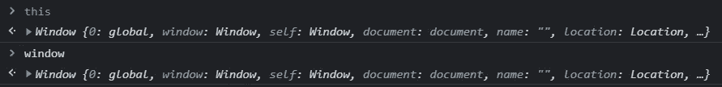
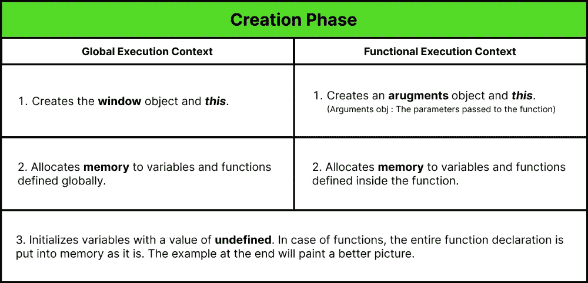
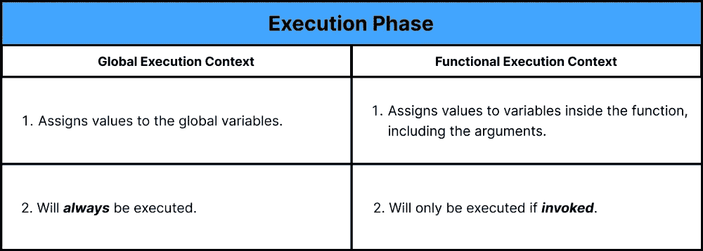
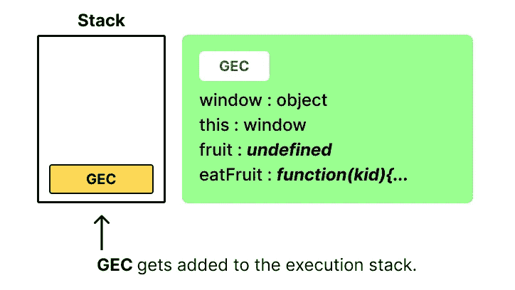
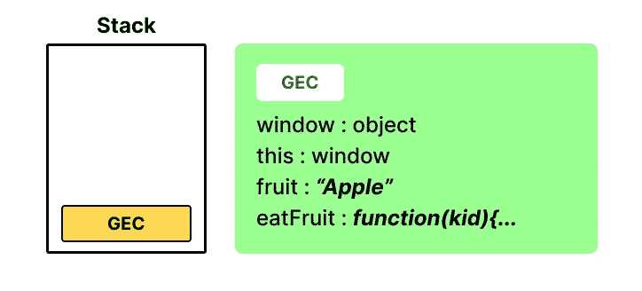
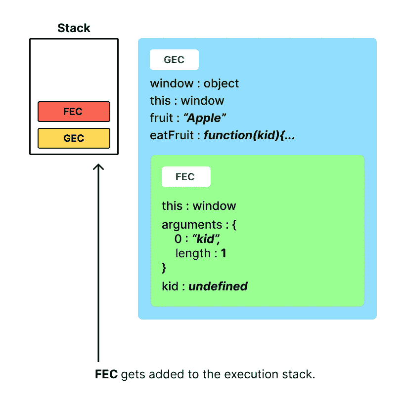
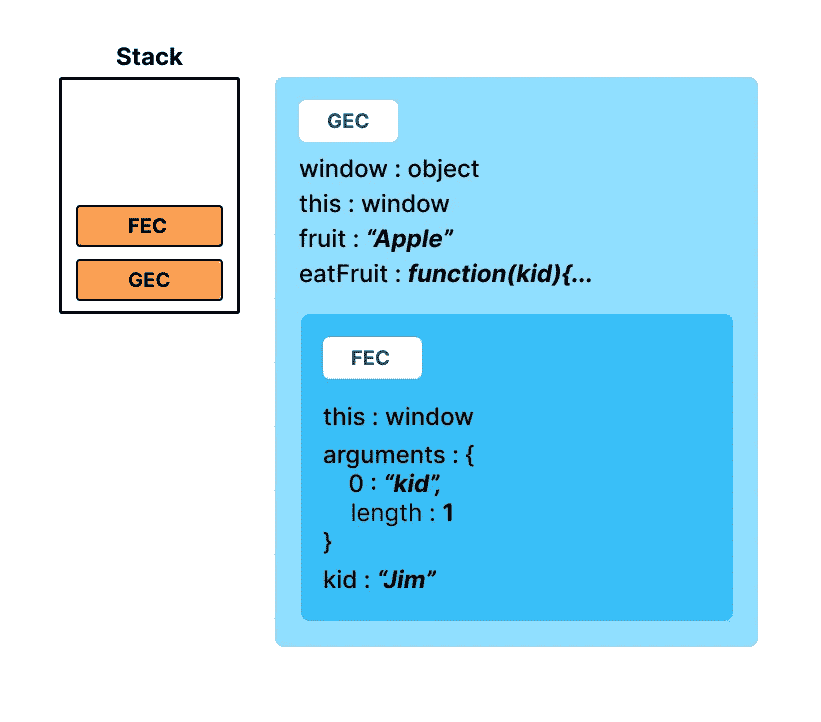
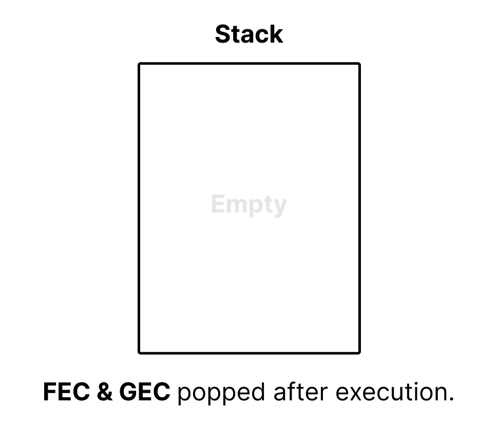

# JavaScript 执行上下文:幕后

> 原文：<https://javascript.plainenglish.io/javascript-execution-context-behind-the-scenes-1463a0ef3dd8?source=collection_archive---------12----------------------->

## JavaScript 中“执行上下文”的初学者友好指南。


在继续利用一项技术创建项目之前，最好先掌握这项技术。当我在使用 React 时，我遇到过无法找出为什么一个组件没有像预期的那样运行的情况。经过几个小时的调试，浏览了一系列博客文章和 StackOverflow 线程，我对 JavaScript 如何在幕后处理事情有了新的了解。从那以后，我一直在深入挖掘类似的话题，并将所有这些信息整理成一系列博客文章。

这篇文章将主要关注 JS 文件是如何在浏览器中执行的。我会尽量让它简单易懂。

*注:我也曾在一段视频中悲惨地试图用***来解释这一点。可以在这里* *看完* [*。*](https://youtu.be/_FjKFCVR4QA)*

# *JavaScript 执行上下文*

*为了理解 JavaScript 文件是如何执行的，我们需要知道什么是“**执行上下文**”。简单地说，它是为代码块及其依赖项创建的环境。JavaScript 引擎查看一段代码，检查它需要执行的所有资源，然后将它们打包到一个块中。这个块是为这段代码创建的执行上下文。一个脚本中可能有几个这样的执行上下文。让我们看一个例子来更好地理解它。*

```
*1\. let greeting = "Hello";
2\. const greetUser = (name) => {
3\.    console.log(greeting + name); 
4\. }
5\. greetUser("Jim");  // "Hello Jim"*
```

*上面的例子是一个简单的函数，它为特定的用户打印一个问候。当在第 5 行调用该函数时，会为此函数创建一个执行上下文。这个上下文充当一个具有一组资源的"**封闭环境"**-在本例中，变量**name**&**greeting**。*

*在这个上下文**中**创建的资源(变量、参数、函数)将不会**成为其他执行上下文的一部分。尽管在上下文范围之外创建的任何东西都可以在上下文内部访问。所以如果你看上面的例子，函数" **greetUser "** "将有它自己的执行上下文，将能够访问 **greeting** 变量，它是外部执行上下文的一部分。不要担心，一旦我们在本文后面看到一个可视化的例子，这将变得更有意义。***

## *执行上下文的类型*

*主要有两种执行上下文。
- **全局执行上下文(GEC)**
- **函数执行上下文(FEC)** 我们前面看到的那个，是函数执行上下文。让我们看一下全局执行上下文。*

***全局执行上下文(GEC)** 非常类似于函数执行上下文。当您在浏览器上运行脚本时，在任何代码执行之前发生的第一件事就是创建一个 GEC。这个 GEC 将有两个默认属性，**窗口对象**和名为 **this 的变量。**在 GEC 的例子中，窗口对象和**这个**本质上具有相同的值。如果您正在桌面上阅读这篇文章，您可以打开您的开发工具控制台，亲自检查一下。“ **this** 和 window 对象的值将是相同的。*

**

*在 FEC 的情况下，“ **this** ”的值根据创建执行上下文的范围而改变。*

## *执行上下文的生命周期*

*一个执行上下文通常有两个阶段。
- **创作阶段**-
-**执行阶段**。GEC 和 FEC 的创建阶段几乎相似，只有一些小的不同。下表突出了这些差异。*

**

*一旦创建阶段完成，执行阶段开始。同样，GEC 和 FEC 在执行阶段有细微的差别。*

**

*让我们演练一个例子，看看这是如何工作的。我们将在示例中引用这段代码。*

```
*1\. let fruit = "Apple";
2\. function eatFruit(kid) {
3\.    console.log(`${kid} ate the ${fruit}");
4\. }
5\. eatFruit("Jim");*
```

***步骤 1:** 创建一个全局执行上下文。这个上下文将有一个**窗口**对象。它还有一个指向窗口对象的变量。JS 引擎遍历脚本，寻找变量和函数。我们有 1 个全局变量，**水果**。该变量被赋予一个未定义的值**。“ **eatFruit** ”的函数声明按原样放入内存。至此，GEC 的创作阶段告一段落。***

******

***Step 1***

*****第二步:**一旦创建阶段完成，执行阶段就开始了。先前分配给**未定义**的全局变量 **fruit** 现在被分配给它的实际值，即“ **Apple** ”。当我们到达第 5 行时，我们调用函数“**eat fruit”**。调用函数导致**函数执行上下文**的创建。***

******

***Step 2***

*****步骤 3:** 现在，该 FEC 将进入其自己的创建阶段。”**这个“T3”指着窗外。因为这是一个 FEC，我们将有一个 **arguments** 对象来跟踪传递给函数的参数。在我们的例子中确实有一个参数， **kid** ，所以我们将为它分配内存，并将其设置为 **undefined。*******

******

***Step 3***

*****第 4 步:**在创建阶段**之后，**变量 **kid** 被赋予实际值，该值将是“ **Jim** ”。该函数现在得到执行，并在控制台中打印一条消息。***

******

***Step 4***

*****步骤 5:** 一旦执行完成，它将从执行堆栈中移除。由于全局执行也在“**eat fruit”**之后完成，GEC 也从堆栈中弹出，脚本执行结束。***

******

***Step 5***

***这就是 JavaScript 文件在浏览器中执行的基本方式。如果您正在开发一个 nodeJs 应用程序，那么这个流程与传统的基于浏览器的 Js 文件没有什么不同。我将在另一篇文章中介绍它。***

***我希望这对你有所帮助。如果您有任何疑问，请随时发表评论。如前所述，我将发布更多的文章，涵盖类似的高级 JavaScript 概念，敬请关注。干杯！***

***[LinkedIn](https://www.linkedin.com/in/akilesh-rao-610357137/)
[Twitter](https://twitter.com/themangalorian)
[Github](https://github.com/AkileshRao)***

****更多内容请看*[***plain English . io***](http://plainenglish.io/)***