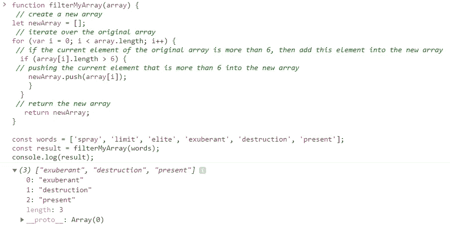

# JavaScript:用 Filter()方法过滤数组

> 原文：<https://javascript.plainenglish.io/javascript-filtering-arrays-filter-method-ac582e4594e2?source=collection_archive---------15----------------------->

在这一系列文章中，我想谈谈 JavaScript 中的数组迭代器方法，更具体地说是过滤 arras 或 **Filter ()** 方法。在一个给定的数组中，我们可能希望通过多种方式与元素进行交互。我甚至可以说，访问数组中的元素并与之交互是日常编程中非常常见的需求。实际上，这种情况非常普遍，几乎所有的编程语言都有内置的方法来迭代数组。


Photo by [Hello I'm Nik](https://unsplash.com/@helloimnik?utm_source=medium&utm_medium=referral) on [Unsplash](https://unsplash.com?utm_source=medium&utm_medium=referral)

那些内置方法减少了我们需要编写的代码行数；具有表达性(易于阅读和理解),这样一旦其他开发人员看到这些方法被调用，他们就知道会发生什么；自动化底层编码的一些部分，例如，一个新的数组被自动创建并作为那些方法的一部分返回，等等。总的来说，这些方法使程序员的生活更加方便，并使我们能够专注于更重要的事情。

所有这些数组迭代器方法都有一些共同点:在所有情况下，我们传入一个数组，然后使用一些循环遍历该数组，最后，编写一些代码以期望的方式与给定数组的每个元素进行交互/操作。

今天我要讲的是 **Array.prototype.filter()** 内置方法。和往常一样，在 [MDN Web Docs](https://developer.mozilla.org/en-US/docs/Web/JavaScript/Reference/Global_Objects/Array/filter) 页面上查看该方法的官方定义是一个很好的做法:

> " filter()方法创建一个新数组，其中所有元素都通过了由提供的函数实现的测试。"

我们来分解一下这个定义吧！

*   它创建了一个新数组
*   它遍历原始数组的每个元素
*   它检查数组的每个元素是否满足某个条件
*   如果满足特定条件，元素将被推入新数组
*   它返回用满足条件的元素填充的新数组

简单来说，这个方法查找并返回满足特定条件的元素列表。

让我们在 [MDN Web Docs 网站](https://developer.mozilla.org/en-US/docs/Web/JavaScript/Reference/Global_Objects/Array/filter)上再看一遍这个例子。给你一个字符串数组，你需要返回一个新的字符串数组，其中每个元素/或字符串多于 6 个字母。

方法 **Filter ()** 在 array / *words* 上被调用，并返回元素的新数组，每个元素多于 6 个。

```
const words = ['spray', 'limit', 'elite', 'exuberant', 'destruction', 'present'];const result = words.filter(word => word.length > 6);console.log(result);
// expected output: Array ["exuberant", "destruction", "present"]
```


它是如何工作的？ **Filter ()** 方法接受一个参数，一个回调函数，它将调用数组中的每个元素(提醒一下，我们可以使用箭头函数表达式或内联回调函数)。对于传递给回调函数的每个元素，如果回调的返回值为 true，则该元素被推入一个新数组。如果回调的返回值为 false，则该元素被过滤掉。在检查完初始数组中的每个元素后， **Filter ()** 返回新数组。

下面是根据 [MDN 网络文档](https://developer.mozilla.org/en-US/docs/Web/JavaScript/Reference/Global_Objects/Array/filter)的这个方法的语法:

```
// Arrow function
filter((element) => { ... } )
filter((element, index) => { ... } )
filter((element, index, array) => { ... } )

// Callback function
filter(callbackFn)
filter(callbackFn, thisArg)

// Inline callback function
filter(function callbackFn(element) { ... })
filter(function callbackFn(element, index) { ... })
filter(function callbackFn(element, index, array){ ... })
filter(function callbackFn(element, index, array) { ... }, thisArg)
```

让我们用一个回调函数重写上面的例子来演示回调函数的语法。将以下代码复制并粘贴到您的控制台中，并检查输出。

```
// Array of words 
const words = ['spray', 'limit', 'elite', 'exuberant', 'destruction', 'present'];// Call back function 
function callBackFunc (words) {
return words.length > 6;}const result = words.filter(callBackFunc);
console.log(result); 
// output-> [ 'exuberant', 'destruction', 'present' ]
```

输出与之前使用箭头函数表达式的输出相同。


现在，有了这些知识，让我们构建我们自己版本的 **Filter ()** 方法，以便更好地理解它是如何工作的！为了简单起见，我们将使用上面相同的例子，但是这一次，我们将苹果香草 JavaScript 来解决这个过滤问题。

这里有一个伪代码和代码本身的问题。请阅读，然后复制并粘贴到您的控制台。

```
function filterMyArray(array) {// create a new empty array
let newArray = [];// iterate over the original array
for (var i = 0; i < array.length; i++) {// if the current element of the original array is more than 6, then add this element into the new array
if (array[i].length > 6) {// push the current element that is more than 6 into the new array
newArray.push(array[i]);
   }
}// return the new array
return newArray;
}const words = ['spray', 'limit', 'elite', 'exuberant', 'destruction', 'present'];const result = filterMyArray(words);
console.log(result);
```

当我们使用作为箭头函数表达式或回调函数编写的 **Filter ()** 方法时，输出与之前相同。



上面的代码演示了如何用普通的 JavaScript 解决这个过滤问题，尽管它仍然是一个有效的解决方案；JavaScript 有自己的内置数组迭代器方法— **Filter ()** ，它有以下好处:

*   我们不需要为循环创建一个*来迭代/或使用任何其他循环*
*   在每次迭代中，当前元素存储在一个变量中，因此我们不需要使用元素的索引值来访问元素
*   所有迭代结束后，一个新的数组会自动创建并返回，所以我们不需要在开始时创建一个空数组并将元素放入其中
*   仅仅几行代码就比较了普通的 JavaScript 方法
*   易于阅读和理解/适合所有用户


Photo by [Pawel Czerwinski](https://unsplash.com/@pawel_czerwinski?utm_source=medium&utm_medium=referral) on [Unsplash](https://unsplash.com?utm_source=medium&utm_medium=referral)

如果您觉得这些信息有用，请随时关注我。希望您喜欢这篇关于 JavaScript 中 Filter()方法的简短指南，请保持关注！

*更多内容请看*[***plain English . io***](http://plainenglish.io/)