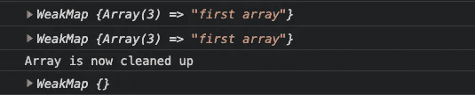

# 理解 JavaScript 中新的终结器和弱引用

> 原文：<https://javascript.plainenglish.io/javascript-finalizer-2859f0832f07?source=collection_archive---------7----------------------->

## ES2021 将使查找和避免内存泄漏变得更加容易


Source: the author

JavaScript 正在发展。所有这些*新的 JavaScript 特性 2021* 文章都很好，但还不是很完整。在我看来，尤其是那些相当新的所谓的*终结者*没有得到应有的关注。ECMAScript 2021 中引入了终结器。

最酷的是，如果我们已经理解了终结器，它会直接帮助我们理解其他新特性:WeakMap、WeakSet 和一般的弱引用。

但首先:理解这个的动机是什么？
这是关于内存泄漏和性能的。

如果您已经知道什么是内存泄漏，请随意跳到下一个标题。

当内存被使用但没有被释放时，就会发生内存泄漏。整个事情没有听起来那么复杂。当您在代码中创建数组时，它需要内存。然而，由于 V8 引擎，浏览器& Node.js 中的 JavaScript 有一个垃圾收集器。

这意味着，例如，不再需要的变量将被清除，从而释放内存。

# 典型的内存泄漏，以及我们如何检测它

毕竟，如果 V8 垃圾收集清理了所有不必要的东西，那么一切都很好，不是吗？是的，事实上，它是。但问题是垃圾收集器并不总是正确地识别出什么是不必要的。

下面是一个典型的内存泄漏:全局范围内所有初始化的变量都不会被清除。例如，以下代码会导致内存泄漏:

```
let bigArray;setTimeout(function() { 
  bigArray = new Array(9999999)
}, 5000)
```

由于*大数组*是在全局范围内声明的，所以永远不会被清理。
想看证明？好吧，这就是终结器最终发挥作用的地方。

# 了解 FinalizationRegistry 类

我觉得这个名字有点令人困惑。所谓的终结器的工作非常简单:它们观察一个传递的对象，并在垃圾收集器移除该对象时通知我们。

让我们为垃圾收集器将要移除的对象初始化一个终结器。
提示:这段代码可以在浏览器或 Node.js 中运行，但是我建议您在 Node.js 中运行它进行实验。(在那里手动调用垃圾收集器更容易)。

终结器本身是下面的代码:

```
const registerFinalizer = new FinalizationRegistry(message => {
  console.log(message)
});
```

它将一些数据作为参数，我用它来记录哪些对象已经被 GC 移除(我暂时称之为垃圾收集器 GC)。

当我们想要观看一个对象时，我们需要注册它。因为全局范围内的变量没有被清除，所以我创建了一个自调用函数。在这个上下文中声明的每个变量如果不再被使用，都将被 GC 清除。

```
(function() {
  let arr = new Array(100000).fill("A")
  registerFinalizer.register(arr, "Huge array is now cleaned up")
} () )
```

为了让这段代码永远运行，我们在末尾添加了一个 *setInterval* ，所以程序永远不会终止。以下是完整的代码:

如果您现在运行它，并等待几秒钟，您应该在控制台中看到“巨大的数组现在被清理”。酷吧。

一个简单的问题使我们的实验有点难看:我们永远不知道 GC 什么时候开始清理——因此，证明某些东西在某个点被清理是很麻烦的。

感谢上帝，我们可以在我们的 one 上调用 GC——正如我所说的，这在 Node.js 中效果最好。

让我们证明 GC 从不删除全局变量:

用`global.gc()`我们可以手动调用垃圾收集器。重要:你需要像这样运行你的代码:`node --expose-gc index.js`。

当您运行代码时，即使我们多次调用 GC，消息“巨大的数组现在被清理”也不会出现。

如您所见，registerFinalizers 帮助我们检查 GC 是否移除了一个对象。这对于优化和测试你的应用非常有价值。
但我们还没有完成——我现在将向您介绍另一个新概念。

多亏了终结器，我们现在可以更好地检测内存泄漏。但是如何避免它们呢？JavaScript 为此提供了新的武器。此外，较老的 WeakSet 和 WeakMap 使用相同的概念。对于示例，我将坚持使用 WeakMap。首先，理解概念很重要。

# 了解 WeakMap

我相信你知道 JavaScript 中的 Map-object。它允许我们在其中保存一个键值对——不要与 map 函数混淆！像所有事情一样，很容易导致内存泄漏。

**提醒:**如果有东西引用了这个对象，GC 会认为它仍然是需要的。这里有一个例子。

同样，我们有一个数组，这次我们称它为 *arr* ，在一个函数的范围内。不使用时，应由 GC 将其移除。感谢我们的终结器，我们可以跟踪数组是否被移除以及何时被移除。不幸的是，在全局范围内创建的 Map 保存了我们的*arr*——因此，GC 认为仍然需要这个数组。

当您在浏览器或节点中复制并运行此代码时，应该会看到以下内容:


Source: the author

我们的 arr 继续存在，永远不会被 GC 删除。为什么？因为它被地图“利用”了——典型的内存泄露，也是我们地图相当嚣张的行为。感谢上帝，还有一种选择 WeakMap。

WeakMap 只保存一个作为键接收的对象的弱引用。**重要:**键必须是对象。但是弱引用是什么意思呢？

WeakMap 不会让 GC 认为它持有的对象仍然被使用。因此，WeakMap 可以为了释放内存而删除一个键。这很谦虚，不是吗？

我们所需要改变的就是把`let arrCollection = new Map()`变成`let arrCollection = new WeakMap()`。我还在自调用函数之后添加了一个`console.log(arrCollection)`,以检查 WeakMap 是否持有它应该持有的东西。

我建议您在浏览器中运行更改后的代码(如果不使用 [util.inspect](https://nodejs.org/api/util.html#util_util_inspect_object_showhidden_depth_colors) ，Node 不知何故无法向我们显示 WeakMap 的内容)。

当您在浏览器中运行此代码时，您可以看到以下内容:



Source: the author

如果您没有立即看到这一点，请不要担心。

有时总检察长开始工作需要时间。您可以使用以下命令在浏览器中手动启动 GC:

1.  打开 chrome 开发工具。
2.  点击右上角的三个点。选择“运行命令”
3.  搜索并点击“收集垃圾”

一旦 GC 完成，我们的 WeakMap 就是空的(正如你在上面的截图中看到的)。是的，因为 WeakMap 只保存一个弱引用，所以删除了数组。

WeakSet 和 WeakRef 在引擎盖下使用了相同的概念。它们帮助我们避免内存泄漏和不必要的内存使用。
一般用例？在我看来，[developer.mozilla.org](https://developer.mozilla.org/en-US/docs/Web/JavaScript/Reference/Global_Objects/WeakMap)总结得很好:

> *“[…]只有在*键没有被垃圾收集的情况下，将键映射到关于有价值的键的信息时*”*

感谢您的阅读！如果您想了解更多关于 GC 的信息，请访问:

[](/if-your-code-is-garbage-nodes-garbage-collector-won-t-help-f48d32d3bc9a) [## 如果你的代码是垃圾，Node 的垃圾收集器就没用了

### 以下是你需要知道的

javascript.plainenglish.io](/if-your-code-is-garbage-nodes-garbage-collector-won-t-help-f48d32d3bc9a) 

## [加入我的时事通讯，了解最新消息](http://eepurl.com/hacY0v)

*更多内容请看*[***plain English . io***](http://plainenglish.io)