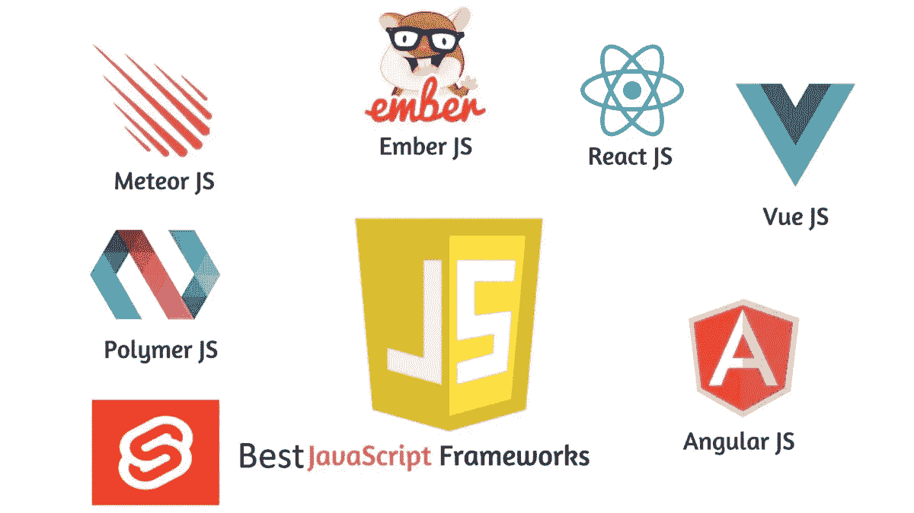

# JavaScript 框架和核心 Web 活力

> 原文：<https://javascript.plainenglish.io/javascript-frameworks-and-core-web-vitals-b5581f1c8962?source=collection_archive---------14----------------------->

## 更快更轻的前端，JavaScript 框架的下一个目标。

list of JavaScript frameworks

长期以来，我一直是框架的拥护者，因为它们让软件工程师和开发人员的生活变得更加轻松。对于从 C 到 JavaScript 的每一种语言，对于从服务器管理到 web 开发的每一种技能，都有一个特定的框架，对于 JavaScript，我们有多种框架选择，这些框架把用普通 JavaScript 编写代码放在第二位，我认为这可能太快了。

JavaScript 是 DHTML 的继任者，它让网络体验更加丰富，与基于这种语言的几个框架的交互性更强，这些框架是由热情的开源贡献者和大型科技初创公司如脸书与 react 构建的。但是，大多数已经开发的 JavaScript 框架都是抱着帮助开发人员更快地交付代码的心态，即开发人员生产力的心态，通过隐藏所有实现的复杂性、简化语法和利用面向对象编程来开发的。

JavaScript 是一种关注最终用户多于开发者的语言。JavaScript 在用户的浏览器中运行，并使用他们的计算资源向他们显示内容。那么 JavaScript 框架的设计和工程应该考虑这些最终用户，而不是 JavaScript 开发人员。它们应该使用户体验不仅更丰富，而且更快、更轻，并且在计算上更具成本效益。

过去十年中诞生的 JavaScript 框架无疑丰富了用户体验。React 和 Angular 帮助开发人员利用虚拟 DOM 的概念和 redux 等框架轻松构建反应式实时 web 应用程序，但当涉及到计算资源、存储和网络带宽的使用时，要问的问题是，当我们考虑这三个标准时，这些框架对最终用户有益吗？

几个月前，我对第 n 次浏览器的内存空间使用情况进行了基准测试，并再次评估了它们在内存方面变得多么贪婪，即使像我这样的人习惯于同时打开几个水龙头，因为内存已经像存储和网络带宽一样成为一种廉价和可访问的商品。我认为，值得停下来思考我们如何设计使用更少内存、更少存储空间和更少网络带宽的框架，因为即使这些商品对科技初创公司和公司来说可能很便宜，能够支付数百万美元的云账单，但仍有数百万互联网购买基于容量和带宽的互联网。

JS 框架应该以用户为中心，我所看到的像 google 这样的搜索引擎倾向于速度更快、对网络带宽、存储和计算资源要求更低的 web 应用程序的方向告诉我们，JS 框架在有效地解决了反应性和交互性之后，现在应该在更有效地满足这些标准方面展开竞争。更轻和更快是定义最好的下一代 JS 框架的两个标准。

我发现了两个试图在这股浪潮中冲浪的 JavaScript 框架，svelte 和 inferno。我不确定它们是否真的兑现了这些承诺，是否像 JavaScript ES6 的承诺一样有用，但可以肯定的是，这两个标准将是每个 JS 框架都要关注的问题，因为网络带宽对用户和托管 web 应用程序都不是免费的，而且并非所有的 web 应用程序都得到像脸书这样的大型科技初创公司的支持，后者拥有自己的数据中心，能够负担得起昂贵的云账单。

快速加载内容将变得越来越重要，谷歌正朝着这个方向努力，推出了一个名为 [Core Web Vitals](https://support.google.com/webmasters/answer/9205520?hl=en) 的更新，旨在让用户体验更快、更轻便，JS framework 将与这一更新有关，因为大多数内容都是通过下载千字节的脚本来加载的。

我们已经看到网站越来越多地使用第三方 JS 脚本，这增加了加载时间，随着这一更新，受益于来自谷歌的有机流量的网站将不得不重新思考他们的 web 前端是如何设计和工程的，这就是更快更轻的 JS 框架将发挥重要作用的地方。

作为网络开发者，我们也应该为像我这样的发展中国家的用户着想，那里的网络带宽不像发达国家那么便宜。

这当然只是一个探索性的解释，关于 JS 框架在不久的将来应该解决的一个问题的技术插图和数据较少。

我正在做两个收集数据的实验，这些数据可以更好地说明我在这里报道的这个问题。第一个实验是使用所有可用的框架构建相同的 web 应用程序，并执行基准测试，以查看它们在速度、网络使用和存储方面的表现。我实际执行第二个任务是收集用 React、Angular、Svelte、Inferno 等前端框架构建的已发布 web 应用程序的数据源，并查看它们在速度和重量这两个标准方面的表现，以及用这些 JS 框架构建的 web 应用程序在 google 结果中的排名。

如果你已经有这方面的数据，请让我知道，我希望我会在这里用简单的英语用 JavaScript 分享我的分析和发现，供你阅读，评论和纠正。

PS: 以下是过去关于核心网站的文章

*更多内容看* [***说白了. io***](http://plainenglish.io/) ***。*** *报名参加我们的* [***免费每周简讯这里***](http://newsletter.plainenglish.io/) ***。***