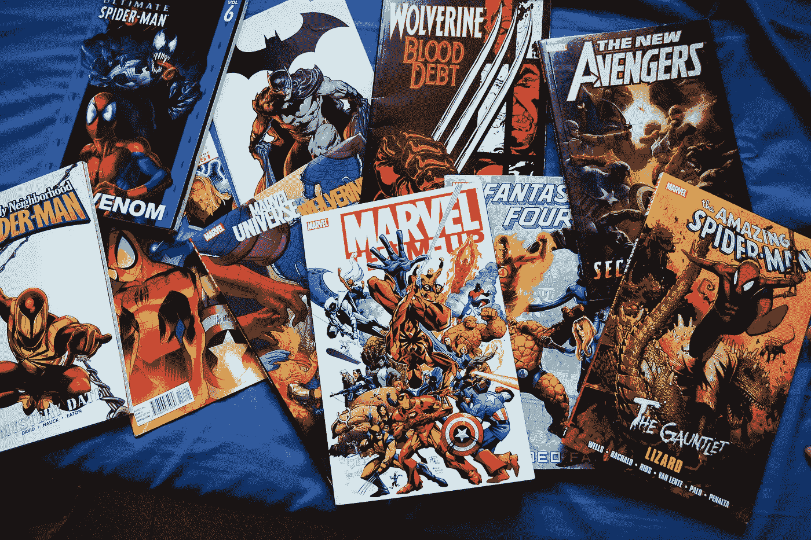

# JavaScript 框架及其在漫威世界中的另一面

> 原文：<https://javascript.plainenglish.io/javascript-frameworks-and-their-alter-egos-in-the-marvel-universe-30eb41c107d0?source=collection_archive---------19----------------------->

## 和我过去 20 年里用过的产品做一个有趣的对比

Image by [Ralph Leonard Poon](https://pixabay.com/users/ralpoonvast-2164607/?utm_source=link-attribution&utm_medium=referral&utm_campaign=image&utm_content=1239698) from [Pixabay](https://pixabay.com/?utm_source=link-attribution&utm_medium=referral&utm_campaign=image&utm_content=1239698)

像许多其他人一样，我是漫威的超级粉丝。我不会说我是一个狂热分子，但作为一个孩子，我偶尔会读金刚狼漫画书，看 x 战警漫画，甚至在街机上玩他们的视频游戏。拥有超能力的想法过去和现在都很吸引人，随着年龄的增长，我对漫画系列的欣赏随着每部新电影的上映而增加。

同样，在我 20 年程序员生涯的大部分时间里，我喜欢 JavaScript 语言。它越来越受欢迎，并由此衍生出许多框架，令人印象深刻。有些人会说，框架为我们做的大量繁重工作可以被认为是英勇的。根据[安古拉吉斯](https://angularjs.org)的说法，甚至可能是超级英雄。这个想法让我产生了疑问。

***漫威宇宙中每个框架或库的另一个自我是什么？***

有时候，当人们描述或比较框架时，听起来几乎像是在谈论一个人的特征。这可能是一种想象的延伸，并且肯定有待解释，但这是我认为如果他们是漫威超级英雄，他们每个人都会成为的人。

**剧透提示** : **我的确参考了漫威的电影。如果你还没有全部看完(尤其是《无限战争》和《终结游戏》)，请谨慎行事。**

# 有角的

**至交**:钢铁侠又名托尼斯塔克
**特征**(超级英雄=框架):

*   固执己见的
*   有争议的
*   公司=企业解决方案
*   富裕=由谷歌资助

如果你了解托尼·斯塔克，你会发现他被描绘成一个有着独特风格和强烈观点的人。他经常与美国队长意见相左，他一生中的决定往往会引起争议。他惊人的财富来自他的公司斯塔克工业，正因为如此，他适应了一种企业生活方式。

Angular 和托尼·斯塔克的描述相差不远。它经常因其严格的架构而被描述为高度固执己见，并因其对其前身 AngularJS 的完全重写而备受争议。该框架通常是企业应用程序的首选，由于其超级成功的创造者 Google，该框架资金充足。

# 安古拉吉斯

**至交**:雷神与仙宫
**特征**(超级英雄=框架):

*   旋转锤=摘要循环
*   维和人员=观察员
*   曾经是王者=曾经是最流行的框架
*   被他的失败压垮了

托尔来自阿斯加德人，他们是宇宙的和平维护者。他以强力的锤子和雷电之神而闻名，是阿斯加德的国王。他与父亲奥丁的冲突，以及在无限战争中未能阻止灭霸后的极度沮丧，使他作为一名伟大战士的名声蒙上了阴影。

AngularJS 的摘要循环让我想起了雷神在战斗中旋转他的锤子。不幸的是，它不是框架最强大的武器，可能也是最弱的。事实证明，不断地监控 UI 的变化并在潜在的成千上万的观察者中循环的需求是难以承受的。该框架很受欢迎，但由于性能不佳和核心基本问题而失宠。

# 反应

**至交**:美国队长
**特征**(超级英雄=库):

*   有观点但愿意妥协=灵活的模式
*   美国英雄=在美国最受欢迎
*   复仇者联盟的领导者= JavaScript 框架的领导者
*   甚至受到那些更强大的人的尊重=一个可以与成熟的框架竞争的库

毫无疑问，美国队长是美国的英雄。毕竟是人物名字的一部分。即使他不是最强的超级英雄，他仍然受到神托尔的尊敬。他是复仇者联盟无可争议的领袖，并且证明了他能为了更大的利益与他人合作。

React 是所有 JavaScript 框架中无可争议的领导者。根据 [Google Trends](https://bit.ly/3sVBkeZ) 显示，它是美国最受欢迎的选择。尽管它更多地被认为是一个库，但它仍然能够与成熟的框架正面交锋。在一些用例中，React 甚至可以和它最大的竞争对手 Angular 一起使用。

# vue . j

**至交**:蜘蛛侠
**特征**(超级英雄=框架):

*   最受欢迎的超级英雄=在 GitHub 中最受欢迎
*   小但强大
*   由其他超级英雄指导=利用其他框架的特性
*   适度的成长=由一名谷歌员工作为副业创造

许多人会说蜘蛛侠是有史以来最受欢迎的超级英雄。他出身卑微，是个孤儿，由他的姑姑和姑父抚养长大。他的体型可能很小，但他的力量和速度几乎无人能及。他是最年轻的超级英雄之一，并听取了更多像钢铁侠和美国队长这样的老牌英雄的建议。

Vue.js 是尤雨溪的创意，最初只是一个兼职项目。它由社区驱动，通过 Patreon 捐款获得财政支持。深受 AngularJS 的启发，它有明显的相似之处，但也利用了 React 这样的虚拟 DOM。考虑到其强大的功能，它的小尺寸令人印象深刻，并且它的粉丝群是显而易见的，因为它拥有顶级 JavaScript 框架中最多的 GitHub 明星。

# 外部 JS

**至交**:灭霸
特征(超级恶棍=框架):

*   相信他的行为是好的和正当的
*   Evil =嵌套 DOM，硒噩梦
*   复仇者联盟的敌人=为讨厌 JavaScript 编码的 Java 开发人员开发了 GWT-Ext
*   拥有大批追随者但被击败
*   被雷神杀死=被安古拉吉斯杀死

在看《复仇者联盟》电影之前，我从未听说过灭霸。他杀死了宇宙一半的人口，是终极恶棍，但他相信自己的行为在道德上是好的。电影《无限战争》和《残局》将他视为复仇者联盟最大的敌人。幸运的是，他和他的大军被打败了，他死在了托尔的手里。

在我职业生涯的某个时刻，我觉得无论我走到哪里，都有一个用 Ext JS 开发的应用程序。它独特的用户界面可以在几秒钟内被识别出来。一个名为 GWT-Ext 的衍生框架的初衷是好的，它致力于将 Java 开发人员从用 JavaScript 编码和设计自己的 UI 中解放出来。然而，呈现的 DOM 是一个嵌套的噩梦，由于标识符的自动生成，每次 UI 更改都会破坏 Selenium 测试脚本。随着 AngularJS 的崛起，它最终走到了尽头——至少在流行程度上是如此。

# jQuery

**至交**:金刚狼
**特征**(超级英雄=库):

*   旧，但仍然很受欢迎
*   多年来最常用的 JavaScript 库
*   x 战警的关键成员=许多应用程序的关键库

金刚狼是我从小到大最喜欢的超级英雄。他的超级治愈能力和可伸缩的爪子是最酷的。可能是最受欢迎和最受认可的 x 战警角色，他是团队的关键成员，经历了许多战斗。

在 2000 年代中期，JavaScript 的世界里没有那么多选择。当涉及到操作 DOM 时，jQuery 是一个令人印象深刻的库。它的实用性已经持续了很多年，并被吹捧为有史以来部署最多的 JavaScript 库。

# 香草 JS

**至交**:奥丁
**特征(**超级英雄=语言):

*   最古老的超级英雄之一
*   All-Father =所有 JavaScript 框架和库之父
*   众神之王=客户端脚本之王
*   没有它，托尔之父就不会存在

奥丁在漫威和北欧神话中被称为众神之王。他是最老最强的超级英雄之一。他作为统治者和战士的成就是众所周知的，很少有人敢挑战他。他也是雷神的父亲，雷神拥有许多相同的能力。

从我记事起，JavaScript 就已经存在了。世界上大多数网站都使用这种语言来编写客户端脚本。它的受欢迎程度随着每一个从它派生出来的新框架或库而持续增长。多亏了 Node.js，它在服务器端的表现同样令人印象深刻。

# 其他名人

有几个框架我没有广泛使用，但仍然给了他们可能是超级英雄的初步印象。

# 苗条的

**至交**:猩红女巫
特征(超级英雄=框架):

*   苗条和优雅，这源于“苗条”一词的含义
*   新颖但功能强大。可能是其中最强大的。

# 流星

**至交**:猎鹰
**特征**(超级英雄=框架):

*   与钢铁侠和美国队长合作=与 Angular 和 React(以及 Vue.js、Svelte、Blaze 等)合作。)
*   有特定的粉丝群，但不太受欢迎

# 结论

漫威继续给人留下深刻印象，因为他们建立了一个令人难以置信的成功的专营权。JavaScript 及其相关框架可能同样令人印象深刻。它们有着惊人的相似之处，而且相关性很好。我对所有即将上映的漫威电影都很兴奋，我也很兴奋看到未来超级英雄 JavaScript 框架将拯救我们。

感谢你的阅读和运用你的想象力！

*更多内容请看*[***plain English . io***](http://plainenglish.io/)