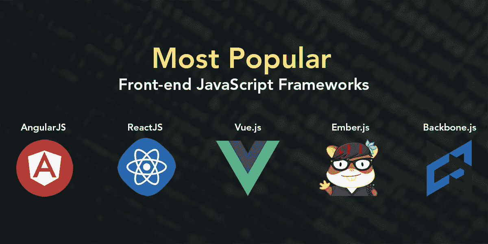

# JavaScript 前端框架包装器

> 原文：<https://javascript.plainenglish.io/javascript-front-end-frameworks-wrapper-9fab635378a0?source=collection_archive---------7----------------------->

## 将代码从一个 JavaScript 前端框架翻译到另一个框架。

image with the logo of most popular Javascript frontend frameworks by [mindinventory](https://www.mindinventory.com/blog/popular-javascript-frameworks-for-frontend-development/)

JavaScript 前端框架现在非常流行，对所有 JavaScript 开发人员社区都很有用。自 jQuery 以来，已经创建了许多框架，现在前端工程师可以从 React、Vue.js、Ember.js、AngularJS、Svelte、Inferno 和其他框架中进行选择，以构建交互式和创造性的前端，将他们的 web 应用程序的逻辑和结果公开给最终用户。

正如我在上一篇关于 JavaScript 框架和核心 web 生命指标的文章中所强调的，JavaScript 前端框架的选择并不取决于前端工程师的技能和意愿，而是取决于交付给最终用户的价值——应用程序向用户展示内容所花费的时间正成为最重要的价值之一。但是我们如何决定选择什么前端呢？

一种解决方案是收集每个框架的基准数据，并在收集到数据的情况下做出选择。这些标杆管理(benchmarketing 顺便说一句是个很棒的名字)报告是由像我这样的独立专业人士完成的。但是对于这样的解决方案，建立信任可能是一个问题，因为谁知道 JavaScript 前端框架背后的团队是否给了我报酬。

对于那些有时间和/或人力资源的人来说，第二个解决方案是用每一个流行的 JS 前端构建你的前端，并在生产中自己做基准测试。然后，您可以使用您收集的数据来决定您的最终前端解决方案将基于什么样的前端框架。但是正如我在最后一句中强调的，第二个解决方案需要许多熟练的前端工程师，每个前端框架至少需要一个工程师。或者如果你是一个可以独自掌握许多 JavaScript 前端框架的人，那么你需要更多的时间来开发每个框架的前端。

第二个解决方案强调了一个技术支持的解决方案，对于低预算的初创公司和开发团队来说可能很有用，因为他们负担不起很多前端工程师或/和受时间限制。这个解决方案是一个包装器，它可以将使用给定 JavaScript 前端框架开发的给定前端解决方案的代码作为输入，并将其转换为其他 JavaScript 前端框架语法和实现。这对软件工程师或精通编译器如何构建的团队来说并不难，因为所有这些都是关于处理语法和保留字的。

将 C 代码转换成 Java 的语言包装器在过去已经开发成功了。另一种解决方案是为前端工程师提供一种用于前端开发的抽象语法语言，可以编译成他们选择作为输出的 JavaScript 前端的语法。

所有这些都可以添加到我正在用这个[下一代编译器](https://medium.com/nerd-for-tech/next-generation-compilers-1346af6cdc51)(这里还有)做的工作中。互操作性一直是软件开发关注的问题，我认为迟早我们将不得不处理我们正在经历的前端框架的碎片化。

几年前，我们只需要 DHTML，现在我们有许多 web 开发框架。这很好，但是将实现细节抽象给工程师和开发人员可以简化事情，使我们更快，并且能够在需要时从一个框架转移到另一个框架。因为规模经济和云成本可能会在不久的将来的某个时间点，让一个框架比其他框架更受青睐。在这种情况下，能够迁移前端框架将与独立成为云运营商一样重要(我的意思是能够从 AWS 平稳地转移到 GCP 或 Azure，反之亦然)。

这些想法是关于我对 JavaScript 前端框架的前瞻性思考和分析，以及它们在核心 web 生命周期中的表现。我已经承诺在[用简明英语](https://javascript.plainenglish.io/)分享我的分析结果，你可以把这篇短文和想法作为一个信号，向你表明我正在进行这个预期的 JavaScript 前端框架分析，并真诚地开始撰写将展示结果的文章。

如果你知道一个允许将前端代码从 JavaScript 框架包装到 JavaScript 框架的解决方案，请告诉我。如果没有，那么这可能是一个有趣的技术支持的项目，让你去做。

**PS:** 可能 translator 这个词比 wrapper 好。

*更多内容看* [***说白了. io***](http://plainenglish.io/) ***。*** *报名参加我们的**[***免费每周简讯这里***](http://newsletter.plainenglish.io/) ***。****