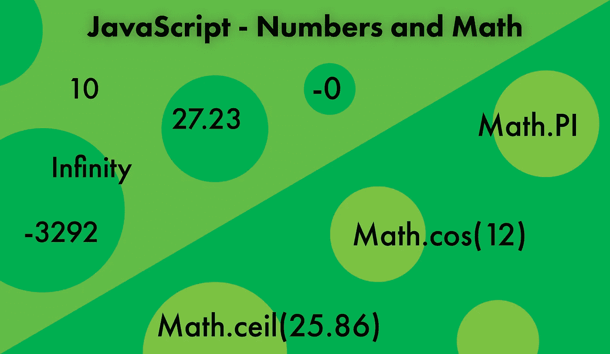

# JavaScript —数字和数学入门

> 原文：<https://javascript.plainenglish.io/javascript-getting-started-with-numbers-and-math-a3311cf8be3e?source=collection_archive---------21----------------------->

## JavaScript 中数字和数学的全面介绍

JavaScript 中的数字包括整数和浮点数，作为单一的数字类型。这与 C#等其他编程语言不同，后者根据数字的大小和在内存中占用的空间来区分多种类型的数字。JavaScript 中的数字可以非常灵活，但也会带来一些风险，这取决于程序如何处理它们。



JavaScript Numbers and Math

原始数值有一个等价的 [Number](https://developer.mozilla.org/en-US/docs/Web/JavaScript/Reference/Global_Objects/Number) 对象，该对象包装该值并提供对可用于处理数值的常量和方法的访问。

## 创建数字

创建新号码有几种不同的方式:

1.  使用`Number()`功能
2.  作为数字文字

```
let myNumber = Number(481);
typeof myNumber; // 'number'let anotherNumber = 326.74;
typeof anotherNumber; // 'number'
```

## 转换为数字

使用几种不同的技术将数值转换成数字是可能的。了解数字是如何转换的很重要，因为它们有时会产生预期的结果。

1.  使用`Number()`功能转换数值
2.  通过在值前放置一个`+`值来转换值
3.  使用`parseFloat()`或`parseInt()`功能。 [parseFloat](https://developer.mozilla.org/en-US/docs/Web/JavaScript/Reference/Global_Objects/parseFloat) 函数将在评估传递的参数时尝试返回一个浮点值。类似地， [parseInt](https://developer.mozilla.org/en-US/docs/Web/JavaScript/Reference/Global_Objects/parseInt) 函数将尝试在评估传递的参数时返回一个整数值。如果 parseInt 函数使用作为字符串传递的浮点值，则只返回该值的整数部分。

```
let total = '36226.72';
let numberTotal = Number(total);
numberTotal; // 36226.72let myAge = '21';
+myAge; // 21let myPrice = '51.85';
parseFloat(myPrice); // 51.85
parseInt(myPrice); // 51
```

上面的例子显示了包含数字的字符串到数字的转换。理解结果如何随字符串的构造而变化是很重要的。例如，根据字符串的构造方式，包含非数字字符的字符串将产生不同的结果。

```
let myPayment = '$24.64';
let mySecondPayment = '75.25 dollars';Number(myPayment); // NaN
parseInt(myPayment); // NaNNumber(mySecondPayment); // NaN
parseInt(mySecondPayment); // 75
parseFloat(mySecondPayment); // 75.25
```

如果函数`Number()`遇到一个非数字字符，它将产生一个`NaN`结果。相比之下，一旦遇到非数字字符，`parseInt()`和`parseFloat()`都会终止。在下列情况下

布尔值也可以转换成数字。这有时很有用，尤其是当布尔数据存储在数据对象或数据库中，并且需要转换为数字时。

```
+true; // 1
+false; // 0Number(true); // 1
Number(false); // 0parseInt(true); // NaN
parseInt(false); // NaNparseFloat(true); // NaN
parseFloat(false); // NaN
```

null 和 undefined 的其他原始值也可以通过在每个值前添加一个`+`来转换成数字。

```
+null; // 0
+undefined; // NaN
```

这些例子表明，有许多方法可以创建数字，以及如何将不同的数据类型转换成数字。这些是在程序中执行的常见操作，在从表单输入中获取数据时经常需要。例如，收集数字数据的表单域将数据存储为字符串，应该对其进行检查并将其转换为数字，以避免任何算术错误。

# 数学

[Math](https://developer.mozilla.org/en-US/docs/Web/JavaScript/Reference/Global_Objects/Math) 是一个内置的 JavaScript 对象，处理数值类型。Math 对象不是构造函数，因为它只有静态属性和方法，不能创建为 Math 对象的实例。Math 对象有助于提供有用的常数值，如 [PI](https://developer.mozilla.org/en-US/docs/Web/JavaScript/Reference/Global_Objects/Math/PI) ，并执行常见的数学运算，如产生一个[随机](https://developer.mozilla.org/en-US/docs/Web/JavaScript/Reference/Global_Objects/Math/random)数，这里仅举几个例子。

## 数学属性和方法的示例

一些最有用的[数学属性](https://developer.mozilla.org/en-US/docs/Web/JavaScript/Reference/Global_Objects/Math#static_properties)包括 PI 和 E，两个数学常数。

```
let pi = Math.PI;
pi; // 3.141592653589793let e = Math.E;
e; // 2.718281828459045
```

数学对象有许多非常有用的方法。这些包括有用的方法，如三角函数，如计算正弦、[余弦](https://developer.mozilla.org/en-US/docs/Web/JavaScript/Reference/Global_Objects/Math/cos)、[正切](https://developer.mozilla.org/en-US/docs/Web/JavaScript/Reference/Global_Objects/Math/tan)的方法。还有一些有用的方法，如[舍入](https://developer.mozilla.org/en-US/docs/Web/JavaScript/Reference/Global_Objects/Math/round)值，计算一个数的[下限](https://developer.mozilla.org/en-US/docs/Web/JavaScript/Reference/Global_Objects/Math/floor)或[上限](https://developer.mozilla.org/en-US/docs/Web/JavaScript/Reference/Global_Objects/Math/ceil)，甚至产生一个[随机](https://developer.mozilla.org/en-US/docs/Web/JavaScript/Reference/Global_Objects/Math/random)数。

这些数学方法有用的一个很好的例子是结合使用它们中的几个来产生两个值之间的一个[随机数。](https://developer.mozilla.org/en-US/docs/Web/JavaScript/Reference/Global_Objects/Math#returning_a_random_integer_between_two_bounds)

```
let randomBetween = function (min, max) {
  const randomNumber = Math.floor(Math.random() * (max - min + 1)) + min;
  return randomNumber;
};randomBetween(1, 100); // 23
```

## 结论

使用数字和执行复杂的计算是用 JavaScript 编程不可或缺的。很好地了解如何创建数字以及如何将其他值类型转换为数字，对于使程序按预期工作并避免代价高昂的错误是很重要的。

*更多内容请看*[***plain English . io***](http://plainenglish.io/)