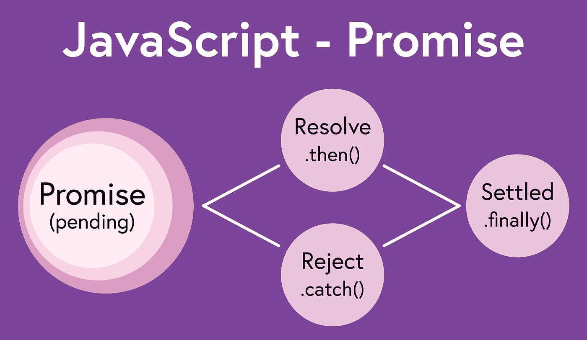

# JavaScript——从承诺开始

> 原文：<https://javascript.plainenglish.io/javascript-getting-started-with-promises-a666a739e76a?source=collection_archive---------16----------------------->

很多时候，当程序或网页中的操作被请求时，请求的结果不能立即用于进一步的处理。在这种情况下，操作被认为是异步的。为了更顺利地处理这种特定情况，JavaScript 有一个名为 [Promise](https://developer.mozilla.org/en-US/docs/Web/JavaScript/Reference/Global_Objects/Promise) 的对象，它代表异步操作的最终完成或失败，并为程序员提供处理异步操作和数据的方法。



JavaScript Promises

## 问题是

在开始承诺和使用承诺之前，最好先了解它们帮助解决的问题。通常在 JavaScript 中，一个函数在返回自己的结果之前依赖于另一个函数的结果。例如，考虑一组复杂的数学运算，这些运算一个接一个地执行，并依赖于前一个运算的结果才能执行下一个运算。

```
const add = (n1, n2) => {
  return n1 + n2;
};const square = (n) => {
  return n * n;
};let v1 = add(5, 8);
let v2 = square(v1);
console.log(v2); // 169
```

这段代码按照从上到下的顺序执行。每个函数都能够在下一个使用结果的函数执行之前返回一个结果。然而，在某些情况下，函数在返回结果之前需要一些时间才能完成，JavaScript 在执行代码时不会等待。

```
const add = (n1, n2) => {
  setTimeout(() => {
    return n1 + n2;
  }, 2000);
};const square = (n) => {
  return n * n;
};let result = add(5, 8);
console.log(square(result)); // NaN
```

上面代码的区别在于`add`函数在完成操作并返回结果之前有 2 秒的延迟。到那时，代码的剩余部分已经运行了。在第二个函数执行时，变量`v1`的值为`undefined`，当传递给`square`函数时，返回`NaN`，该值在第一个函数返回其计算值之前输出。

## 召回救援

在 ES6 将承诺添加到 JavaScript 之前，处理异步操作的最佳方式是使用回调。回调基本上是一个函数，它作为参数传递给另一个函数，然后在第一个函数的主体中被调用。这样做的一个常见原因是为了处理异步数据检索——程序的进展依赖于数据，这些数据可能需要一段时间才能返回并供程序的下一部分使用。一个典型的例子是异步等待程序的另一部分需要的来自 API 的数据继续。

例如，上面的例子目前无法处理在`add`函数完成之前调用`square`函数的情况。为了解决这个问题，可以从`add`函数回调调用`square`函数，如下所示:

```
const add = (n1, n2, callback) => {
  setTimeout(() => {
    let calculation = n1 + n2;
    callback(calculation);
  }, 2000);
};const square = (n) => {
  return n * n;
};add(5, 8, (result) => {
  console.log(square(result));
});
```

上面的例子异步执行`add`函数，然后将`add`函数的结果传递给`square`函数。然后，`square`函数使用`add`函数的结果来计算结果的平方。在这种情况下，即使有 2 秒的延迟，`square`函数也能够使用`add`函数的结果，因为回调依赖于`add`函数的结果。

上面这个简单的例子并不难理解。然而，一个操作在完成之前可能需要几个步骤，这将需要多个回调。例如，考虑以下代码:

```
const add = (n1, n2, callback) => {
  setTimeout(() => {
    let result = n1 + n2;
    callback(result);
  }, 2000);
};const multiply = (n1, n2, callback) => {
  setTimeout(() => {
    let result = n1 * n2;
    callback(result);
  }, 2000);
};const subtract = (n1, n2, callback) => {
  setTimeout(() => {
    let result = n1 - n2;
    callback(result);
  }, 2000);
});const square = (n) => {
  return n * n;
};add(5, 8, (result) => {
  multiply(result, 5, (result) => {
    subtract(result, 8, (result) => {
      console.log(square(result));
    });
  });
});
```

尽管这个例子看起来并不复杂，但它确实显示了回调模式是如何变得嵌套很深的，并且对于比上面显示的更复杂的任务，理解发生了什么会变得非常困难。谢天谢地，JavaScript 的开发者认识到了这个问题，并提出了解决方案。

## 用承诺改善回访

如上所述，回调的问题是它们会变得复杂，难以维护和/或理解。相互嵌套的多个回调会很快变得难以控制，有时被称为[末日金字塔](https://en.wikipedia.org/wiki/Pyramid_of_doom_(programming))。此外，当异步请求没有成功完成时，回调不提供任何内置的错误处理。这个功能必须由开发人员添加。

[Promise](https://developer.mozilla.org/en-US/docs/Web/JavaScript/Reference/Global_Objects/Promise) 对象的引入有助于解决这些问题，并提供了一种更优雅的处理异步操作的方式。承诺表示异步操作的最终完成或失败，并为程序员提供了处理异步操作和数据的方法。

承诺背后的核心思想是，当异步操作正在进行时，它将返回一个可用于跟踪操作进度的中间值。一旦操作完成，承诺要么解析为最终值，要么不解析。该值可用于确定操作的成功或失败。

承诺的核心概念是承诺可以经历的不同状态:

*   待定——承诺处于初始状态，既未解决(履行)也未拒绝
*   已履行(已解决)-承诺操作已成功完成
*   拒绝-承诺操作失败

输入 resolved 或 rejected 选项将触发相关的处理程序，这些处理程序通过调用 Promise `then`方法来处理。

## 履行承诺

利用承诺可以通过使用预先存在的承诺来完成，通常以可以作为承诺使用的外部库或 API 的形式，或者通过用构造函数创建一个[新承诺](https://developer.mozilla.org/en-US/docs/Web/JavaScript/Reference/Global_Objects/Promise/Promise)来完成。通过从零开始创造一个承诺，有可能理解一个承诺在内部做什么。

以下示例显示了如何创建新承诺的基础知识。promise 期望一个包含定制代码的`executor`函数来指示 promise 如何解决或拒绝 promise。executor 函数包括 resolve 函数和 reject 函数的签名，这些签名可用于传递由相应的 resolve 和 reject 函数处理的值。

```
const myPromise = new Promise((resolve, reject) => {
  resolve('promise is resolved');
});myPromise.then((result) => {
  console.log(result);
});
```

一个更复杂的示例展示了如何添加控制流，以根据 executor 函数中逻辑运算的结果来确定是否使用 resolve 或 reject 函数。

```
const additionPromise = (number1, number2) => {
  return new Promise((resolve, reject) => {
    setTimeout(() => {
      if (typeof number1 === 'number' && typeof number2 === 'number') {
        let result = number1 + number2;
        resolve(result);
      } else {
        reject('Please use numbers');
      }
    }, 2000);
  });
};additionPromise(5, 7)
  .then((result) => {
    console.log(result);
  })
  .catch((error) => {
    console.error(error);
  })
  .finally(() => {
    console.log('promise completed');
  });// 12
// promise completedadditionPromise(5, 'hello')
  .then((result) => {
    console.log(result);
  })
  .catch((error) => {
    console.error(error);
  })
  .finally(() => {
    console.log('promise completed');
  });// Please use numbers
// promise completed
```

上面的承诺展示了几个不同的概念。首先，函数`additionPromise`是一个常规函数，它接受两个参数并返回一个承诺。promise 由一个包含 resolve 和 reject 函数处理程序的 executor 函数组成。执行器还包含一个`setTimeout`函数来演示承诺的异步本质。如果传递的参数为逻辑运算返回 true，数字被相加，结果变量被传递给 resolve 函数，该函数可由`then`方法调用。

如果逻辑运算返回 false，则调用 reject 函数，传入一个字符串值。处理这种情况的方法是调用 promise 上的`catch`方法。如果调用 reject 函数，promise 将绕过所有 resolve(包括 chained) `then`方法，使用`catch`方法。最后，可以调用一个可选的`finally`方法。无论承诺是被解决还是被拒绝，都将调用此方法。

## 连锁承诺

如上所述，承诺可以链接在一起，这允许在返回最终结果之前处理多个承诺，包括多个流程。

```
const additionPromise = (number1, number2) => {
  return new Promise((resolve, reject) => {
    setTimeout(() => {
      if (typeof number1 === 'number' && typeof number2 === 'number') {
        let result = number1 + number2;
        resolve(result);
      } else {
        reject('Please use numbers');
      }
    }, 2000);
  });
};const squarePromise = (number) => {
  return new Promise((resolve, reject) => {
    setTimeout(() => {
      if (typeof number === 'number') {
        let result = number * number;
        resolve(result);
      } else {
        reject('Please use a valid number');
      }
    }, 2000);
  });
};additionPromise(2, 4)
  .then((result) => {
    return squarePromise(result);
  })
  .then((result) => {
    console.log(`final result: ${result}`);
  })
  .catch((error) => {
    console.log(error);
  })
  .finally(() => {
    console.log('promise operation completed');
  });// final result: 36
// promise operation completed
```

上面的例子展示了如何使用多个承诺，并且每个承诺都解析返回一个结果，该结果可以被承诺用来单步执行异步操作。

## 结论

如果承诺只能通过消费的方式实现，那就很难理解了。通过创造一个承诺并理解它们是如何组成的，就更容易理解使用它们的最佳步骤。

*更多内容尽在*[***plain English . io***](http://plainenglish.io/)