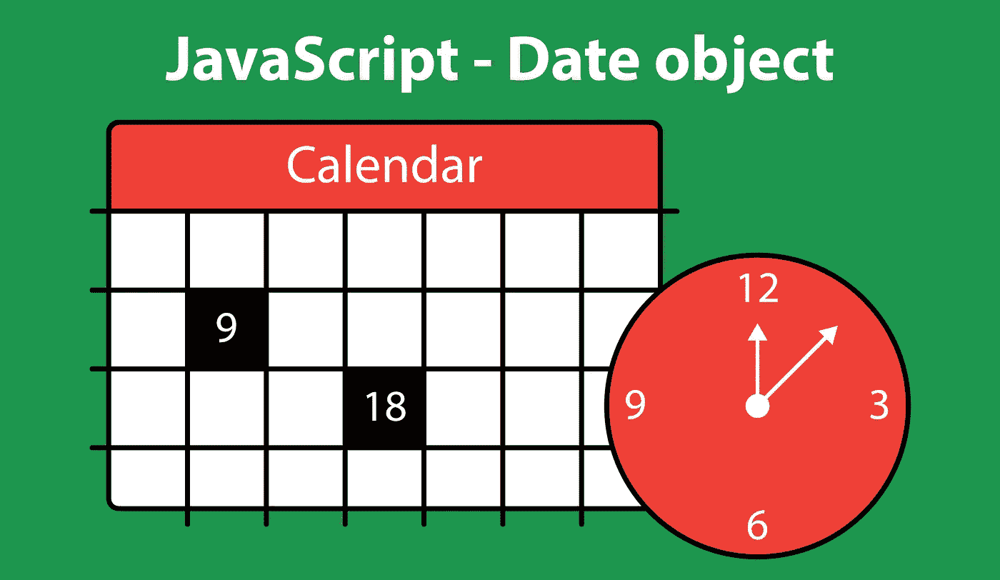

# JavaScript —日期对象入门

> 原文：<https://javascript.plainenglish.io/javascript-getting-started-with-the-date-object-e06f513fab71?source=collection_archive---------21----------------------->

在 JavaScript 程序中，需要访问或计算日期和时间是很常见的。为了处理这些情况，语言中内置了几个日期工具。具体来说，JavaScript 提供了一个[日期](https://developer.mozilla.org/en-US/docs/Web/JavaScript/Reference/Global_Objects/Date)对象，该对象提供了创建新日期的方法和几个处理这些日期的方法。JavaScript 中的日期带有内置功能，可以处理 UTC(协调世界时)日期和时间。



JavaScript — the Date object

## 创建日期

[日期对象](https://developer.mozilla.org/en-US/docs/Web/JavaScript/Reference/Global_Objects/Date)提供了几种不同的方法来使用构造函数创建新日期:

1.  通过指定日期数据部分—年、月、日、小时、分钟、秒和毫秒
2.  用一个数字表示时间戳
3.  带有日期字符串
4.  通过调用不带任何参数的构造函数，这将返回当前日期和时间

```
// Using date parts
let july4thDate = new Date(2021, 6, 4, 0, 0, 0); // 2021-07-04T04:00:00.000Z// using a time stamp number
let dateInThe1990s = new Date(721484611197); // 1992-11-11T12:23:31.197Z// using a date string
let newYearsDate2000 = new Date('2000-01-01'); // 2000-01-01T00:00:00.000Z// Date constructor without any parameters
let currentDate = new Date(); // 2021-07-28T15:12:42.769Z
```

当使用日期部分创建一个[新日期](https://developer.mozilla.org/en-US/docs/Web/JavaScript/Reference/Global_Objects/Date/Date)时，对于每个参数，有一些重要的注意事项需要记住。

*   **year** —代表年份的必需整数。值 0-99 将被加到 1900 上。例如，88 将产生 1988 年。
*   **month** —是一个必需的索引值，从 0 到 11，对应于一年中的每个月。例如，索引值 3 将产生月份 4(或四月)。
*   **日** —可选整数，表示一个月中的某一天(1 为默认值)
*   **小时** —可选整数，表示一天中的小时(0 表示午夜)
*   **分钟** —表示时间分钟的可选整数
*   **秒** —可选整数，表示时间的秒数
*   **毫秒** —可选整数，表示时间的毫秒数

使用日期部分创建日期的一些示例:

```
new Date(2021, 0, 12); // 2021-01-12T05:00:00.000Znew Date(1999, 11, 31, 12, 59, 59); // 1999-12-31T17:59:59.000Znew Date(2009, 5, 20, 10, 30, 15, 232); // 2009-06-20T14:30:15.232Z
```

使用不带任何参数的 date 构造函数创建新日期相当于调用`Date.now()`静态方法，将返回当前日期和时间。使用构造函数创建新的日期后，将返回一个 date 对象，该对象可以利用 date 对象可用的许多实例方法。

## 使用日期和时间

日期对象提供了[方法](https://developer.mozilla.org/en-US/docs/Web/JavaScript/Reference/Global_Objects/Date#instance_methods)来获取和设置日期实例的所有部分，包括:

*   全年
*   月
*   日期
*   小时
*   分钟
*   秒
*   毫秒

这些方法可以与每个关键字前的词语`get`或`set`一起使用。`set`方法需要一个整数作为参数传递。

```
let myDate = new Date(2009, 5, 20, 10, 30, 15, 232);myDate.getFullYear(); // 2009
myDate.setFullYear(2021); // 1624199415232
myDate.getFullYear(); // 2021myDate.getDate(); // 20
```

还有另一种方法，`getDay()`返回一个 0 到 6 之间的整数，表示一周中的某一天。

```
myDate.getDay(); // 0 (Sunday)
```

还有几个其他有用的方法可用于`Date`对象。

*   **getTime()** —返回代表时间戳的数字
*   **valueOf()** —与`getTime()`一样，返回一个代表时间戳的数字
*   **toString()** —返回完全格式化的日期和时间字符串
*   **toDateString()** —返回格式化的日期字符串
*   **toTimeString()** —返回格式化的时间字符串
*   **toLocaleDateString()** —返回本地敏感的日期字符串
*   **toLocaleTimeString()** —返回本地敏感的时间字符串

```
let myDate = new Date(2009, 5, 20, 10, 30, 15, 232);
myDate.getTime(); // 1245508215232
myDate.valueOf(); // 1245508215232
myDate.toString(); // 'Sat Jun 20 2009 10:30:15 GMT-0400 (Eastern Daylight Time)'
myDate.toDateString(); // 'Sat Jun 20 2009'
myDate.toTimeString(); // '10:30:15 GMT-0400 (Eastern Daylight Time)'
myDate.toLocaleDateString(); // '6/20/2009'
myDate.toLocaleTimeString(); // '10:30:15 AM'
```

## 结论

使用 Date 对象提供的许多资源，可以创建预先格式化的日期字符串或执行日期和时间计算来查找信息，如两个日期之间经过的时间或日期值的星期几。尽管`Date`对象确实有[的一些限制](https://css-tricks.com/everything-you-need-to-know-about-date-in-javascript/)——比如缺乏对时区的支持以及用除了少数内置格式化方法之外的方式格式化日期字符串——处理日期并不太棘手。JavaScript 中可用于处理日期的资源可以处理处理日期和时间时出现的许多不同情况。

*更多内容请看*[***plain English . io***](http://plainenglish.io/)