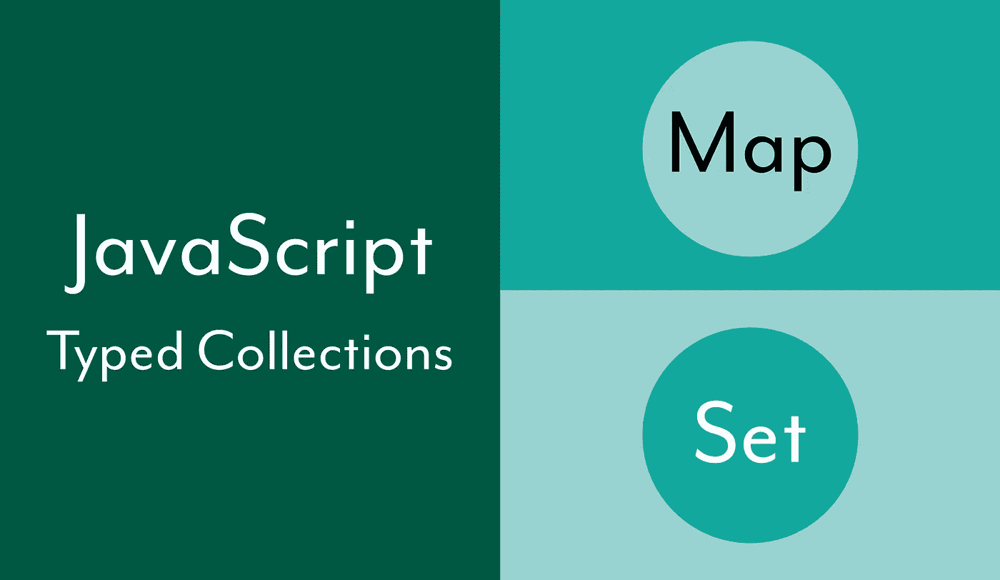

# JavaScript —开始使用地图和设置类型化集合

> 原文：<https://javascript.plainenglish.io/javascript-getting-started-with-the-map-and-set-typed-collections-2ba173b0ce9f?source=collection_archive---------17----------------------->

JavaScript 有许多不同的方法来分组和收集数据，包括数组和对象。还有另外两种组织数据集合的主要方法—地图和集合。尽管数组和对象提供了许多有用的特性，但它们也有一些缺点。例如，对象是值的关键集合，但不允许值的简单迭代或找到集合的大小。`Map`和`Set`集合很有用，在某些情况下比数组或对象更有优势。



JavaScript — Getting Started with the Map and Set Typed Collections

# 地图

[Map](https://developer.mozilla.org/en-US/docs/Web/JavaScript/Reference/Global_Objects/Map) 对象提供了一种保存键值对集合的方法。地图保持数据添加到地图对象的顺序，当`Map`迭代时，将按顺序检索数据。

## 地图对象的特征

可以通过调用`Map()`构造函数来创建地图。可以在没有参数或可选的可迭代值的情况下调用构造函数。

```
let employees = new Map();
let managers = new Map([
  ['bob', 23],
  ['kal', 36],
]);
```

Map 对象有一个属性和几个使用地图的有用方法。

*   **size** —是一个属性，返回 Map 对象拥有的键-值对的总数。
*   **set(key，value)** —是一种将新的键值对追加到映射中的方法。
*   **get(key)** —是一种通过键从地图中检索值的方法。
*   **has(key)** —是一种基于键值是否包含在地图对象中来返回布尔值的方法。
*   **delete(key)** —这是一种基于键从地图对象中删除键值对的方法，并根据键值对是否被删除返回一个布尔值。
*   **clear()** —从映射中删除所有键值对。

## 使用地图对象

使用地图的一个主要好处是它们提供的灵活性，这可以通过一些例子来说明。

```
let employee = new Map();
employee.set('name', 'bob');
employee.set('age', 32);
employee.set('title', 'manager');
employee.set('skills', ['javascript', 'C#', 'Ruby']);employee.size; // 4
employee.get('name'); // 'bob'employee.has('title'); // trueemployee.set('name', 'melvin');
employee.get('name'); // 'melvin'employee.delete('age'); // true
employee.size; // 3employee.clear();
employee.size; // 0
```

`Map`对象的一个关键特性是能够使用任何数据类型作为键。这与一个`Object`不同，它只允许字符串或符号用于键。

```
let person = new Map();
person.set('name', 'kal');
person.set(10, 'rating level');let age = Symbol('age of person');
person.set(age, 36);let education = ['high school', 'college', 'coding bootcamp'];
person.set(education, 'completed');let contacts = {
  supervisor: 'jim',
  friend: 'hal',
};
person.set(contacts, 'work and home');
```

## 方法来迭代地图对象

`Map`对象也有几种不同的迭代方式。它可以通过 Map 对象方法或使用`for..of`或`forEach`循环迭代它的键和/或值。

*   **keys()** —返回一个迭代器对象，其中包含每个项目的键。
*   **values()** —返回包含每个项目值的迭代器对象。
*   **entries()** —返回一个迭代器对象，该对象包含`Map`对象的每个元素的[key，value]数组。

```
let employee = new Map();
employee.set('name', 'bob');
employee.set('age', 32);
employee.set('title', 'manager');
employee.set('certified', true);employee.keys(); // [Map Iterator] { 'name', 'age', 'title', 'certified' }
employee.values(); // [Map Iterator] { 'bob', 32, 'manager', true }
employee.entries(); // [Map Entries] { [ 'name', 'bob' ], [ 'age', 32 ], [ 'title', 'manager' ], [ 'certified', true ] }for (const [key, value] of employee) {
  console.log(`employee ${key} is ${value}`);
}// employee name is bob
// employee age is 32
// employee title is manager
// employee certified is true
```

地图对象也可以用`forEach()`方法迭代。

```
employee.forEach((key, value) => {
  console.log(`employee ${key} is ${value}`);
});
```

# 一组

[Set](https://developer.mozilla.org/en-US/docs/Web/JavaScript/Reference/Global_Objects/Set) 对象是值的集合，可以是任何类型的原始值。**集合中的每个值都是唯一的**，这意味着它在`Set`对象中只能出现一次。

## 设置对象的特征

可以通过调用`Set()`构造函数来创建集合。可以在没有参数或可选的值的可迭代对象的情况下调用构造函数。

```
let employees = new Set();
let managers = new Set(['bob', 'kal', 'melvin']);
```

Set 对象有一个属性和几个有用的方法来处理地图。

*   **size** —是一个属性，返回由 Set 对象保存的值的总数。
*   **add(value)** —是一种向集合追加新值的方法。
*   **has(value)** —是一种基于值是否包含在设置对象中来返回布尔值的方法。
*   **delete(value)** —从设置对象中删除值的方法，并根据值是否被删除返回一个布尔值。
*   **clear()** —从集合中删除所有值。

## 使用设定的对象

使用集合的一个主要好处是它们保持了值添加到集合中的顺序。它们也是可重复的。

```
let employees = new Set();
employees.add('melvin');
employees.add('bob');
employees.add('lou');
employees.add('gill');employees.size; // 4
employees.has('jim'); // false
employees.has('lou'); // trueemployees.delete('bob'); // true
employees.size; // 3employees.clear();
employees.size; // 0
```

## 方法来迭代集合对象

`Set`对象也有几种不同的方法来迭代 Set 对象，与 Map 不同，它只有值。它可以通过 Set object 方法或者使用`forEach`循环来迭代。

*   **values()** —返回包含每个项目值的迭代器对象。
*   **keys()** —与`Set`对象的`values()`方法功能相同
*   **entries()** —返回一个迭代器对象，该对象包含`Set`对象的每个元素的数组[value，value]。

```
let holidays = new Set();
holidays.add('Mothers Day');
holidays.add('Flag Day');
holidays.add('Memorial Day');
holidays.add('Halloween');holidays.values(); // [Set Iterator] { 'Mothers Day', 'Flag Day', 'Memorial Day', 'Halloween' }
holidays.keys(); // [Set Iterator] { 'Mothers Day', 'Flag Day', 'Memorial Day', 'Halloween' }
holidays.entries(); // [Set Entries] { [ 'Mothers Day', 'Mothers Day' ], [ 'Flag Day', 'Flag Day' ], [ 'Memorial Day', 'Memorial Day' ], [ 'Halloween', 'Halloween' ] }
```

Set 对象也可以用`forEach()`方法迭代。

```
holidays.forEach((value) => {
  console.log(`holiday ${value}`);
});
```

## 结论

`Map`和`Set`对象为数组和对象提供了相似但有用的替代品，用于存储数据集合。与数组和对象相比，映射和集合提供了一些明显的优势——最明显的是，当条目被添加到集合中时，它们保持条目的顺序，这与集合不同。与数组不同，映射允许任何类型数据的键值对集合，提供了很大的灵活性。在搜索集合条目时，它们还提供了一些性能优势。

*更多内容尽在*[***plain English . io***](http://plainenglish.io/)