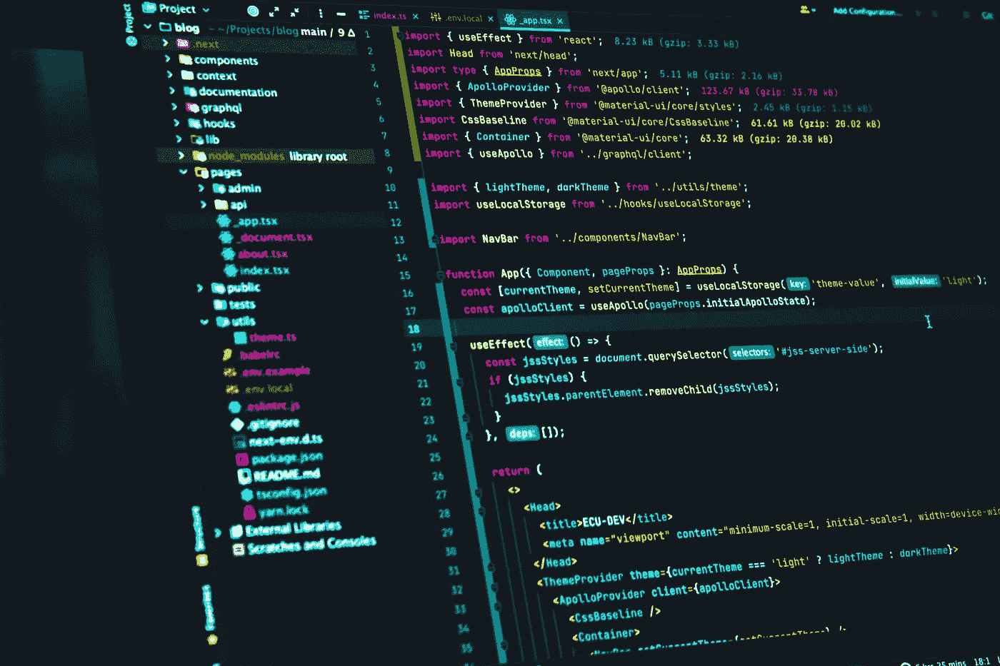

# “易于遵循”的 JavaScript 编码实践

> 原文：<https://javascript.plainenglish.io/javascript-good-to-follow-practices-e053ecd215e0?source=collection_archive---------6----------------------->

Photo by [Juanjo Jaramillo](https://unsplash.com/@juanjodev02?utm_source=unsplash&utm_medium=referral&utm_content=creditCopyText) on [Unsplash](https://unsplash.com/s/photos/coder?utm_source=unsplash&utm_medium=referral&utm_content=creditCopyText)

首先要明确的是，这篇文章不是关于最佳实践，而是关于我多年来学到的一些“值得遵循”的实践。我一直认为没有最好的方法可以在一夜之间学会它们，但是我们可以循序渐进地学习。

> 我们所做的一切都是为了比现在更好的东西而练习。练习只会带来进步。 **—** *莱斯布朗*

# 编码实践

这些是我们在编写 JavaScript 代码时可以遵循的一些实践。这些实践使代码更加整洁、易读、易管理和易于理解。

## 三元运算符

三元运算符的条件数量没有上限，但是为了避免代码的复杂性并使代码更具可读性，我们更倾向于对三元运算符使用单个条件。

Usage of ternary operators

## 解构分配

随着 ES6 的引入，我们掌握了一种新的方法，可以一次从数组和对象中解包多个项目，而不必单独定义它们。

Destructuring Assignment

## 零合并

随着 EcmaScript 2020 的推出，添加了空合并运算符，也称为 *nullish* *运算符*。它用于在缺少任何值时返回默认值，或者基于布尔条件返回另一个值。最棒的是，它节省了多行代码。

Null coalescing operator

## 可选链接

随着 EcmaScript 2020 的引入，可选的链接操作符也随之引入。它用于读取嵌套对象内部的属性值，以检查它是否已定义并具有有效的引用。这个操作符允许我们避免检查嵌套对象中属性的*未定义*值。用传统的方法，我们需要检查深度嵌套对象中每一层的未定义值。

Optional Chaining

Without optional chaining

## 静态类型检查

JavaScript 是一种自由流动的语言，也就是说，如果一个变量最初是用一个字符串值定义的，那么它以后可以用来存储整数或任何其他类型的值，并且它会工作得非常好。最好定义变量以及它们将要存储的值的类型，以避免类型错误。静态类型检查的主要好处是可以防止许多类型错误，从而节省大量调试时间。同样，我们可以使用[流程](https://flow.org/en/)或[打字稿](https://www.typescriptlang.org/)。

## 对象文字

对象文字是花括号内逗号分隔的键值对列表，其中的值可以是属性和函数。它也可以作为 switch-case 或嵌套 if-else-if 的替代。

Object literal

Without object literal

## 命名规格

通常对于命名变量和方法，首选驼峰式大小写。对于命名类、接口和其他，标题大小写是首选，以便于与普通变量和方法区分开来。我们也可以使用 snake_case 约定，但是使用一致的命名约定样式很重要。我们应该提供与使用它的上下文更相关的名称。在命名变量或方法时，我们应该避免使用受限制的关键字。

Naming Conventions

## 注释和文档字符串

为我们的代码提供注释和文档字符串总是好的，但是不建议为我们编写的每一个方法或每一行代码添加注释。应该为具有复杂逻辑的方法或代码添加注释。这有助于任何阅读评论的用户理解所写代码的目的和流程。Docstrings 是一种为下面定义的方法添加描述的方法，以及使用的不同参数和方法的返回类型。我们应该始终为我们定义的通用函数或实用函数提供文档字符串。

With Docstrings

With Comments

## 箭头功能

随着 ES6 的引入，我们接触到了类似于普通函数的箭头函数，除了它们不需要显式的方法绑定。它还提供了简化的语法，使得代码更加紧凑和易于理解。

Arrow Functions

## 代码清理

在 JavaScript 中，一旦不再需要代码，垃圾收集器就会自动触发。尽管计时器或自定义事件侦听器应该在不需要时立即取消注册。定时器应该复位和清零。忽略这些可能会导致内存泄漏。

## 结论

就这样，伙计们！这些是我在编写 JavaScript 代码时遵循的一些实践。请在评论中分享你“值得遵循”的实践！编码快乐！👩‍💻

*更多内容看*[***plain English . io***](http://plainenglish.io)