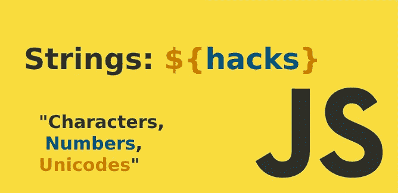

# 操纵字符串不可或缺的 JavaScript 技巧

> 原文：<https://javascript.plainenglish.io/javascript-hacks-cannot-dispense-when-manipulating-strings-aa8432b6598b?source=collection_archive---------9----------------------->



# 简介:

字符串是每种编程语言中最基本的数据类型。JavaScript 字符串对于存储包含字符、数字和 Unicode 的文本非常有用。许多编程语言足够开放，允许程序员用多种方式来实现相似的结果。JavaScript 也是一样。

许多开发人员在 JavaScript 中操作字符串后发现了许多窍门。今天，我将分享一些在 JavaScript 中操作字符串时不可或缺的技巧。

我们将在文章中讨论以下技巧或范例:

**1。**如何检查一个字符串是否为空？

**2。**如何反转一个字符串？

**3。**如何从字符串中去掉子串？

**4。**大写字母前如何插入空格？

**5。**如何去除字符串中的空格？

6。如何让一个字符串的第一个字母大写？

7。如何将字符串转换成布尔值？

8。如何从字符串中删除一个字符？

# 1.如何检查一个字符串是否为空？

我们将介绍不同的方法来检查字符串是否为空。

## 使用`===`操作符检查字符串是否为空

我们可以使用严格的等式运算符(`===`)来检查一个字符串是否为空。比较`data=== ""`只有在值的数据类型为字符串的情况下才会返回`true`，同样为空；否则，它将返回`false`。

**例如:**

**输出:**

```
false
false
false
false 
false
true
```

**注意:**不要使用相等比较器`==`，因为如果`data`为`0`或`false`，则`data == ""`将返回`true`，而不仅仅是空字符串`""`。

**例如:**

**输出:**

```
true
true
true
```

## 使用`length`属性检查字符串是否为空

这是检查 JavaScript 空字符串的另一种方式。如果长度为零，那么我们知道字符串是空的。

**例子:**

Example Use the `length` property to check if the String is empty

**输出:**

```
false
true
false
```

## 将变量转换为布尔值，以检查字符串是否为空

有两种方法可以将变量转换为布尔值。第一个是通过 dual NOT 运算符(`!!`)，第二个是通过类型转换`(Boolean(value))`。

```
Boolean(str);!!str;
```

`str`是一个变量。对于`null`、`undefined`、`0`、`000`、`""`、`false`返回`false`。对于非空字符串和空白，它返回`true`。

**例如:**

Example Convert the variable to Boolean to check if the String is empty

**输出:**

```
true
false
true
false
```

# 2.如何反转一个字符串？

在 JavaScript 中有不同的方法来反转一个字符串。

例如:

*   `"worldmajor"`->-
*   `"this is an example"`->-`"elpmaxe na si siht"`

## 使用内置方法反转字符串:

*   使用将字符串拆分成数组的`split()`将字符串对象转换成单独的数组元素。
*   我们将使用`reverse()`函数来反转字符数组。
*   我们将使用`join()`函数将数组元素连接成一个字符串。

**例如:**

Example on built-in methods to reverse a string

## 使用扩展运算符反转字符串:

我们将使用上面相同的方法，但是唯一的区别是我们将使用 spread 操作符将字符串转换成字符数组，而不是使用`split()`函数。点击此处了解更多关于[传播算子](https://medium.com/javascript-in-plain-english/javascript-es6-the-spread-operator-197cfb7c46ad)的信息。

**例如:**

Example on spread operator to reverse a string

## 使用 for-loop 反转字符串:

最直接的方法是在字符串上循环。

**例如:**

Example on For loop to reverse a string

ES6 中引入了新 for 循环语法的另一个例子:

**例如:**

## 使用递归反转字符串:

我们建立一个函数，然后它递归地调用自己，直到它达到我们的目标。

**例如:**

Example on Recursion to reverse a string

**使用三元运算符递归的另一个例子:**

Example on a ternary operator to reverse a string

# 3.如何从字符串中移除子串？

JavaScript 有两种常用的方法来从字符串中删除子串。下面的每个方法都有一个代码示例，你可以在你的机器上运行。

## 使用`replace()`方法从字符串中删除特定的子字符串:

`replace()`函数是 JavaScript 中的内置函数。它用另一个字符串或正则表达式替换给定字符串的一部分。它从给定的字符串中返回一个新的字符串。因此原始字符串将保持不变。

**`**replace()**`**的语法:****

```
Txt.replace(Specificvalue, Newvalue)
```

**`Specificvalue`是必需的，它将被新值替换，并且`Newvalue`是必需的。**

****例如:****

**`replace()` method to remove specific substring**

## **使用 regex 的`replace()`方法从一个字符串中删除特定子串的所有匹配项**

**使用一个正则表达式代替`Specificvalue`和全局属性。**

****举例:****

**`replace()` method with regex**

## **使用`substr()`方法从字符串中提取特定的子字符串**

**`substr()`函数是 JavaScript 中的内置函数。它用于从给定的字符串中提取子字符串，或者返回字符串的一部分，从指定的索引开始，扩展到给定的字符数。**

****语法:****

```
String.substr(startIndex, length)
```

**`startIndex`是必需的。`length`是可选的，从那个`Startindex`中选择字符串的长度，如果没有指定，它提取到字符串的其余部分。**

****例如:****

**`substr()` method to extract a specific substring**

# **4.大写字母前怎么插空格？**

**让我们想象一下，你从一个文本 API 得到一个响应来显示它，然后你发现在一个单词的结尾和另一个单词的开头之间没有空格作为例子`requirementsMost` 我想在`requirement`和`Most`之间放置一个空格。**

## **在每个大写字符前添加一个空格**

**您可以在每个大写字符前添加一个空格，并删除前导和尾随空格:**

```
text = text.replace(/([A-Z])/g, ' $1').trim()
```

## **查找后面跟有大写字符的每个小写字符**

**这将查找后面跟有大写字符的小写字符，并在它们之间插入一个空格:**

```
text = text.replace(/([a-z])([A-Z])/g, '$1 $2');
```

**对于出现两个连续大写字母的特殊情况(例如:ATest ),使用以下代码:**

```
text = text.replace(/([A-Z])([A-Z])/g, '$1 $2');
```

# **5.如何删除字符串中的空格？**

**要从字符串中删除空格，让我们看一下下面的例子:**

```
Input: / world major .net/Output: /worldmajor.net/
```

**JavaScript 有不同的方法来删除字符串中的空格。我们将演示两种从字符串中删除空格的方法，尤其是在涉及到制表符和换行符时。**

## **使用`regex`删除字符串中空格的 JavaScript `replace()`方法:**

**我将使用两个正则表达式:**

**第一个:**

```
String.replace(/ /g, "")
```

**正则表达式包含一个空格字符(" ")，而全局属性将捕捉字符串中的每个空格，并在第二个参数中用空字符串替换它们。**

****例如:****

****第二个:****

```
String.replace(/\s+/g, '')
```

**正则表达式包含`\s`引用任何空白符号:空格、制表符和换行符，以及全局属性，它将捕获字符串中的每个空格，并在第二个参数中用空字符串替换它们。**

****例如:****

```
<script type="text/javascript"> 
    const removeSpaces = () => { 
        let text1 =  
            "/ world major .net/`";let text2 =  
            text1.replace(/\s+/g, '');document.querySelector('.outputString').textContent 
            = text2; 
    } 
</script>
```

## **JavaScript 的`split()`和`join()`方法从字符串中删除空格**

**`split()`方法用于将一个字符串分成一个数组，并返回新的数组。**

**`join()`方法用于通过连接数组中的所有元素来返回新的字符串。**

**我们将使用`split()`方法删除字符串中的空格，将其转换为数组，然后使用`join`方法将数组转换为没有空格的字符串。**

****举例:****

# **6.如何让一个字符串的首字母大写？**

**例如:**

```
"world major" -> "World major"
"this is an example" -> "This is an example"
```

**在 JavaScript 中，字符串的首字母大写有不同的方法。**

## **`JavaScript slice() and toUpperCase()` 首字母大写的方法**

**`slice(start,end)`方法提取字符串的一部分，并将其作为新字符串返回。**

**`start`是必需的参数。这是切片字符串开始的位置。**

**`end`是可选的。这是结束切片字符串的位置。如果省略，`slice()`在字符串末尾结束。**

**`toUpperCase()`方法将字符串中的所有字母转换成大写；我们将结合其他 JavaScript 函数来使用它，以达到我们想要的目标。**

****例如:****

****再比如:****

```
//shortened version
function capitalizeSentence(sentence)
{
    return sentence && sentence[0].toUpperCase() + sentence.slice(1);
}
```

## **`JavaScript charAt()` 与`toUpperCase()`首字母大写**

**`charAt()`方法从字符串中的指定索引返回字符。索引从 0 开始。**

****例如:****

```
//We will use the same html above 
function capitalizeSentence() { 
     let input = document.getElementById("input"); 
     let headingElement = document.getElementById("modified-String"); 
     let String = input.value; 
     headingElement.innerHTML = String.charAt(0).toUpperCase() + 
         String.slice(1); ; 
 }
```

## **JavaScript `replace() and toUpperCase()`首字母大写**

**`replace()`是 JavaScript 中的一个内置方法。**

****例如:****

```
//We will use the same html above 
function capitalizeSentence() { 
    let input = document.getElementById("input"); 
    let headingElement = document.getElementById("modified-String"); 
    let String = input.value; 
    headingElement.innerHTML = String.replace(/^./, String[0].toUpperCase());
}
```

**`/^./`代表字符串的第一个字母。在 [RegExp 教程](https://www.w3schools.com/js/js_regexp.asp)和 [RegExp 对象参考](https://www.w3schools.com/jsref/jsref_obj_regexp.asp)中阅读更多关于正则表达式的内容。**

**我建议欧洲大学的 [**在线学位**](https://click.linksynergy.com/fs-bin/click?id=GGg4no0HUcA&offerid=871625.130&subid=0&type=4) 课程的读者，他们中的许多人是 [**免费的。**](https://click.linksynergy.com/fs-bin/click?id=GGg4no0HUcA&offerid=871625.130&subid=0&type=4)**

# **7.如何将字符串转换成布尔型？**

**将字符串转换为布尔值有不同的方法。我们应该选择哪一个？这取决于你把字符串转换成布尔值的目的。我们将讨论两种不同的目的或场景:**

## **将表示布尔值的字符串转换为内部布尔类型:**

**字符串值就是其中之一(例如，`true`、`false`、`yes`、`no`、`0`、`1`)，所以我们将其转换为固有类型。我们在特定的情况下使用这个场景，例如我们有 HTML 表单元素和一个隐藏的表单，它是基于用户在检查输入或选择输入中的选择而显示的。**

****例如:****

****输出:****

```
{isTrueval: true, isTrueval2: false}
```

****再比如:****

****输出:****

```
true
false
true
```

## **通过将字符串转换为布尔值来检查字符串是否为空:**

**我们上面提到了两种将变量转换为布尔值的方法。第一次是通过对偶 NOT 运算符(`!!`)，第二次是通过类型转换`(Boolean(value))`。**

****例如:****

```
let x = Boolean("false");let y = !!"false";console.log({x, y});
```

****输出:****

```
{x: true, y: true}
```

**对于`null`、`undefined`、`0`、`000`、`""`和`false`返回`false`。对于字符串和空格，它返回`true`。**

**在上面的例子中，`"false"`是一个字符串，因此，`Boolean("false")`返回`true`。**

****注意:**在第一个场景中使用这两个方法时，你可能要小心，任何不是空字符串的字符串都将通过使用它们计算为`true`。**

# **8.如何从字符串中删除一个字符？**

**从字符串中删除特定字符有不同的方法，其中一些方法就像从字符串中删除子串一样。**

## **`JavaScript replace()`带正则表达式的方法**

**在 JavaScript 中，我们使用`replace()`方法删除字符串中指定字符的所有实例。**

```
replace(/regExp/g, '');
```

****移除字符串中指定字符的所有实例的示例:****

****输出:****

```
The original String is WorldMajor.netNew Output is: WrldMajr.net
```

****示例:删除字符串中的第一个字符实例****

**我们将使用不带正则表达式的`replace()`方法，仅从字符串中删除字符的第一个实例:**

**我们将使用上面相同的 HTML:**

## **移除给定索引处的指定字符**

**如果我们需要删除一个字符，并且这个字符在一个字符串中有多个实例，例如，从一个字符串`WorldMajor.net`中删除字符`o`，我们可以使用`slice()`方法获得给定索引前后的两个字符串，并将它们连接起来。**

**我们将使用上面相同的 HTML:**

**如果你喜欢看文章，想支持我当作家，你可以 [**请我喝杯咖啡！**](http://buymeacoffee.com/kirillibrahim)**

**如果你喜欢我的内容，我在 Twitter 上很活跃。**

**如果你想深入 [**现代高级 JavaScript 实践**](https://click.linksynergy.com/link?id=GGg4no0HUcA&offerid=507388.1501104&type=2&murl=https%3A%2F%2Fwww.udemy.com%2Fcourse%2Fadvanced-javascript-concepts%2F) ，我建议你去看看下面的 [**课程**](https://click.linksynergy.com/link?id=GGg4no0HUcA&offerid=507388.1501104&type=2&murl=https%3A%2F%2Fwww.udemy.com%2Fcourse%2Fadvanced-javascript-concepts%2F) 。**

**如果你想深入 JavaScript 中的 [**设计模式，发现 JavaScript 中设计模式的现代实现，我建议你去看看下面的**](https://click.linksynergy.com/link?id=GGg4no0HUcA&offerid=507388.2251868&type=2&murl=https%3A%2F%2Fwww.udemy.com%2Fcourse%2Fdesign-patterns-javascript%2F) **[**课程**](https://click.linksynergy.com/link?id=GGg4no0HUcA&offerid=507388.2251868&type=2&murl=https%3A%2F%2Fwww.udemy.com%2Fcourse%2Fdesign-patterns-javascript%2F) 。****

***更多内容看*[***plain English . io***](http://plainenglish.io/)**