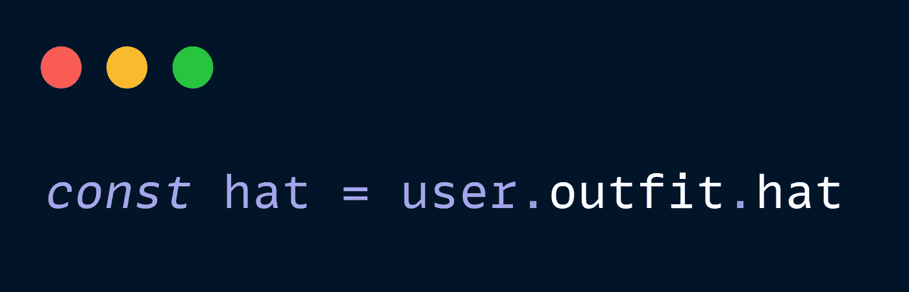

# JavaScript Hacks 可以立即让你的代码没有 Bug

> 原文：<https://javascript.plainenglish.io/javascript-hacks-to-instantly-make-your-code-bug-free-8b7b11740891?source=collection_archive---------3----------------------->

看完这篇文章成为一个更好的开发者。

[📷](https://unsplash.com/@agto?utm_source=medium&utm_medium=referral)

# 臭虫起源简史

今天，bug 是一个术语，用来表示一个计算机软件中的故障、错误或失败，它会产生不希望的结果，如软件崩溃或程序部分的不正确行为。

1947 年 9 月 9 日，一组计算机科学家和工程师报告了世界上第一个计算机错误。这不是第一次有人在这种情况下使用 bug 这个词。托马斯·爱迪生早在 19 世纪就在他的设计中描述了“bug ”,但这是第一次在计算机中发现 bug。

This letter, which was later auctioned for a cool **$12,500**, is one of the earliest examples of the word ‘bug’ to describe a technical issue found.

无论如何，这个 bug 是一个真正的 bug。一名同事在日志中写道:“ ***首次发现真正的漏洞*** ”。

Picture of the moth that was found in MARK II

马萨诸塞州剑桥市哈佛大学的研究小组发现，他们的个人电脑马克 2 号会传达可预见的错误。当他们打开电脑的设备时，他们发现了一只飞蛾。被感染的病毒扰乱了个人电脑的硬件。

从那以后，每当早期的计算机不能像预期的那样工作时，人们就会说，“哦！系统有 bug。”

计算机语言先驱格蕾丝·赫柏是发现第一个报道的计算机漏洞的小组成员之一。她经常因为报告了漏洞而受到表扬，但这不是真的。然而，她可能是使这一事件出名的人。

Grace Hopper

1934 年获得耶鲁大学数学博士学位的霍普是第一批计算机程序员之一。Hopper 发明了第一个英语语言数据处理编译器，为开发独立于机器的编程语言奠定了基础，比如她帮助开发的 COBOL。

> 计算机程序中的错误或缺陷。

好了，这是我们如何得到计算机科学术语 bug 的简短历史！

在本文中，我们将关注 JavaScript。我们将看到三种可能导致代码错误的常见场景，以及我们可以做些什么来修复它们！我们可以开始了吗？

# 在使用 JavaScript 时，错误是如何发生的？

我们知道 JavaScript 是一种动态类型语言。这意味着当我们声明一个变量时，我们不需要指定它是什么类型的变量，不像 C#，Java，Scala——你知道，所有那些工业编程语言。这给了我们在编写程序时一定的灵活性和速度。

这种速度、灵活性和易用性是许多人用 JavaScript 编写代码的原因！

## 类型是该死的！

开个玩笑！当然，这种灵活性是有代价的，如果你使用的是 [Typescript](https://stackoverflow.com/questions/12694530/what-is-typescript-and-why-would-i-use-it-in-place-of-javascript) ，其中一些可能会暴露出来，但是在编写代码时使用下面的技巧可以让你在将来避免一个讨厌的 bug。

# 场景 1

假设你有一个依赖于自变量的函数，自变量是这样一种特殊的类型。

很简单，对吧？我们取一个名字和一个`nameArr`,然后简单地将名字添加到数组中(如果存在的话)。

然而，我们在这里做了一些假设，这个名字将是一个具有长度属性的类型，并且我们的`nameArr`将是一个数组。

如果这两个条件中的任何一个不满足，我们就会惨败。

# 砍

考虑在函数签名中使用默认参数。

好多了！现在您可以晚上睡觉了，因为知道这个无用的函数
不会在生产中中断，即使它是用一个丢失的参数调用的。

# 场景 2

你的团队有这个优秀的小函数，它接受 3 个参数，并用它做了一些简单的逻辑来从第三方服务获取一些数据。

但那是过去的事了；现在，这个小函数几乎无法识别，并且有 6 个参数传递给它。

过多的参数通常表明违反了[单一责任原则](https://en.wikipedia.org/wiki/Single_responsibility_principle)。但这不是唯一的问题。像这样的函数的危险在于参数的顺序很重要，如果其中任何一个不正确，我们就有破坏 API 调用的风险。

> 更多的争论意味着更大的犯错空间。

如果认为当一些开发人员调用这个函数时，`profileId`将不会在`dataId`的位置，或者类似的事情，那将是愚蠢的。

这不会破坏你的程序，因为它们都可能是数字或字符串，但是它们不正确的顺序会给你错误的 API 数据，或者更糟——不起作用。

# 砍

使用对象作为参数。

使用一个对象，我们给我们的开发伙伴带来更少的认知负担，并确保我们的参数是显式设置的。

对于超过 3 个参数的函数，我觉得使用一个对象是必须的。

# 场景 3

我们在 JavaScript 中处理了很多对象。我们最终经常与他们和他们的财产打交道。如果不小心的话，挖掘有价值的信息会是一件痛苦而且有点危险的事情。

看看下面的代码:

看起来无害，对吧？如果我们的用户对象没有装备属性或者那个属性是 ***未定义*** 怎么办？那我们就有麻烦了。

现在，确保我们不会得到这个错误的第一步是检查下一个属性是否在每一层都存在，但是作为回报，我们不得不编写这样糟糕的代码。

我不知道你怎么想，但是我写了这样的代码后感觉很糟糕。谢天谢地，现在 JS 开发人员也可以利用 Ruby 开发人员多年来拥有的！

# 砍

使用[可选链接](https://developer.mozilla.org/en-US/docs/Web/JavaScript/Reference/Operators/Optional_chaining)

现在，如果我们的遍历在任一点失败，我们的操作将短路并返回在`||`操作符后描述的值。这样，代码既更安全又更可读。

错误最常见的原因是软件设计和编码中的人为错误。一旦你知道了软件缺陷的原因，你将更容易采取纠正措施来减少这些缺陷。

# 摘要

*   我们学习了虫子起源的简史。
*   格雷斯·胡珀在计算机环境中推广了术语“bug”
*   我们学习了函数签名中默认参数的用法。
*   如果有三个以上的参数，总是使用一个对象来传递参数。
*   在将对象属性值赋给某个变量之前，使用可选的链接。

# 感谢信

我想利用这最后的机会说声谢谢。

感谢您的光临！如果没有像你这样的人，我将无法做我现在所做的事情。

我希望你能 [**和我一起**](https://polymathsomnath.medium.com/subscribe) 发表 [**我未来的博文**](https://xps8zvgfv2x.typeform.com/to/AmZnFhsK) 并留下来，因为我认为我们这里有一些很棒的东西。我希望在未来的许多年里，我能在你的职业生涯中帮助你！

下次见。再见！

*更多内容请看*[*plain English . io*](http://plainenglish.io/)