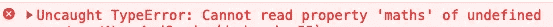

# JavaScript —如何避免运行时错误—可选链接(？。)

> 原文：<https://javascript.plainenglish.io/javascript-how-to-avoid-runtime-error-optional-chaining-b5b9cea3d2e2?source=collection_archive---------22----------------------->

当您使用 JavaScript 时，您可能会引用后端数据进行数据操作或显示。

考虑下面的例子。

只要您获得了预期的数据，这段代码就会完美地工作。如果你丢失了*马克*财产怎么办。然后你会看到

有两种方法可以避免运行时错误。

1.  在读取每个属性之前，对其添加条件检查
2.  可选链接(？。)

# 条件检查

您可以在每个属性上添加条件检查，以避免运行时错误。但是这种方式有一些缺点，

*   需要写的代码更多，而且乱七八糟。
*   对于复杂的数据，可能要考虑更多的情况。

# 可选链接(？。)

**可选链接**操作符(`**?.**`)使您能够读取一个位于连接对象链深处的属性值，而无需检查链中的每个引用是否有效。

用*可选链接，*

*   您可以使用更少且干净的代码来避免运行时数据错误。
*   您可以轻松处理复杂的数据。

*更多内容看* [***说白了。***](https://plainenglish.io/)

*报名参加我们的* [***免费周报***](http://newsletter.plainenglish.io/) *。关注我们关于* [***推特***](https://twitter.com/inPlainEngHQ) ，[***LinkedIn***](https://www.linkedin.com/company/inplainenglish/)*，*[***YouTube***](https://www.youtube.com/channel/UCtipWUghju290NWcn8jhyAw)*，以及* [***不和***](https://discord.gg/GtDtUAvyhW) ***。***

***有兴趣缩放你的软件启动*** *？检查出* [***电路***](https://circuit.ooo?utm=publication-post-cta) *。*