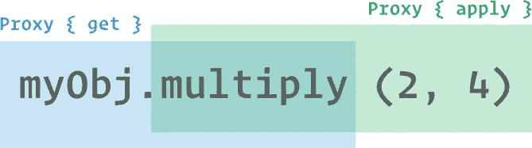

# JavaScript:如何拦截函数和方法调用

> 原文：<https://javascript.plainenglish.io/javascript-how-to-intercept-function-and-method-calls-b9fd6507ff02?source=collection_archive---------2----------------------->

## JavaScript Alpha 指南

## 拦截 JavaScript 中的函数或方法调用。猴子补丁或代理。让我们谈谈那个。


前几天，我有一个对象，需要知道它的任何方法何时被调用。这个对象有许多方法，这些方法在许多文件中被调用。因此，在每次调用后添加一行额外的代码来获得调用通知似乎是不切实际的。

# 问题是

让我们考虑以下对象:

```
let myObj = {
  multiply(x, y) {
    return x * y;
  },
  squared(x) {
    return x ** x;
  }
};
```

现在，每次你调用`myObj.multiply(x, y)`或`myObj.squared(x)`时，你都想知道在`myObj`对象上调用了一个方法。在理想的情况下，你会想知道它是哪种方法，它是用什么参数调用的。类似这样的。

```
interceptMethodCalls(myObj, (fnName, fnArgs) => { ... });
```

# 猴子补丁

> Monkey patching 是一种在运行时添加、修改或取消一段代码的默认行为而不改变其原始源代码的技术
> https://www . au dero . it/blog/2016/12/05/monkey-patching-JavaScript

所以**猴子补丁**基本上是运行时属性的动态替换。我们如何着手解决猴子补丁的问题？

```
function interceptMethodCalls(obj, fn) {
  Object.keys(obj).forEach(key => { // **(A)**
    const prop = obj[key];
    if (typeof prop === 'function') { // **(B)**
      const origProp = prop;
      obj[key] = (...args) => { // **(C)**
        fn(key, args); // **(D)**
        return Reflect.apply(origProp, obj, args); // **(E)**
      }
    }
  });
}
```

在第`(A)`行，我们遍历给定对象的属性名。在第`(B)`行，我们检查对象的属性是否是一个函数。神奇的事情发生在第`(C)`行，我们用一个匿名函数替换了原来的函数——这就是**猴子补丁**部分。这个匿名函数用两个参数调用给定的`fn`函数`(D)`: 1。被调用函数的名称，2。调用函数时使用的参数(作为数组)。最后，我们使用`Reflect` API 调用原始函数。

这太棒了👍。

```
const handleMethodCall = (fnName, fnArgs) =>
  console.log(`${fnName} called with `, fnArgs);interceptMethodCalls(myObj, handleMethodCall);myObj.multiply(2, 7); // "multiply called with [ 2, 7 ]"
myObj.squared(2); // "squared called with [ 2 ]"
```

酪总有一个 but️.

**猴子补丁的作用是改变对象的位置。**在我们的例子中是`myObj`。在调用`interceptMethodCalls(myObj, handleMethodCall);`之后，所有的对象方法都被替换成不同的方法——行`(C)`。

我们不希望这样。有更好的解决办法。

# 代理人

> `Proxy`对象使您能够为另一个对象创建一个代理，它可以截取并重新定义该对象的基本操作
> [https://developer . Mozilla . org/en-US/docs/Web/JavaScript/Reference/Global _ Objects/Proxy](https://developer.mozilla.org/en-US/docs/Web/JavaScript/Reference/Global_Objects/Proxy)

JavaScript **代理**包装另一个对象(目标)并允许您拦截目标对象上的基本操作。像获取一个值、设置一个值、调用一个函数这样的操作。这些操作被称为**陷阱**。这听起来正是我们想要实现的目标。

## 应用陷阱

> "`**handler.apply()**`方法是一个函数调用的陷阱."~[https://developer . Mozilla . org/en-US/docs/Web/JavaScript/Reference/Global _ Objects/Proxy/Proxy/apply](https://developer.mozilla.org/en-US/docs/Web/JavaScript/Reference/Global_Objects/Proxy/Proxy/apply)

这个`apply`陷阱看起来很合适。不过，有个问题。在对象上调用方法实际上是两个操作。

1.  检索功能- `get`陷阱
2.  调用函数- `apply`陷阱

方法调用没有**陷阱**，所以我们将结合`get`和`apply`陷阱。

工作解决方案如下:

```
function interceptMethodCalls(obj, fn) {
  return new Proxy(obj, {
    get(target, prop) { // **(A)**
      if (typeof target[prop] === 'function') {
        return new Proxy(target[prop], {
          apply: (target, thisArg, argumentsList) => { // **(B)**
            fn(prop, argumentsList);
            return Reflect.apply(target, thisArg, argumentsList);
          }
        });
      } else {
        return Reflect.get(target, prop);
      }
    }
  });
}
```

比猴子打补丁的方案长一点，但是更干净。在任何时候，我们都没有修改原始对象或它的方法。我们只是把它们包装在一个代理中。

在第`(A)`行，我们在`obj`参数上设置`get`陷阱。所以当我们访问某个方法时(例如前面例子中的`myObj.multiply`),这个陷阱就会被触发。它只是对象上的一个属性。属性的值只是一个函数。



JavaScript Proxies When Intercepting Method Calls

现在我们准备创建一个被检索函数的代理版本，我们可以通过`target[prop]`访问它。所以我们制作一个新的**代理**，设置`apply`陷阱，并返回那个**代理**而不是原来的方法。

所以这基本上是一个两步的过程，但这是值得的，因为你既不改变对象也不改变它的方法。

# 操场

你可以在[https://repl.it/@MelkorNemesis/Intercept-Method-Calls](https://repl.it/@MelkorNemesis/Intercept-Method-Calls)玩一玩上面的代码。