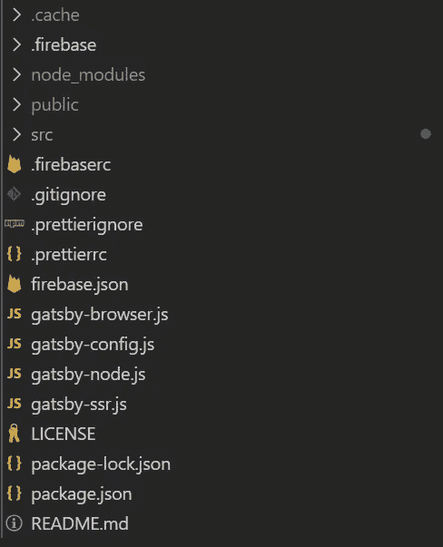

# 在 Gatsby、Next.js 和类似的框架中 JavaScript Import vs Require 语句

> 原文：<https://javascript.plainenglish.io/javascript-import-vs-require-statements-in-gatsby-next-js-and-similar-frameworks-1de1145f1228?source=collection_archive---------3----------------------->

为什么在使用这些框架的项目目录的不同部分中,`import`语句和`require`语句的用法有所不同，回答了。

Photo by [CHUTTERSNAP](https://unsplash.com/@chuttersnap?utm_source=medium&utm_medium=referral) on [Unsplash](https://unsplash.com?utm_source=medium&utm_medium=referral)

我一直认为 JavaScript 的`import`和`require`语句或多或少是一样的。当你想使用不同文件或模块中的其他组件和功能时，你可以通过`import`或`require`将它们添加到你正在处理的文件中。我认为,`import`和`require`语句之间的唯一区别在于前者是后者的“更新”版本。没别的了。

当我使用 Gatsby 框架进行一个项目时，我的预想被证明是错误的。在`src`目录中编写代码时，我使用`import`或`require`语句都没有问题。然而，当涉及到在位于根目录的文件上配置应用程序时，当使用`import`语句时，错误开始出现。在深入研究这个问题之后，我发现了以下情况。

# 模块之前 Javascript 的一点历史

在 JavaScript `require`和`import`语句出现之前，没有真正可行的方法使 JavaScript 模块化。javascript 语言没有自己的模块特性。唯一能做的就是将代码分成不同的 javascript 文件，并将每个文件作为自己的`<script>`标签添加到 html 文件中。

通过使用`<script>`标签进行模块化，您必须格外小心`<script>`标签的排序。如果您只有几个 javascript 文件，这是可以管理的。但是，如果因为 app 的规模而不得不管理几十个文件的顺序，那将是一种痛苦。

使用`<script/>`标签的另一个问题与全局范围/名称空间的使用有关。变量、函数和类被放在全局范围内，造成了混乱。您只希望一个文件中的代码不会与其他文件中的代码冲突，因为所有代码都占用相同的全局名称空间。

为了应对全局范围污染问题，程序员可以求助于立即调用函数表达式(IIFE)和模块对象。这样，您可以将相关的方法和值放入一个对象中，同时让所有的局部变量都留在 IIFE 函数的局部范围内。尽管如此，这并没有解决排序问题。此外，您只是将全局范围内的对象数量减少到几个，而不是全部消除。

# CommonJS 和 NodeJS

随着 javascript 开始成为首选语言，让它在浏览器之外运行是利用 javascript 的一种新方式。当在浏览器之外使用 javascript 时，也应该实现模块化。最好将代码放在不同的文件中，每个文件都有自己的功能，而不是在一个文件中放很多行代码。

创建 CommonJS 标准是为了解决浏览器之外的 javascript 模块化问题。当时，javascript 只能通过使用不同的`<script>`标签将每个 javascript 文件包含在同一个 html 页面中来实现“模块化”。在浏览器之外根本没有办法实现同样的壮举。浏览器外的 Javascript 不依赖于 html 文件。通过使用 CommonJS 标准，一个文件中的代码可以毫不费力地在另一个文件中使用。注意，CommonJS 不是一个库，而是一个标准。通过使用用于导入模块/代码的`require`语句和用于导出模块/代码的`module.exports`语句来识别 CommonJS 标准。

2009 年，NodeJS 面世，boy 做到了在浏览器之外普及 javascript。它开始成为后端开发最受欢迎的选择之一。NodeJS 在实现模块系统时采用了 CommonJS 标准。因此，当使用 NodeJS 时，模块化代码的方法是使用 CommonJS 的`require`和`module.exports`。

# ES6 导入

随着 ES6 或 ECMAScript 2015 的发布，javascript 语言获得了自己的模块系统实现。模块系统的 Javascript ES6 实现可以用`import`和`export`语句来标识。顾名思义，我们使用`import`语句导入功能，否则使用`export`语句。使用 ES6，您可以在引用其他 javascript 文件(模块)的 html 中只包含一个 javascript 文件。

在发布的时候，浏览器并没有立即实现 ES6。浏览器适应起来很慢(尽管在撰写本文时，除了 Internet Explorer，几乎所有主流浏览器都实现了 ES6)。一些浏览器很快实现了 ES6，而另一些则采取了缓慢的方式。

为了帮助使用 ES6，同时确保在当时不同的浏览器上正确实现，创建了捆绑器和编译器。这些库中最受欢迎的是 Webpack 和 Babel。通过使用 Webpack 和 Babel，javascript 的 ES6 实现可以被转换、编译和捆绑成与浏览器兼容的 javascript，而不管浏览器实现 ECMAScript 版本。

Webpack 高度利用 ES6 导入和导出。然而，Webpack 中的导出和导入系统实际上有助于依赖图的创建。依赖图指出了哪个文件依赖于哪个其他文件。然后，在将所有这些相关文件或“模块”捆绑成一个 javascript 文件的过程中，会用到这个映射(或者，如果您要进行代码拆分，会用到几个 javascript 文件——但这是另一个主题)。

为了将 ES6 javascript 转换成与浏览器兼容的 javascript，通过 Webpack 的加载器特性使用 babel-loader。除了 babel-loader 来转换 ES6+ javascript 代码之外，还有其他加载器允许我们捆绑 javascript 之外的静态资源。这个特性使得 Webpack 能够加载 javascript 之外其他文件类型。因此，使用 Webpack，像`import "a.png"`、`import “b.css"`和`import "c.jpeg"`这样的导入语句是可能的。

# Gatsby、Next.js 和类似框架中的需求与导入

回到手头的问题。作为一个典型的 Gatsby 项目，我的文件夹结构如下:

My project folder structure

我的主代码在`src`目录里面，而所有的配置代码(比如`gatsby-config`、`gatsby-node`、`gatsby-browser`)都在根目录外面。对于在`src`目录中使用`require`和`import`语句，我没有任何问题。然而，只有`require`语句在配置文件中起作用(在`src`目录之外，在根目录中)，而`import`语句不起作用。

Gatsby 使用 Webpack 来捆绑文件，并使用 Babel 将 ES6 和 React 的 JSX 语法转换为浏览器可以读取的 javascript。`import`语句和`require`语句都在`src`目录中工作(在主代码中),因为这些代码将在稍后的构建过程中使用 Babel 和 Webpack 进行传输和捆绑。另一方面，位于根目录中(在`src`之外)的配置文件中的 javascript 代码无法利用 ES6 `import`，因为它运行在 NodeJS 生态系统中，我们之前知道它采用了 CommonJS 标准作为默认标准。

这种情况并不是盖茨比独有的。在撰写本文时，当您使用其他框架(比如 Next.js)开始一个项目时，`require`和`import`语句的二分法也会出现。

# 节点中的 ES 模块

你可能会问，NodeJS 会实现 ES6 `import`语句吗？从技术上讲，答案是已经有了。从 2018 年 NodeJS 版本 10 开始已经采用 ES6 模块，尽管仍处于实验状态(截至本文撰写时的版本 15，状态已经稳定)。然而，CommonJS `require`语句并没有被弃用。ES6 模块和 CommonJS 标准在 NodeJS 生态系统中并存，CommonJS 标准是默认的。

为了在 NodeJS 中使用 ES6 模块，我们需要将我们的文件扩展名设置为`.mjs`而不是典型的`.js`扩展名。这意味着，您应该将文件命名为`index.mjs`而不是`index.js`。另一种方法是让我们的 javascript 文件仍然作为一个`.js`扩展名，但是我们需要在项目的`package.json`中将类型字段指定为“模块”。通过将`.mjs`作为文件扩展名或在`package.json`中将字段类型定义为“模块”，CommonJS `require`语句不能在该文件中使用。

为了明确而有目的地使用 commonjs 标准，我们可以使用`.cjs`扩展(例如`index.cjs`)或将`package.json`中的类型字段指定为“CommonJS”。这样，您可以根据需要在节点环境中使用`require`语句。

# 摘要

概括地说，在典型的 javascript 框架(如 Gatsby 或 Next.js)项目结构中，`require`和`import`语句都可以在`src`目录中使用，因为这些文件将在生产构建过程的后期使用 Babel 和 Webpack 进行转换、编译和打包。同时，位于根目录下`src`目录之外的配置文件将不会被转换、编译或捆绑，而是会在 NodeJS 环境中运行。由于 NodeJS 默认采用了 CommonJS 系统，所以它只能理解`require`语句。

在撰写本文时，NodeJS 已经实现了 ES6 `import`语句的稳定版本。然而，使用它需要对规范进行一些简单的修改。