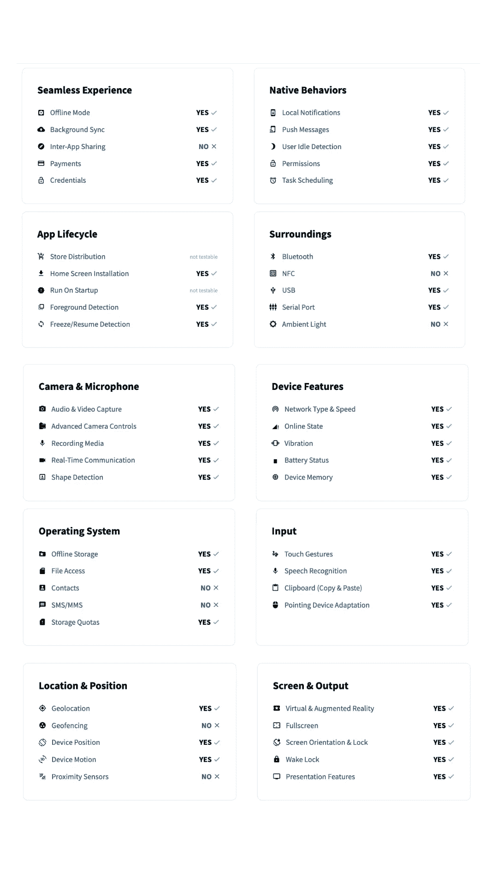

# JavaScript 要接管世界了！

> 原文：<https://javascript.plainenglish.io/javascript-is-going-to-take-over-the-world-4dd77b6a10ae?source=collection_archive---------5----------------------->

## 所有的东西都用 JavaScript 写是必然的吗？

[📷](https://www.pexels.com/@alipazani?utm_content=attributionCopyText&utm_medium=referral&utm_source=pexels)

JavaScript 正处于不可阻挡的上升轨道。

它现在不仅仅用于 web 开发；它还用于移动应用程序开发和机器学习。

它也正在进入物联网设备的世界。

自 1995 年问世以来，JavaScript 已经走过了漫长的道路。由于它的跨浏览器兼容性和 Node.js 运动的兴起，它在过去几年中大受欢迎。

它的流行可以归因于这样一个事实:它是完全免费的、开源的，并且你可以在几乎任何设备上运行(由于它的便携性)。

这可能是 Sun 对 Java 的口号，但 JavaScript 真正做到了这一点。

几乎每个智能设备都可以运行 JS。

很难相信什么主要用于查看天气、邮件、新闻、答案、音乐或玩 flash 游戏——互联网已经发生了很大的变化。

更难以置信的是，JavaScript 这种曾经被认为毫无用处的玩具语言让这种改变成为可能。

网络在发展，JavaScript 也在发展。

有人想知道 JavaScript 是否还会存在一段时间——所有的东西最终都会在 JavaScript 中运行吗？

> C 语言提供的这种编程方式可能会保持绝对的相似性，或者使用量会慢慢下降，但是相对来说，JavaScript 或者它的变体会继续变得更加重要。
> 
> —丹尼斯·里奇

# 桌面应用程序已经死在花瓶里——我们的一切都将留在过去。

看看你用的 app——***、脸书、Twitter、Gmail、YouTube、Slack、Discord、Zoom、微软团队、Google Drive、Office 365、*** *等等。*

你能猜出它们中哪一个不是 web 应用吗？

没有。

但是 Som，像 ***Photoshop，After Effects，Final Cut Pro，Blender，Visual Studio*** 这些应用都是桌面应用。它们太重太复杂，我不认为我们能够使用基于网络的技术来运行它们。

我感觉微软 Office 应用在桌面应用上是“事实上的”。他们 [*在 react 中重写了*](https://react-etc.net/entry/microsoft-office-rewrite-to-react-js-nears-completion) 他们的界面 react 是基于网络的技术。

如果你还没有注意到，大多数大型应用程序正在向网络迁移。

`Photoshop, Illustrator, Adobe XD` → [Photopea](https://www.photopea.com/) 、 [Figma](https://www.figma.com/) 、[成帧器](https://www.framer.com/)和 [Avocode](https://avocode.com/)

`VLC Media Player` → [VLC.js](https://code.videolan.org/jbk/vlc.js)

`Audacity` → [测深](https://soundation.com/)

`After Effect` → [Rive](https://rive.app/)

`Blender` → [花键](https://spline.design/)

`AutoCad, Sketchup` → [AutoCad Web](https://web.autocad.com/) 和 [Sketchup Web](https://app.sketchup.com/app)

`Microsoft Office` → [Office 365](https://www.office.com/) 、 [Google docs](https://www.google.com/docs/about/) 、 [Google slides](https://www.google.com/slides/about/) 、 [Google sheets](https://www.google.com/sheets/about/) 和[idea](https://www.notion.so/)

`Visual Studio & Other IDEs` → [CodeSandBox](https://codesandbox.io/) 、 [Github CodeSpaces](https://github.com/features/codespaces) 、 [Glitch](https://glitch.com/) 、 [Git Pod](https://www.gitpod.io/) 和 [Next.js Live](https://nextjs.org/blog/next-11#nextjs-live-preview-release)

`Unreal Engine, Unity` → [Three.js](https://threejs.org/) 、 [Babylon](https://www.babylonjs.com/) 、 [Play Canvas](https://playcanvas.com/#!) 和 [RogueEngine](https://rogueengine.io/)

`Skype` → [团队](https://www.microsoft.com/en-ww/microsoft-teams/group-chat-software)、[缩放](https://zoom.us/)、[松弛](http://slack.com/)、[不和谐](https://discord.com/)

还有一个 [windows 98](https://copy.sh/v86/?profile=windows98) 、 [Windows XP](https://winxp.vercel.app/) 、 [windows paint 克隆](https://jspaint.app/)可以在你的浏览器上运行。

似乎这还不够，我们甚至可以在网络上运行浏览器——如果一切顺利，这将成为新的常态。

[Mighty App](https://www.mightyapp.com/)

桌面应用已经在走向数字墓地的路上了。

# 这很好，但是手机应用程序呢？

早些时候，如果一家公司想支持移动，它会建立一个原生的移动应用程序，而不是一个移动友好的网络应用程序。

移动应用程序可以安装在您的主屏幕上，发送通知，以及访问相机、联系人、文件系统和其他功能，同时显示无缝的动画和动作，这些是我们通常在网站上看不到的。

为什么？因为 web 应用程序无法访问与本机应用程序相同的 API 和功能。

React Native 等框架允许您使用 web 技术创建跨平台的应用程序。

它们主要提供对与原生应用相同的 API 和特性的访问，尽管性能水平较低。

脸书、Instagram、Discord、Tesla、Skype、Pinterest 和优步 eats 等公司都采用了 React Native。

但我觉得更好的东西正在路上——一种可以运行并感觉像本地应用的网络应用——渐进式网络应用。

它们是*可安装的*，可以访问诸如存储、摄像头、通知等 API。可以即时更新。

**An overview of the device integration HTML5 APIs**

PWA 不需要像原生应用一样提交到应用商店。

通过 URL 可以很容易地访问它们，通过像 use-gestures、react-spring 和 framer motion 这样的库，您可以快速实现流畅的动画和手势。

大概最著名的例子就是 [Twitter Lite。](https://blog.twitter.com/engineering/en_us/topics/open-source/2017/how-we-built-twitter-lite)

Google play 商店和微软商店已经允许 pwa 提交到他们的市场。

让我们期待苹果能在 iOS 上增加更多支持，并解除对 PWA 的一些限制🤞。

我相信久而久之会有更多的企业迁移到 PWA。它们将与原生应用共存，直到有一天 PWA 成为标准(希望如此)。

# Web 总的来说不是很慢吗？图形密集型应用呢？

web 不是为支持大型应用程序而设计的。然而，随着 Web Assembly 的出现，情况不再是这样了。

Web Assembly 让你以接近机器代码的速度运行来自多种语言的编译代码。

网络传统上是二维的，这是因为它主要是为共享文档而不是“应用程序”而设计的

近年来，事情发生了巨大的变化；以下是一些在 3D 领域蓬勃发展的网站。

`Google Earth`

`NASA Mars 2020 simulation`

`Stars Chrome Experiment`

`Wikiverse.io`

`NASA Jet Propulsion Laboratory Open Source Rover`

`SpaceX ISS Docking Simulator`

`Google Arts & Culture — Blob Opera`

 [## Blob Opera -谷歌艺术与文化

### 用 Blob Opera 创建自己的歌剧灵感歌曲-不需要音乐技巧！大卫的一个机器学习实验…

g.co](https://g.co/arts/A9FmXjtVUZ8ntm7x7) 

`Google Cloud Infrastructure`

`Paper Lanes`

`Bruno Simon Portfolio`

`Lusion Site`

虽然虚拟现实和增强现实尚未进入主流，但它们将在互联网上占有一席之地。未来属于 XR 相关技术，所以 web 正在迎头赶上。

[WebXR](https://developer.mozilla.org/en-US/docs/Web/API/WebXR_Device_API) 是一个 API，允许我们在网络上创建混合现实(VR & AR)体验，因此我们将能够创建与多种耳机兼容的体验，而不是一种耳机。

# 网络游戏的时代已经开始

视频游戏一直存在于游戏机和个人电脑上。网络只剩下迷你 flash 游戏——当时网络还没有为视频游戏行业做好准备。

但是有了 Web Assembly，事情开始改变了。现在你可以把用 C++等其他语言编写的游戏直接移植到网络上。

借助 [WebGPU](https://web.dev/gpu/) ，我们将看到 web 3D 引擎可以更直接地访问 GPU，为网络游戏带来新的可能性。

[Unity 宣布将支持 Web 组装](https://blog.unity.com/technology/webassembly-is-here)。有了像 [Three.js](https://threejs.org/) 、 [Babylon](https://www.babylonjs.com/) 、 [Play Canvas](https://playcanvas.com/#!) 和 [RogueEngine](https://rogueengine.io/) 这样的工具，网络游戏的前景看起来有点光明。

以下是一些在网络上运行的游戏示例:

*   `[Classic Minecraft](https://classic.minecraft.net/)`
*   `[Robostorm](https://robostorm.io/)`
*   `[Foosball World Cup](https://www.foosballworldcup18.com/)`
*   `[Doom 3 (ported via Web Assembly)](https://wasm.continuation-labs.com/d3demo/)`
*   `[Heracles](https://heraclosgame.com/)`
*   `[Unity: Angry Bots](https://beta.unity3d.com/jonas/AngryBots/)`
*   `[HexGL — Racer Game](http://hexgl.bkcore.com/play/)`
*   `[Ouigo — Pinball](http://letsplay.ouigo.com/)`
*   `[ponders — racing game](https://racing.pmnd.rs/#)`
*   `[Trolli](https://trollideliciouslydarkescape.com/)`

web 是一个向后兼容的平台。

从技术上来说，你可以在任何设备上运行你的游戏——没有必要将你的游戏移植到不同的主机和架构上。PC 游戏将不再局限于 Windows。

测试一款游戏不需要下载千兆字节的数据。只需分享一个游戏会话的 URL 即可开始。

# 结论

甘地说，*“首先他们忽视你，然后他们嘲笑你，然后他们和你斗争，然后你赢了*，”JavaScript 尤其如此。

当我们刚开始使用计算机时，我们选择 Unix 作为我们的操作系统。

Unix 是有特权的，运行用户代码的程序是一个托管进程。就像是主人里的客人；如果它崩溃了，你可以暂停或杀死它。该过程不会关闭整个操作系统。

对内核的调用是昂贵的，同时，硬件架构和虚拟化技术已经发展到无需进入操作系统内核就可以非常便宜地进行软件故障隔离的地步，从而产生了独角兽、外内核和非常轻量级的虚拟机。

纵观全局，我百感交集。

一方面，我相信 JavaScript 最终会接管计算，因为系统调用边界太昂贵了，所以一切可能最终都在 JavaScript 中以更轻量级的隔离强制机制结束。

> "任何可以用 JavaScript 编写的应用程序，最终都会用 JavaScript 编写."
> 
> —杰夫·阿特伍德

然而，仅仅因为我们可以用 JavaScript 做一些事情，并不意味着这是最好的方法。存在安全性和健壮性问题；毕竟，你不会用 JavaScript 来运行一个核电站吧？

JavaScript 无疑已经接管了世界，但在某些地方，垃圾收集、动态语言是不合适的，甚至是不可能的。

需要大量内存分配和释放的数据处理可能会以 JS 垃圾收集为代价而严重受损。

类似地，微控制器等低功耗/低内存设备可能没有足够的内存来支持完整的 JavaScript 引擎。

# 感谢信

我想利用这最后的机会说声谢谢。

感谢您的光临！

如果没有像你这样的人跟随并带着信念阅读我的帖子，我就不会有今天的成就。

我希望你将 [**加入我的**](https://polymathsomnath.medium.com/subscribe) 在 [**我未来的博客文章**](https://polymathsomnath.medium.com/subscribe) 中，并留下来，因为我们这里有一些伟大的东西。

我希望在未来的许多年里，我能在你的职业生涯中帮助你！

下次见。再见！

*更多内容看* [***说白了。报名参加我们的***](http://plainenglish.io/) **[***免费周报在这里***](http://newsletter.plainenglish.io/) *。***