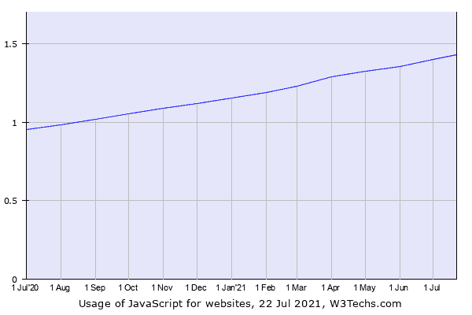
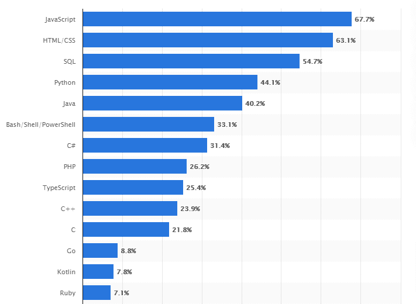

# 为什么 JavaScript 独领风骚，有什么替代方法吗？

> 原文：<https://javascript.plainenglish.io/javascript-is-ruling-the-roost-have-any-alternatives-come-to-light-841d44201591?source=collection_archive---------12----------------------->

想知道哪种编程语言最适合您的 web 应用程序开发？嗯，对于企业家和网络开发者来说，这似乎是一项艰巨的任务。前端开发是网站开发最关键的一个方面，当你踏入网站开发的世界时，JavaScript 是绝对听不到的。

JavaScript 就是这样一种编程语言，它可以帮助网站在几秒钟内创造奇迹。虽然 HTML 和 CSS 是任何网页的基础，但将 JavaScript 融入其中会增加网站的行为。它将静态网页转化为动态网页，给网页注入了活力。

据报道，1.4%的网站使用 Javascript 作为他们的服务器端编程语言。下图显示了 JS 相对于其他服务器端编程语言的增长率。

一些使用 Javascript 的流行网站有 **Twitter、Github、Spotify、Fiverr、Medium GoDaddy 等。**

但所有这些数据和普及并不意味着每个 web 开发公司都盲目依赖 JavaScript 进行 web 开发。除了它的优点，JavaScript 还有许多其他的选择。公司意识到了这一点，并发现在 JavaScript 的阴影下出现了许多超集。

*通过这个博客，我们将看到 JavaScript 的好处和最好的替代方案。*

# **使用 JavaScript 开发移动应用的好处**

JavaScript 确实因其易于使用而独领风骚，与其他替代语言相比，web 开发人员发现它是网站开发的最佳编程语言。全球 68%的软件开发人员认为 Javascript 是 2020-21 年开发人员中最常用的编程语言。

移动应用程序开发已经开始主宰世界，因为没有什么比智能手机更接近人们了。各种各样的语言被用来开发各种各样的编码，主要是 HTML、CSS 和 JavaScript。如今，JavaScript 编码、移动应用和 web 应用开发在当前的技术趋势中扮演着重要角色。

近年来，JavaScript 框架对移动应用程序开发产生了持续的巨大影响。JavaScript 包括几种开发应用程序的方法，尽管它并不被认为是应用程序开发的主要语言。对 JavaScript 开发公司的需求突飞猛进。

让我们来看看在移动应用中使用 JavaScript 的一些重要方面。

> **创建移动应用:JavaScript**

术语 JavaScript 是用于在网页上执行复杂方法的编程语言。它可以改变 HTML 和 CSS，也可以计算、验证和操作数据。通过使用 JavaScript，该应用程序提供了更好的用户界面/ UX，并提供了最新的内容更新、最近的滚动视频点唱机、交互式地图、2D / 3D 动画图形等。

一个叫做 Meteor 的平台使用一个 **JavaScript 代码库**来创建网络和移动应用。用 JavaScript 创建新的移动应用程序非常容易，而且适用于 Android 和 iOS 等所有平台。

看看 JavaScript 的一些重要特性，这些特性是在移动应用程序开发中使用它的原因。

*   *被评为最简单的语言*
*   *执行客户端执行时节省带宽范围*
*   *用于动态动画的开发。*
*   *快速发展*
*   *速度和简单性*
*   *互操作性*
*   *丰富的界面*
*   *扩展功能*

作为一种客户端语言，它减少了对服务器的需求，因为小型应用程序不需要服务器。这种语言如此受欢迎，以至于你可以在 Stackoverflow 和 GitHub 上查看越来越多使用 javascript 的项目。

> **移动应用中的 JavaScript 框架**

通过将 JavaScript 融入 web 开发，前端开发者可以在客户端操作基本功能。他们推广 JavaScript 库，向所需页面添加更高级的动态元素。看看可用于生成专业 JavaScript 应用程序的多种框架。

**离子型**

使用这个框架，开发人员可以构建、测试、监控和部署 web 和移动应用程序。尽管市场上有许多其他框架，但 Ionic 是用 JavaScript 开发移动应用程序的首选。

**PhoneGap**

通过使用单一的 JavaScript 代码库，开发人员可以创建多个平台，并轻松接触到他们的目标受众。

**jQuery:**

使用 jQuery，web 开发人员可以开发出响应速度非常快的应用程序，这些应用程序可以在各种大小的设备上运行，比如平板电脑、智能手机和桌面平台。

**反应原生:**

React native 被视为一个开源框架，在移动应用开发者的工作中发挥着至关重要的作用。在这种设计的帮助下，开发人员可以从装饰性组件开发出丰富的移动 UI(用户界面)。

**原生脚本**

原生脚本是 JavaScript 中最重要的框架之一，它允许您使用 JavaScript 语言创建 Android 和 iOS 移动应用程序。本机脚本代码可以帮助您实现更好的 UI(用户界面)性能。

**Tabris.js**

在这里，开发人员可以用一段 Javascript 或 typescript 代码创建原生的 Android 和 IOS 应用程序。在这里，您将有机会使用节点模块、Cordova 插件和 JavaScript 库来构建应用程序。

*虽然这些都是使用 JavaScript 的好处，但是很少有 web 开发者愿意尝试它的替代品。因此，这里我们也将列出一些最好的 Javascript 替代方案，帮助 web 开发公司和 web 开发人员做出公平的选择。*

# **JavaScript 替代品**

尽管 Javascript 如此流行和独特，但许多替代品可以取代它。看一看这些中的每一个。

> **咖啡脚本**

Coffeescript 是 JS 的一个很好的替代品，因为它已经被翻译成了 Javascript。它使代码更简单、更短，从而提高了 javascript 的可读性。您也可以在 Node.js 中使用它。但是，它不是 JavaScript 的修改或子集。

但是，如果你想用它来编码，你需要了解 JavaScript。CoffeeScript 的缺点包括需要编译，功能集有限，以及使用它的专家数量少。

> **镖**

它是谷歌的产品，为开发结构良好的应用程序提供了很多机会。它是一种高性能语言，为新一代开发人员提供了极大的灵活性。Google 定期升级 JS 的这一替代方案，但是与 JavaScript 相比，它的能力仍然较弱，而且社区中很少有开发人员来解决这些问题。

> **打字稿**

微软在 2012 年 10 月开发了 TypeScript 来开发大型应用。主要功能是升级 JavaScript 的能力和功能，它与以前的版本兼容。当编译成 JS 时，任何用 TypeScript 编写的应用程序都可以在几种浏览器中查看。

该语言也与 Node.js 兼容。它支持调用类、模块和静态类型检查。Typescript 的语言社区比 JavaScript 社区小，用这种语言编码需要更长的时间。

> **关闭描述**

它是用 JavaScript 编译的 Clojure 编程语言的实现。Clojure 导出与 Google 闭包聚合器的翻译模式兼容的 JS 代码。它可以在大多数浏览器中流畅运行，兼容移动平台和 Node，js。它是一个简单而有效的编程工具，但肯定没有 JavaScript 流行。

> **蛋白石**

它是一种面向对象的语言，充当 Ruby 的 JavaScript 编译器。

开发它是为了补充和取代其他语言，如 C、C++、Java、JavaScript 和 Eifel。但是，它的受欢迎程度仍然很低，开发人员认为它值得使用。

> **标志**

它是一种新的函数式语言，web 开发人员积极使用它来构建图形界面。Flag 可以很容易地转换成 JavaScript，并在 web 开发中提供了很大的灵活性。Elm 易于使用，具有自格式化图标。

> **凯菲恩**

当你觉得 JS 不能处理你所有的任务时，Kaffeine 是 javascript 的最佳替代。它是一个强大的工具，并提供了 javascript 语法的扩展。Kaffeine 中的代码编译 JS 代码，使调试更简单。

> **罗伊**

像许多其他语言一样，Roy 被翻译成 JavaScript。它是作为实验工具开发的，非常类似于 JavaScript。Roy 简化了代码生成，并具有函数式语言的一些特性，如模式匹配、空白等。

**总结思路**

虽然 JavaScript 仍然是 web 开发人员的首选，但是只有您自己才能决定使用 Javascript 进行 web 开发是否是一个明智的决定。很明显，JavaScript 是一种非常受欢迎的编程语言，但是您也可以尝试它的替代品。

如果你想在网上开展业务，你可以联系一家顶级的 JavaScript web 开发公司来最大限度地满足你的编程需求，或者联系一家[软件咨询公司](https://www.pixelcrayons.com/technology-consulting-services)，如果你想在 JavaScript 备选方案之间做出选择并有疑问的话。

*更多内容请看*[***plain English . io***](http://plainenglish.io/)