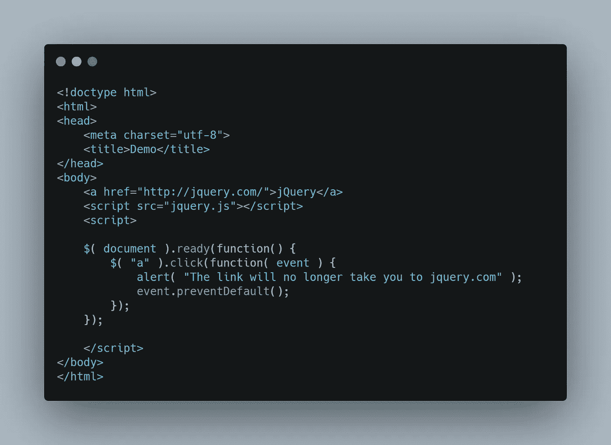

# 你应该知道的 JavaScript 库

> 原文：<https://javascript.plainenglish.io/javascript-libraries-you-should-know-548b00805a69?source=collection_archive---------8----------------------->

JavaScript 是最流行和使用最广泛的语言之一。从前端开发到后端开发，到处都在用。它有一个很大的社区，因此，它有很多库和框架。这些库使得 JS 更加强大和简单。它们让开发人员不必从头开始编写任何东西，从而节省了开发和测试时间。代码变得可重用和更易维护。JS 为各种目的提供了广泛的库。在本文中，我们将讨论你应该知道的 18 个 JavaScript 库。所以，事不宜迟，我们开始吧。

# **jQuery**

jQuery 是一个流行的 JavaScript 库。它速度快、重量轻、功能丰富。它允许我们以更简单快捷的方式编写 JS 代码。在 JS 中需要很多代码行的功能，使用 jQuery 只需要 1-2 行代码就可以实现。有了 jQuery，DOM 操作、AJAX 调用、事件处理和动画变得轻而易举。它还具有跨浏览器兼容性。因此，编写的代码可以无缝地跨大多数浏览器运行。此外，它通过抽象降低了复杂性，也就是说，您只需要调用方法，而不需要知道它是如何工作的。

# **D3.js**

D3 代表数据驱动文档。它是一个开源库，可以根据数据对文档进行有效的操作。例如，如果数据存储在一个数组中，可以使用 D3.js 通过 HTML、SVG 或 CSS 将其可视化。它支持 HTML、SVG 和 CSS 等 web 标准。因此，你不需要学习任何新的东西，它具有非凡的灵活性。

它还通过使用声明性方法提供了对 DOM 元素的简单选择。之后，您可以对它们执行任何操作和样式设置。

D3 速度很快，开销很小。它支持大型数据集和代码可重用性。

# **Anime.js**

动画现在已经成为任何网站的重要组成部分。他们使你的网站具有互动性和吸引力。Anime.js 是一个轻量级的 js 动画库，允许你在网站上添加很酷的动画。您可以在 SVG、CSS、HTML、DOM 和 JS 对象上设置动画。它强大的 API 可以帮助你轻松地添加复杂的动画。使用 anime.js，您可以在一个 HTML 元素上以不同的时间同时制作各种 CSS 变换属性的动画。它还提供了许多回调和控制功能来播放、控制、暂停和触发事件。

# **Parsely**

Parsely 是一个执行前端表单验证的 JavaScript 库。这是一个非常简单和用户友好的库。您可以轻松地在 HTML 标记中添加验证信息，而无需编写任何 JS 代码，Parsely 会处理所有其他事情。它为您提供了许多有用的内置验证器，但是您也可以根据自己的需求来创建自己的验证器。Parsely 还执行动态表单验证。它可以自动识别对表单数据的修改，然后转换它的验证器。Parsely 专注于 UI 和 UX，因此，它允许您根据自己的需求定制它的默认行为。此外，它是开源的，没有错误，并且经过严格测试。

# **插座。IO**

插座。IO 是另一个用于实时 web 应用程序的流行而强大的 JavaScript 库。它支持浏览器和服务器之间基于事件的实时双向通信。而且，它由 node.js 服务器和浏览器的 js 客户端库组成。插座。IO 是可靠、高效的，可以在大多数平台上工作，比如浏览器和移动设备。带插座。IO，您可以创建具有实时分析、即时消息、二进制流和文档协作的应用程序。它提供自动重新连接、数据包缓冲和空间(向所有或部分客户端广播)等功能。

# **反应过来**

React 是一个开源的 JavaScript 库，允许我们创建单页面 web 应用程序。它专注于应用程序的 UI 部分，并基于模型视图控制器(MVC)架构。React.js 遵循基于组件的体系结构，因此，应用程序被分成独立的小部分，这些小部分被组合在一起以创建更复杂的 UI。由于它使用组件，代码变得更加可重用、可维护和可优化。它在虚拟 DOM 上工作，因此是高效的。此外，它是由脸书开发和维护的，拥有相当大的社区和支持。

# **谷歌聚合物**

Polymer 是一个 JavaScript 库，允许你使用 web 组件创建网站。它是谷歌创建的一个开源库。使用 Polymer，您可以重用 HTML 元素。您还可以使用 HTML、CSS 和 JavaScript 创建自定义元素。它提供了跨浏览器的兼容性，可以在几乎所有的浏览器中工作。此外，它还提供单向和双向绑定。

# **微光**

Glimmer.js 是另一个流行的开源 JavaScript 库，用于为 web 构建 UI 组件。它提供了定义、创建和呈现组件的功能。此外，它使 DOM 与组件的内部状态保持同步。Glimmer 提供的组件速度快、重量轻。它建立在 Glimmer VM 之上，Glimmer VM 是 Ember.js 的一个渲染引擎。

# **Three.js**

Three.js 是一个 JavaScript 库 API，允许您轻松地创建和显示动画 3D 计算机图形。它提供了很好的性能，并使 WebGL 更容易。WebGL 是一个 API，它帮助您使用 JavaScript 访问计算机图形硬件(以绘制 3D 对象),并在典型的画布元素中呈现结果。使用 three.js，您可以在运行时创建或删除对象。它允许您添加各种功能，如相机，灯光和动画。此外，它有很好的文档和示例。它还有一个很大的社区，因此有很多第三方插件可用。

# **Bideo.js**

如果你想在网页上添加背景视频，那么 bideo.js 就是你要找的库。这使得添加视频变得轻而易举。你可以添加一个视频作为背景的完整的身体或一些容器。所使用的视频元素会自动调整到其容器尺寸，并在浏览器窗口调整时调整大小。它还提供自动播放、高分辨率回放，并且超级容易扩展。

JavaScript 在很多地方都有使用，因此，它提供了不同用途的库。上面给出的库是一些常用的顶级库。然而，根据您的使用情况，您可以使用许多其他的库和框架来使您的任务更加简单和高效。

# **洛达什**

谈到 JavaScript 开发，您总是需要实用函数来加速开发过程。Lodash 拥有日常编程任务所需的所有实用功能。在幕后，Lodash 基于 Underscore.js，这也是一个令人惊叹的库。这个库使你的代码更加简洁和容易。在 Lodash 中，您有方法来迭代对象、字符串、数组、创建复合函数等等。

# **粉笔**

Console.log()是调试程序最广泛使用的技术。从初学者到有经验的开发人员，所有人都依赖粉笔来改进他们的网络应用程序。Chalk 为您的控制台输出提供了丰富多彩的表现，而不会影响任何性能。目前有 256 种颜色与样式嵌套一起被支持。如果你厌倦了枯燥的控制台，粉笔等着你。

# **指挥官**

说到后端开发，命令行界面是它的中心。由于 JavaScript 没有自己的命令行接口，Commander 是一个了不起的库，它为服务器端 JavaScript 提供了一个接口。它具有异步支持、自定义事件侦听器、自定义帮助等特性。

# **请求。JS**

说到应用层，HTTP 是最常用的协议。任何前端开发人员总是需要一个 HTTP 客户端。这就是要求。JS 进场。请求。JS 是最流行的 HTTP 客户端，拥有大量的高级特性。Request 简单而强大，因为它提供了 HTTP 认证、自定义 HTTP 头、OAuth 签名以及 SSL 支持等功能。

# **快递。JS**

对于后端使用 Javascript，您将需要实现 HTTP 服务器和 Express。JS 是最好的解决方案。它是服务器端 Javascript 的轻量级解决方案，主要用于开发高性能的 web 应用程序和 REST APIs。快递。JS 是许多其他 JavaScript Web 框架的基础。它支持中间件、路由、服务器端模板引擎、缓存等等。

# **时刻。JS**

作为一名 web 开发人员，处理日期和时间是一项常见的任务，有时，它会变得非常令人头痛。在 JavaScript 的早期版本中，对日期和时间操作的支持不多，这导致了 Moment 的发布。从那以后，它已经成为处理日期和时间的标准方法。

# **FS-extra**

在后端 JavaScript 中，处理文件系统是一个常见的例程。可悲的是，NodeJS 在文件系统方面提供的功能非常少。为了填补这个空白，FS-extra 提供了额外的高级功能来处理文件系统。从防止 EMFILE 错误到文件系统的插入位置，FS-extra 涵盖了一切。

# **波普。JS**

该库帮助您为网站创建弹出器。在普通 CSS 和 JavaScript 中，创建和定位弹出器是一件令人头疼的事情，这个库增加了很多抽象；让事情变得简单。这个库中的元素弹出器有大量的变体。波普最大的优点是。JS 是轻量级的，没有依赖性。

*最初发表于*[*https://www.ordinarycoders.com*](https://www.ordinarycoders.com/blog/article/javascript-libraries)*。*