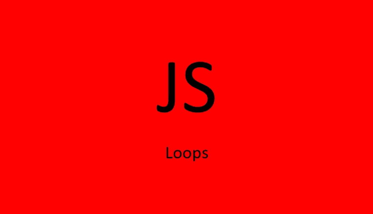

# JavaScript 循环:综合指南

> 原文：<https://javascript.plainenglish.io/javascript-loops-a-comprehensive-guide-eb7f98b7c455?source=collection_archive---------7----------------------->

## 对象、数组和字符串— for、forEach、for…of、for…in、while、do…while、every、some、find、findIndex、includes、map、filter、reduce



Photo by Author

你有没有想过在编写 JavaScript 代码时使用什么循环？有时您可能会想，是否有一种快捷方式可以节省您的时间，或者您的循环是否会导致 bug。

本文的目的是将所有重要的循环信息放在一个地方，这样您就可以滚动并找到您的循环。

所以，事不宜迟，下面是可以在代码中使用的 JavaScript 循环，组织成对象、数组和字符串的循环。

# 遍历对象

## 1.为了…在

是最适合对象的 JavaScript 循环。这个循环遍历一个对象的所有属性。属性的键必须是字符串。跳过符号键。

如果您需要让`for…in`循环看到对象的属性，那么它们必须是可枚举的属性。可枚举属性只是将内部可枚举标志设置为 true 的属性。用对象文字或通过属性初始化器(`new Object()`，`Object.create()`)创建的对象将把可枚举属性默认设置为 true。

如果不想让`for…in`循环看到某个属性，可以像这样设置一个不可数的属性:

```
const myObject = {
    keyOne: 5,
    keyTwo: "valueTwo",
    differentkey: "value3"
};Object.defineProperty(myObject, 'newKey', {
  value: "can't see me in a for...in loop",
  configurable: **false**, // default is false
  writable: **false**, // default is false
  enumerable: **false**, // default is false
});
```

`for…in`循环以随机顺序遍历对象，所以开发人员不应该依赖于属性添加到对象的顺序。

当修改/添加/删除一个对象**的属性，同时仍然在循环**中迭代时，注意以下几点很重要:

*   任何被删除的属性在被删除之前都可以被访问。
*   任何被修改的属性在被修改之前可能被访问，也可能不被访问。
*   添加的属性可能会被访问，也可能不会被访问。

`break`和`continue`关键字可以在`for…in`循环中使用，但是不能像在`for`循环中那样访问任何类型的索引。

`for…in`循环可能会迭代原型属性，所以最好执行`hasOwnProperty()`检查。(见下文:**中的……与**中的……的对比)

```
const myObject = {
    keyOne: 5,
    keyTwo: "valueTwo",
    differentkey: "value3"
};for (var keyName in myObject) { if (myObject[keyName] > 4 && myObject["differentkey"]) {
    // may not be deleted before loop reaches it
    delete myObject["differentkey"];
  } if (myObject.hasOwnProperty(keyName)) {
    console.log(keyName + " : " + myObject[keyName]);
  }
}
```

## 2.为了…的

因为`for…of`循环不是针对对象的，所以你必须首先通过分别使用`Object.keys()`、`Object.values()`或`Object.entries()`方法将对象的键或值或者键和值存储在一个数组中。

您可以一起使用析构、`for…of`和`Object.values() / Object.keys() / Object.entries()`:

```
for (const [value] of Object.values(myObject)) {
  console.log(value);
}for (const [key] of Object.keys(myObject)) {
  console.log(key);
}for (const [key, value] of Object.entries(myObject)) {
  console.log(key, value);
  if (myObject[keyName] < 4) {
    break;
  }
}
```

`break`和`continue`在`for…of`循环中工作，但是不能像在`for`循环中那样访问任何类型的索引。

**上面的** `for…of` **循环可能会成为你遍历对象的常用方法。**

## 3.为每一个

如 **2 所示。在上面的**中，你可以分别使用`Object.keys()`、`Object.values()`或`Object.entries()`方法将对象的键或值或者键和值存储在一个数组中，然后使用`Array.prototype.forEach()`循环遍历它们。

```
Object.keys(myObject).forEach(
    (key, index) => console.log(key, index)
);Object.values(myObject).forEach(
    (value, index) => console.log(value, index)
);Object.entries(myObject).forEach(
    ([key, value], index) => console.log(key, value, index)
);
```

## 4.为

有更好的方法来遍历一个对象，但是在极少数情况下，您可以使用`for`循环遍历一个对象。这种方法的优点是您可以访问对象的键的索引(对象本身没有索引，但是您可以使用`Object.keys()`将键保存在一个数组中)。

[JavaScript 中对象属性的顺序很复杂](https://stackoverflow.com/questions/5525795/does-javascript-guarantee-object-property-order)，所以不要依赖使用`Object.keys()`生成的数组的顺序来保持一致或者反映插入到对象中的顺序。然而，您可以使用`i%2`可靠地做一些事情，比如仅访问每秒的属性。

在 i = 100 以下，循环开始，在 i = 155 (56 个键)时循环中断。如果一个对象有 2000 个键，可以通过将循环限制在感兴趣的索引值来节省时间。

要获得循环的上限，使用`Object.keys()`方法将对象的键写入一个数组，并获得该数组的长度。

```
const myObjectKeys = Object.keys(myObject);
for(let i = 100; index < myObjectKeys.length; index++) {
  if (myObjectKeys[i] === "thisKey") {
    keyInThisRange = true;
  }
  arrayOfAllRangeValues.push(myObject[myObjectKeys[i]]);
  if (i%2 == true) {
    arrayOfEverySecondValue.push(myObject[myObjectKeys[i]]);
  }
  if (i > 155) break;
}
```

# 遍历数组

## 为了…的

这是用于数组的默认循环。`for…of`循环遍历可迭代对象。这些**不是**用对象字面量或者用`new Object()`或`Object.create()`创建的相同对象。数组**是**这些可迭代对象中的一个。

语法如下所示:

```
const myArray = [3, 4, 19];for (const value of myArray) {
  console.log(value);
}// use let, not const, if reassigning values inside the loop
for (let value of myArray) {
  value += 20;
  console.log(value);
}
```

`break`和`continue`关键字可以在`for…of`循环中使用，但是不能像在`for`循环中那样访问任何类型的索引。

## 为每一个

这个循环专门用于数组。该函数接受一个带有三个参数的回调，后两个参数`index`和`myArray`是可选的。`index`会给你当前值的索引，`myArray`是你调用方法的数组。你可以使用索引来知道你在哪里，但是你不能像使用`for`循环那样从某个索引开始。

```
let myArray = [3, 4, 19];myArray.forEach((value, index, myArray) => {
  console.log(value, index, myArray);
});
```

以下几点值得注意:

*   `forEach()`不能用`break`或`continue`停止或中断循环。
*   `forEach()`期望回调是同步函数，它不会等待承诺被解析。以下将不起作用:

```
let myArray = [3, 4, 2];
let total = 0;

let addFunction = async (x) => {
  return x + 2
};

myArray.forEach(async (number) => {
  total = await addFunction(total)
});

console.log(total)
// Expected output with async function: 15
// Actual output: 0
```

*   调用回调后，`forEach()`的回调不会访问追加到数组中的元素。

## 为

`for`循环可以很好地处理数组。

```
let myArray = ["Newton", "Isaac", "Hello,"];
let myArrayLength = myArray.length;
for (let i = myArrayLength; i > 0 ; i--) {
    console.log(myArray[i]); //  "Hello,", "Isaac", "Newton",
}
```

for 循环的优点是可以完全控制索引。例如，如果您愿意，可以从末尾开始循环，如上例所示。

## 为了…在

`for..in`可用于迭代数组，但是它访问元素的顺序没有保证，因此它从不用于数组。(另见下文:**中的……与**中的……的对比)

以下方法是您可以用来代替手动使用任何传统循环的`Array.prototype`方法。

## 地图

`map`将通过循环遍历一个数组并对该数组中的每个元素执行一个函数来生成一个新数组。

```
const myArray = [3, 6, 9, 12, 27];// place your mapping function in the method
const myArrayMap = myArray.map(x => x / 3);console.log(myArrayMap); // [1, 2, 3, 4, 9]
```

## 过滤器

`filter`将**通过循环遍历一个数组并对该数组中的每个元素执行测试函数来产生一个新数组**。所有通过测试的元素都将被放入新数组中。

```
const myNumbersArray= [3, 6, 9, 12, 27];const arrayOfNumbersGreaterThan6 = myNumbersArray.filter(number => number > 6);console.log(arrayOfNumbersGreaterThan6); // [9, 12, 27]
```

## 减少

`reduce`通过对所有元素执行一个函数，将数组缩减为一个值。

```
const myArray = [2, 5, 3, 6];
const reducerFunction = (accumulatingValue, currentValue) => accumulatingValue + currentValue;console.log(myArray.reduce(reducerFunction)); // 16

// initial value of 15
console.log(myArray.reduce(reducerFunction, 15)); // 31
```

还有一种镜像法`Array.prototype.reduceRight()`从右手边开始。

## 一些

`some`将遍历数组并返回一个布尔值，表明**中是否至少有一个**元素通过了测试函数。

```
const myNumbersArray= [3, 6, 9, 12, 27];const aNumberGreaterThan12 = myNumbersArray.some(number => number > 12);console.log(aNumberGreaterThan12); // true
```

## 每个

`every`将遍历数组并返回一个布尔值，表明是否所有的**元素都通过了你的测试函数。**

```
const myNumbersArray= [3, 6, 9, 12, 27];const allNumbersGreaterThan2 = myNumbersArray.every(number => number > 2);console.log(allNumbersGreaterThan2); // true
```

## 包含

这是一个非常有用的循环。要检查一个数组是否有某个值，使用`Array.prototype.includes()`来检查它。该方法将遍历数组的值来检查您的值，并将返回`true`或`false`。

这与前面提到的`some`方法不同。`includes`不取测试函数，只取一个值。

`const isItThere = myArray.includes("this string");`

如果您只想确认对象中的键或值的存在，那么就没有必要手动遍历整个对象。使用`Object.values()`或`Object.keys()`方法将值/键写入一个新数组，然后使用`Array.includes()`测试真或假。

```
const myObject = {
    keyOne: 5,
    keyTwo: "valueTwo",
    differentkey: "value3"
};myObjectValuesArray = Object.values(myObject);
const helloValue = myObjectValuesArray.includes("hello"); // falsemyObjectKeysArray = Object.keys(myObject);
const helloKey = myObjectKeysArray.includes("keyTwo"); // true
```

## 发现

`find`将遍历数组并返回通过测试函数的第一个**元素的**值**。如果没有找到元素，则返回`undefined`。**

```
const myNumbersArray= [3, 6, 9, 12, 27];const valueOfFirstNumberGreaterThan6 = myNumbersArray.find(number => number > 6);console.log(valueOfFirstNumberGreaterThan6); // 9
```

## findIndex

`findIndex`将遍历数组并返回通过测试函数的第一个**元素的**索引**。如果没有找到元素，则返回`-1`。**

```
const myNumbersArray= [3, 6, 9, 12, 27];const indexOfFirstNumberGreaterThan6 = myNumbersArray.findIndex(number => number > 6);console.log(indexOfFirstNumberGreaterThan6); // 2
```

# 遍历字符串

## 为了…的

如果你不需要控制迭代的索引，那么一个好的循环是`for…of`循环。

```
const myString = "Hello";for (let letter of myString) {
  console.log(letter); // "H", "e", "l", "l", "o"
}
```

## 为

如果您需要访问索引，请使用`for`。

```
const myString = "Hello";for (let i = 2; i < myString.length; i++) {
  console.log(i); // "H", "e", "l", "l", "o"
}
```

## 为每一个

如果您首先使用 spread 语法`…`将字符串扩展到一个数组中，那么您可以使用`forEach`。

```
const myString = "Hello";[...myString].forEach((letter) => {
   console.log(letter); // "H", "e", "l", "l", "o"
})
```

# 其他常规循环

## 在…期间

`while`循环非常类似于没有第一条和第三条语句的`for`循环。索引值在循环之前声明，例如`let i = 0;`，并且索引在循环内用`i++`增加。以下 for 和 while 循环是等效的:

```
// FOR LOOP
const myNumbersArray= [3, 6, 9, 12, 27];
let i = 0;for (;myNumbersArray[i];) {
 console.log(myNumbersArray[i]);
 i++;
}// WHILE LOOP
const myNumbersArray= [3, 6, 9, 12, 27];
let i = 0;while (myNumbersArray[i]) {
 console.log(myNumbersArray[i]);
 i++;
}
```

您可以像使用`for`一样使用`while`:

```
const myObject = {
    keyOne: 5,
    keyTwo: "valueTwo",
    differentkey: "value3"
};
let i = 0;
const obKeys = Object.keys(myObject);while (i < obKeys.length) {
  console.log(myObject[obKeys[i]]);
  i++;
}
///////////////////const myArray= [3, 6, 9, 12, 27];
let i = 0;while (i < myArray.length) {
  // get numbers in myArray between 10 and 20
  if (myArray[i] > 9 && myArray[i] < 21) {
    anotherArray.push(myArray[i]);
  }
  i++;
}
```

`break`和`continue`关键字可以在`while`循环中使用。

## 做…的同时

除了`do`块中的代码至少迭代**一次**之外，`do...while`循环与`while`循环相同。

```
let num = 3;
let i = 0;do {
  num += 1;
  i++;
}
while (i < 12);
```

`break`和`continue`关键字可以在`do…while`循环中使用。

# 组合循环

您可以将循环组合在一起工作。

```
const keysToBeAdded = [
  "massOfSugar",
  "massOfBeans",
  "massOfCoffee"
];const myObject = {
    massOfSugar: 5,
    randomMass: 50,
    massOfBeans: 19,
    massOfTomatoes: 50,
    massOfFish: 50,
    massOfCoffee: 5200,
};let totalMass;
let massesToBeAdded = [];const addValuesReducer = (accumulator, currentValue) => accumulator + currentValue;for (const [key, value] of Object.entries(myObject)) {
  if (keysToBeAdded.includes(key)) {
    massesToBeAdded.push(value);
  }
}
totalMass = massesToBeAdded.reduce(addValuesReducer);
console.log(totalMass); // 5224
```

# **嵌套'** `**for'**` **循环**

有时有必要将一个`for`循环嵌套在另一个循环中。通常，这是为了相对于另一个对象比较或更新一个对象。通常，对多维数组使用嵌套的 for 循环。多维数组只是数组的数组，比如`[[1, 6], [2,2,1], [5,6]]`。

```
function aggregate(multiDimArray) {
  let sum = 0;
  for (let indexA = 0; indexA < multiDimArray.length; indexA++) {
    const insideArray = multiDimArray[indexA];
    for (let indexB = 0; indexB < indexB.length; indexB++) {
      sum += insideArray[indexB];
    }
  }
  console.log(sum); // 23
}const multiDimensionalArray = [[1, 6], [2,2,1], [5,6]];
aggregate(multiDimensionalArray);
```

您也可以对对象使用嵌套循环，首先分别使用`Object.keys()`、`Object.values()`或`Object.entries()`方法将对象键/值/键+值转换为数组。

# `for...of` vs `for...in ?`

数组只是带有整数隐藏键的对象。这意味着数组只是一个定制的对象。`for…of`循环和`for…in`循环都迭代这些对象，但是它们迭代的内容不同。

`for…in`循环随机遍历对象的**可枚举属性**。它将返回所有属性名，包括非整数名称和继承的属性。

`for…of`循环依次迭代对象的**可迭代值**，可迭代对象定义迭代的内容。

注意下面的`for…in`返回一个数组的隐藏的**索引键**，而`for…of`返回**值**。

```
const myArray= [3, 6, 9, 12, 27];for (const i **in** myArray) {
  console.log(i); // "0", "1", "2", "3", "4"
}for (const i **of** myArray) {
  console.log(i); // "3", "6", "9", "12", "27"
}
```

如果你用`Object.prototype`或`Array.prototype`修改`Object`原型，`for…in`将返回那些属性，除非你用`hasOwnProperty`指定它不应该。下面，`newArraykey`甚至和`hasOwnProperty`一起返回，因为它是你添加到`myArray`的属性。

```
const myArray= [12, 6, 9];// Array objects will also inherit this property "myObProp"
Object.prototype.myObProp =  function() {};// Only array objects will inherit this property "myArrayProp" Array.prototype.myArrayProp =  function() {};myArray.newArraykey = "surprise!";for (const i **in** myArray) {
  console.log(i); // "0", "1", "2", "myObProp", "myArrayProp", "newArraykey"
}for (const i **in** myArray) {
  if (myArray.hasOwnProperty(i)) {
    console.log(i); // "0", "1", "2", "newArraykey"
  }
}for (const i **of** myArray) {
  console.log(i); // "12", "6", "9"
}
```

# 最终外卖

如果你想从这篇文章中学到什么，那就是:

**`for…of`**循环是最通用的循环。**要迭代对象，首先，使用`Object.keys()`、`Object.values()`或`Object.entries()`方法之一将它们转换成数组，然后使用`for…of`中的新数组——这样可以避免错误地迭代继承的属性。要迭代数组，只需像在`for…of`循环中一样使用数组。如果不需要知道索引，也可以对字符串使用`for…of`。**

**感谢阅读。如果你喜欢这篇文章，可以考虑在这里[订阅](https://craftedwebpages.medium.com/membership)中级会员，以获得数以千计的其他文章。**

**将来我会发布更多的 JavaScript 文章。你可能也会喜欢我的另一篇文章:**

**[](https://levelup.gitconnected.com/9-early-signs-you-will-be-a-successful-programmer-1a604f04be39) [## 你将成为成功程序员的 9 个早期迹象

### 不要放弃

levelup.gitconnected.com](https://levelup.gitconnected.com/9-early-signs-you-will-be-a-successful-programmer-1a604f04be39) [](https://medium.com/technology-hits/the-best-programming-languages-to-learn-first-a-roadmap-for-the-indecisive-beginner-f242e5ffeac5) [## 首先学习的最佳编程语言——犹豫不决的初学者的路线图

### 最省时、最具成本效益的学习方式以及免费和付费课程

medium.com](https://medium.com/technology-hits/the-best-programming-languages-to-learn-first-a-roadmap-for-the-indecisive-beginner-f242e5ffeac5) 

# 学习资源:

[for loop](https://developer.mozilla.org/en-US/docs/Web/JavaScript/Reference/Statements/for)
[for…in loop](https://developer.mozilla.org/en-US/docs/Web/JavaScript/Reference/Statements/for...in)
[array . prototype .](https://developer.mozilla.org/en-US/docs/Web/JavaScript/Reference/Global_Objects/Array/map)[forEach](https://developer.mozilla.org/en-US/docs/Web/JavaScript/Reference/Global_Objects/Array/forEach)
[while loop](https://developer.mozilla.org/en-US/docs/Web/JavaScript/Reference/Statements/while)
[do…while loop](https://developer.mozilla.org/en-US/docs/Web/JavaScript/Reference/Statements/do...while)
[array . prototype . map](https://developer.mozilla.org/en-US/docs/Web/JavaScript/Reference/Global_Objects/Array/map)
[array . prototype . filter](https://developer.mozilla.org/en-US/docs/Web/JavaScript/Reference/Global_Objects/Array/map)
[array . reduce](https://developer.mozilla.org/en-US/docs/Web/JavaScript/Reference/Global_Objects/Array/map)
[array . prototype . include](https://developer.mozilla.org/en-US/docs/Web/JavaScript/Reference/Global_Objects/Array/includes)**