# JavaScript 映射和绑定方法来拯救

> 原文：<https://javascript.plainenglish.io/javascript-map-and-bind-methods-to-the-rescue-696c37d428b4?source=collection_archive---------10----------------------->

当您从事 JavaScript 项目时，JavaScript 方法将是您最好的朋友。无论是在前端使用 React、Angular 或 Vanilla JavaScript，还是在后端使用 Node.js，JavaScript 方法都是你需要知道的。现在，这些东西被称为方法——这意味着有一些方法可以实现这些功能，而不需要使用这些方法中的任何一种，但是这些方法可以减轻您的开发压力，因为您最终会编写更少的代码。

在这篇文章中，我很乐意对您经常会遇到的一些 JavaScript 方法给出一些理解。现在个人觉得，真的很有必要了解什么时候用哪种方法，它的功能是什么。你看，这些 JavaScript 方法在 React 和 Node 项目中被大量使用，我曾经觉得这是一些我需要记住的样板代码，但是，每当我发现这些方法有一些错误时，我发现很难修复它们，因为我不知道这些算法是如何基本工作的。

在这里，我将讨论您会遇到的两种主要方法:

1.  **地图()**
2.  **bind()**

> 注意，所有代码都可以在我的 [github repo](https://github.com/nerdylabs/JavaScript-methods) 上找到

# 理解地图🗺

当我听到“地图”这个词时，我首先想到的是世界地图😆。我知道这是一个糟糕的笑话，但我不得不这样做。不管怎样，map 是一个 JavaScript 数组方法，这意味着这个方法只能在数组上使用。考虑到`arr` 是一个包含元素`[1,2,3,4,5]`的数组，现在 *VS 代码的代码完成*工具提供了一个方便的下拉菜单，当我键入 *map* 时，意味着这个变量 *arr* 有这个叫做 *map* 的方法可用。

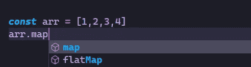

现在 map 的工作就像 JavaScript 中传统的`for`循环，它的工作是迭代`arr`元素。正如你在下面的代码中看到的，我们将`arr`传递给我们的函数`understandingFor`，并使用标准的 for 循环遍历数组元素，并将当前元素加 1。注意输入是`[1,2,3,4,5]`，代码输出是`[2,3,4,5,6]`。

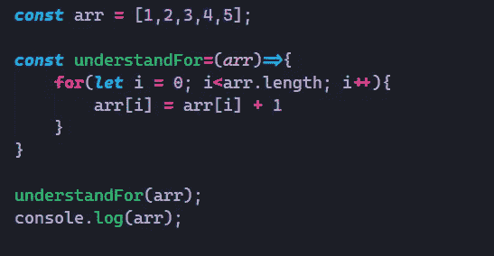

现在考虑给所有元素加 1 是一个函数。现在 map 方法在`arr`上迭代，但该方法需要一个名为 [*回调函数*](https://www.w3schools.com/js/js_callback.asp) 的参数。现在该函数按顺序接收数组中的每个元素，回调函数对每个元素执行操作。为了更好地理解这一点，让我们从使用 map 打印数组元素开始。

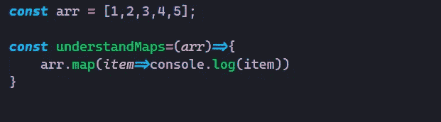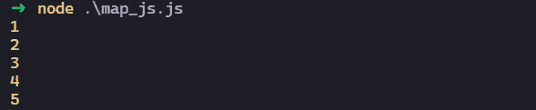

你看在 map 函数里面我们传递了一个函数这是一个特殊类型的函数叫做 [*匿名函数*](https://www.geeksforgeeks.org/javascript-anonymous-functions/) ，意思是这些函数没有任何名字。正如我所说的，这个函数接收每一项作为函数参数，你可以在函数内部使用这个参数。

现在让我们看看如何给数组中的每个元素加 1。

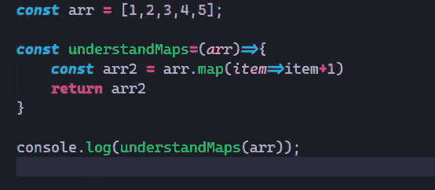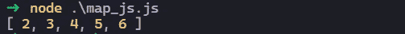

现在正如你在代码中看到的，我们只是使用了`item`,并从函数中添加了 1。现在 map 的问题是它返回一个新的数组，而不是修改之前的数组。因此，我们将新返回的数组存储在`arr2`中。因此，您以前的数组值不会被修改。

现在有其他的 JavaScript 数组方法，比如`[reduce()](https://www.w3schools.com/jsref/jsref_reduce.asp), [filter()](https://www.w3schools.com/jsref/jsref_filter.asp), [forEach()](https://www.w3schools.com/jsref/jsref_foreach.asp)` ，它们以类似的方式工作。参考我的 [*GitHub repo*](https://github.com/nerdylabs/JavaScript-methods) 在代码中看到它们。 [*阅读 JavaScript*](https://developer.mozilla.org/en-US/docs/Web/JavaScript/Reference/Global_Objects/Array) 中关于数组方法的更多内容。

# 理解`Bind 🤝`

现在*绑定*是我经常在 React 代码中看到的东西。我们将`this`绑定到一个*事件监听器*上，神奇的是，我们没有得到我们没有绑定`this`时得到的错误。如下图所示。

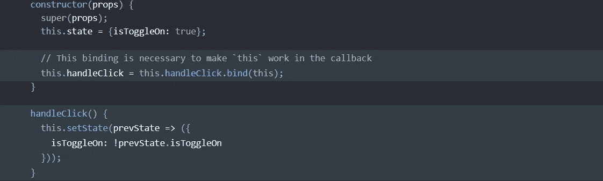

现在我写这段代码的时候认为它是一些样板 JavaScript 东西或者 React 特定的东西，最终，我厌倦了，很想知道`bind()`做什么，令我惊讶的是我错了，它既不是一些 JavaScript 样板也不是一些 React 特定的东西，我们有一些有效的理由这样做。现在有了另一种添加事件监听器的方法，React 称之为“实验性的”,这种方法更容易，但是理解 bind 也有助于理解为什么这种“实验性的”方法也能工作。

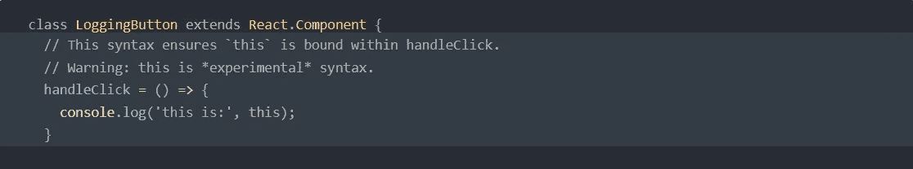

现在考虑如下所示的对象。对象父亲有一个名为`add_money()`的方法，现在这个函数使用了使用`this`关键字的`income`属性，并在之前的收入基础上再增加 5000。

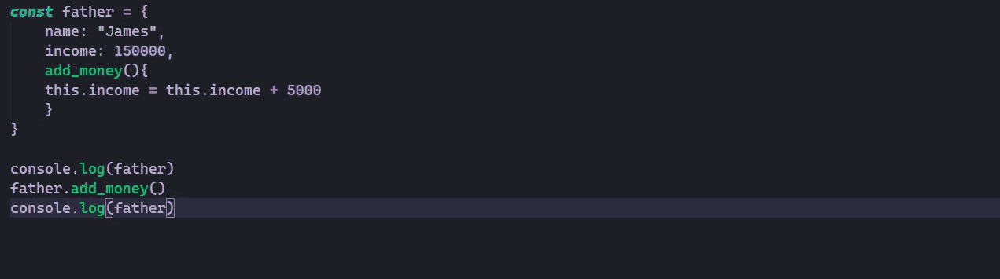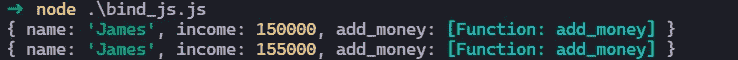

现在，在运行函数`add_money()`一次后，您会看到`income`属性现在是 155000。现在考虑另一个名为`son`的对象，它有一些其他属性，如下所示。

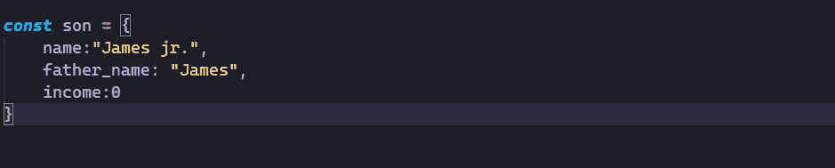

现在假设我们想从父对象中使用这个`add_income()`方法。这里有几个问题:

1.  在`add_money()`方法中，我们使用了`this`关键字，它现在只引用/指向`father`对象。
2.  子不能访问父的方法和属性。这可能会让你想起一些事情。您可以使用继承来获得访问权限，但这不是我们在这里想要做的。

现在我们想要访问`father`对象的`add_money()`方法，我们可以通过使用 bind 来实现。`bind()`简单地将一个对象的方法绑定到另一个对象。

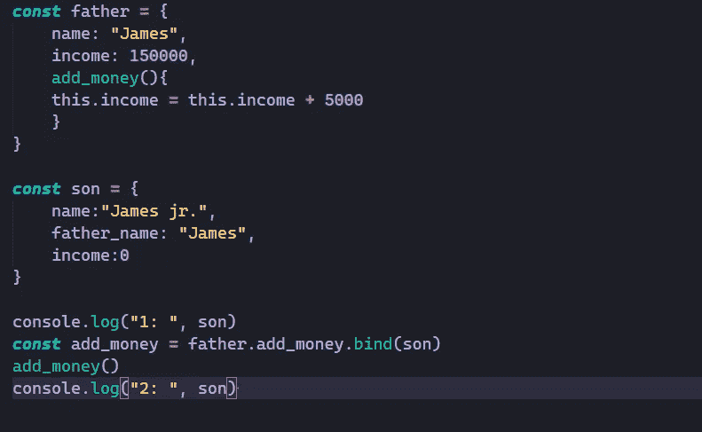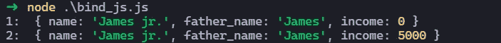

现在请注意，在第一个`console.log()`之后，我们调用了 bind 方法。现在`bind()`被称为`const func_name=object1.method_to_bind.bind(object2)`现在你可以看到绑定`returns`一个新函数，它可以被存储为一个新函数。现在来自`add_money()`方法的`this`关键字现在引用绑定后的 son 对象。

所以要快速覆盖最后的东西。我们之前看到的 React 代码:

这里的`this`指的是类组件的对象，而`handleClick()`方法现在可以访问`this`。现在使用`bind()`，我们将方法绑定到`this`，从`bind()`返回的函数存储在`this.handleClick`中。

所以我希望你理解了`bind()`。我知道这有点难以理解，但这是我们需要了解的必要想法。现在就像`[bind()](https://developer.mozilla.org/en-US/docs/Web/JavaScript/Reference/Global_objects/Function/bind)`一样，还有两个方法`[call()](https://developer.mozilla.org/en-US/docs/Web/JavaScript/Reference/Global_Objects/Function/call)`和`[apply()](https://developer.mozilla.org/en-US/docs/Web/JavaScript/Reference/Global_Objects/Function/apply)`以类似的方式工作。

现在，您可以使用 Udemy 课程 [*JavaScript:高级概念*](https://www.udemy.com/course/advanced-javascript-concepts/) *学习所有这些概念和其他高级 JavaScript 函数。*

# 最后

JavaScript 方法是非常重要的，也是常用的。彻底了解他们肯定会让你比其他开发人员更有优势。

另外，如果你想学习如何开始使用 React，或者学习 React 并想进一步了解它，请阅读我的文章 [*让我们反应⚛—react js 入门指南*](https://medium.com/codex/lets-react-a-reactjs-starter-guide-a333ad79eaef) *。*

只要连接到互联网并开始学习😃❕快乐学习😎❕

*更多内容请看*[***plain English . io***](http://plainenglish.io/)