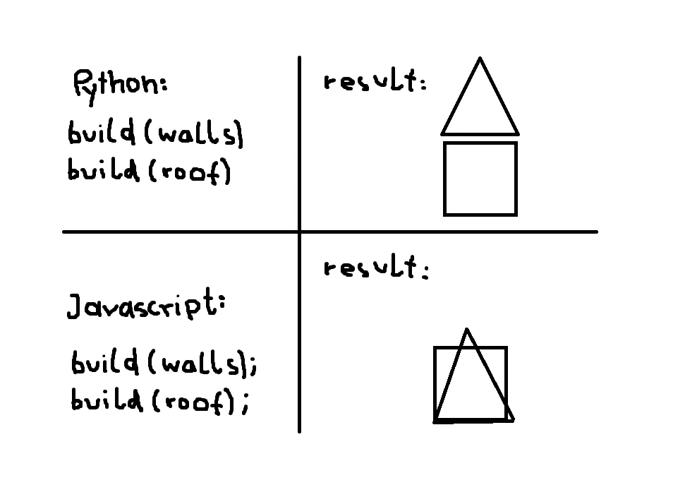
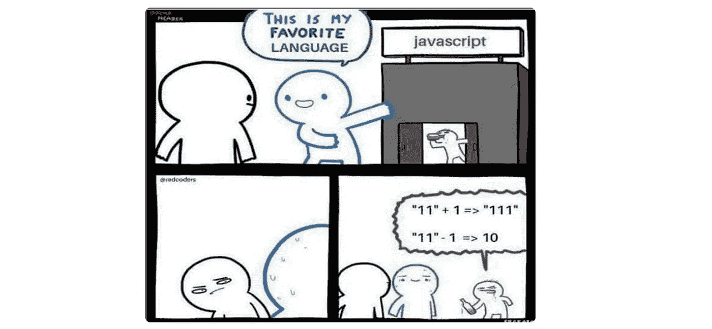
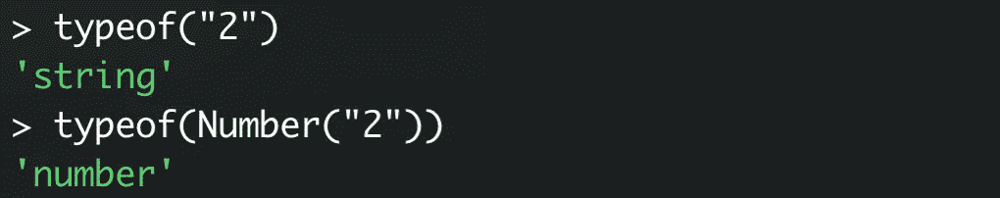
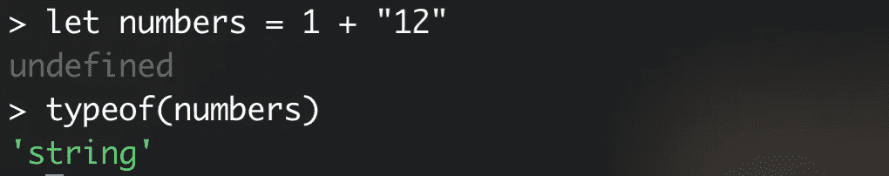

# 3 个迷因解释了你应该知道的重要 JavaScript 概念

> 原文：<https://javascript.plainenglish.io/javascript-memes-c45c547c570f?source=collection_archive---------5----------------------->

## 以异步代码、强制和 this 关键字为特色


Photo by [Brian Lundquist](https://unsplash.com/@bwl667?utm_source=medium&utm_medium=referral) on [Unsplash](https://unsplash.com?utm_source=medium&utm_medium=referral)

我知道——程序员的笑话没那么好笑。

然而，它们可以帮助传达概念。这里有 3 个 JavaScript 迷因，阐述了重要的概念！

# 1.JavaScript 中的“this”


Source: [reddit](https://www.reddit.com/r/ProgrammerHumor/comments/b252lc/javascript_pain/)

这个-关键字存在于所有面向对象的编程语言中。在 JavaScript 中，我们可以面向对象编程——但是‘this’有时表现得有点不寻常。这里有一个例子:

我们有一个类，在这个类中，我们希望输出我们汽车的品牌。
构造器确保属性“*品牌*在类中可用。

如果我们像这样运行代码，一切都正常。但是现在我们想在输出之前等待一秒钟—这并不困难，只需在 *nameBrand()* —方法中放入一个 *setTimeout* 。

```
nameBrand() {
  setTimeout(function() {
    console.log(*this*.brand)
  }, 1000)
}
```

错误。如果我们像这样运行代码， *this.brand* 是未定义的。

**为什么？**因为我们用作回调的经典函数将“this”绑定到 setTimeout。正确，对于经典的 JS 函数来说是这样的——但对于 Arrow 函数来说不是！

如果我们只对 *nameBrand()* 方法进行最小程度的修改，一切都会按预期运行:

```
nameBrand() {
  setTimeout(() => {
    console.log(*this*.brand)
  }, 1000)
}
```

普通函数和箭头函数处理'*这个*'的方式不同。对于许多程序员来说，只有两种类型的函数是不寻常的。

> *在箭头函数中，*这个*总是代表定义箭头函数的对象，因此*这个*具有封闭上下文的原始含义。*
> - [我的关于 JavaScript 中‘this’的整篇文章](https://medium.com/javascript-in-plain-english/this-javascript-bca2b028e5ac)

[](https://medium.com/javascript-in-plain-english/this-javascript-bca2b028e5ac) [## 关于 JavaScript 中的“this ”,你需要知道什么

### 常见问题&一个 ES6 的例外

medium.com](https://medium.com/javascript-in-plain-english/this-javascript-bca2b028e5ac) 

这只是处理“这个”时可能出现的令人困惑的情况之一。

# 2.同步还是异步？



Source: [steemit](https://steemit.com/busy/@felixxx/python-vs-js)

准确地说，JavaScript 是一种同步编程语言。但是这到底意味着什么呢？

同步程序是逐步执行的。计算机一次只承担一项任务。只有当任务完成后，执行才会继续。

异步程序也是逐步执行的——但它不一定要等待。对于要执行的任务 B，任务 A 不必完成，而是继续在后台处理 B。

所以 JavaScript 实际上是同步的——这种模式在执行过程中非常容易理解。但是它也有一个很大的缺点:我们程序中的流程被阻塞了，而这通常是我们不希望的。然而，在 JS 中，一些回调允许异步代码——例如， *setTimeout* ，而这恰恰会导致没收。

要做到这一点，让我们看看如何在 Python 中计时程序的执行:

```
*import* timetime.sleep(1)print("after 1 second")print("Hello!")
```

控制台上的结果:*1 秒后，你好！*
前两者都是输出，但是，后一秒就过去了。所以 *time.sleep* 函数中断了执行。

如果我们想用 JS 实现同样的代码，首先想到的可能是这个:

```
setTimeout(() => {
  console.log("after 1 sec")
}, 1000)console.log("Hello!")
```

但是这里发生的事情是这样的:*你好！1 秒钟后。*

正确， *setTimeout* 不会中断程序的整个执行。这里发生的是**异步**。计算机会识别 setTimeout 函数，但会转到 console.log —上面的代码在后台执行。

这可能非常令人困惑——尤其是对于来自 Python 这样的语言的人来说。

# 3.强迫



Source: [redcoders](https://www.instagram.com/p/B1oKoLBAosu/)

JavaScript 被认为是相当随机的——但当然不是。所有奇怪的行为背后都有一个逻辑。

网络语言是弱类型的。这意味着数据类型可以任意地相互转换，即使我们没有执行一个函数来转换它们——这是可能发生的。在像 Java 这样的其他语言中，这会给出一个错误。

类型强制，即转换为另一种类型，可以是隐式的，也可以是显式的。如果我们有意识地想要使用 cast 函数转换一个类型，这就叫做显式强制。



Explicit coercion. Source: the author

几乎所有的编程语言都使用类型的有意识转换。只有隐式强制是相当不寻常的——这意味着我们可以在没有传统强制转换的情况下转换数据类型，并相互进行操作。这里有一个例子:



Implicit coercion. Source: the author

隐式强制有许多规则，重要的是理解它的存在。来自低级语言的程序员通常很难理解这个概念。强制会导致无意的错误。

这里有一个更复杂的关于强制的个人规则的文章。

感谢您的阅读！

## [加入我的简讯，了解最新消息](http://eepurl.com/hacY0v)